# Виртуалды STEM оқыту платформасы — толық сипаттама

**Грант:** BR28713097
**Тақырыбы:** «Креативті тәрбие мен STEM білімді интеграциялау негізінде оқушылардың икемді дағдыларын қалыптастыру: теориялық-әдіснамалық негіздері, инновациялық-практикалық іске асыру тәсілдері»
**Қаржыландырушы:** ҚР Ғылым және жоғары білім министрлігінің Ғылым комитеті
**Репозиторий:** `bibaermek-stack/softskills`
**Құжат жасалған күні:** 2026-09-07

---

## Мазмұны

1. [Жоба туралы қысқаша](#1-жоба-туралы-қысқаша)
2. [Технологиялық стек және іске қосу](#2-технологиялық-стек-және-іске-қосу)
3. [Архитектура және маршруттар картасы](#3-архитектура-және-маршруттар-картасы)
4. [Ақпараттық бөлім — көпшілік сайт](#4-ақпараттық-бөлім--көпшілік-сайт)
5. [Панель (Dashboard)](#5-панель-dashboard)
6. [Аутентификация және рөлдер](#6-аутентификация-және-рөлдер)
7. [Оқу мазмұны: пәндер, сабақтар, модульдер, зертханалар](#7-оқу-мазмұны-пәндер-сабақтар-модульдер-зертханалар)
8. [ТЕСТТЕР — толық тізім](#8-тесттер--толық-тізім)
9. [СИМУЛЯЦИЯЛАР — толық тізім](#9-симуляциялар--толық-тізім)
10. [Ойындар және геймификация](#10-ойындар-және-геймификация)
11. [Кейс тапсырмалар](#11-кейс-тапсырмалар)
12. [Бағалау жүйесі, аналитика және XP](#12-бағалау-жүйесі-аналитика-және-xp)
13. [Мұғалім кабинеті](#13-мұғалім-кабинеті)
14. [AI ассистенті](#14-ai-ассистенті)
15. [Дерекқор (Supabase): схема, RLS, триггерлер](#15-дерекқор-supabase-схема-rls-триггерлер)
16. [3D графика және модельдерді оңтайландыру](#16-3d-графика-және-модельдерді-оңтайландыру)
17. [Қолжетімділік, тіл және типографика](#17-қолжетімділік-тіл-және-типографика)
18. [Скрипттер және деректер файлдары](#18-скрипттер-және-деректер-файлдары)
19. [Тексеру нәтижелері және шектеулер](#19-тексеру-нәтижелері-және-шектеулер)

---

## 1. Жоба туралы қысқаша

Платформа екі бөліктен тұрады:

| Бөлік | Маршрут | Мақсаты |
|---|---|---|
| **Таныстырылым сайты** | `/` | Ғылыми жобаның мазмұнын, әдіснамасын, модульдерін және нәтижелерін көпшілікке таныстыру |
| **Интерактивті LMS панелі** | `/dashboard/**` | Нақты оқыту: сабақтар, тесттер, симуляциялар, ойындар, кейстер, аналитика |
| **Тіркелусіз ойын кіру** | `/play`, `/play/case` | Оқушы QR-код немесе 6 таңбалы кодпен командалық ойынға/кейс рөлдік ойынына қосылады |

**Негізгі идея.** Пәндік білім (физика, математика, тарих, әдебиет, технология) нақты өмірлік мәселе арқылы біріктіріледі, ал икемді дағдылар (Soft Skills) пәндік нәтижемен қатар толыққанды оқу нәтижесі ретінде өлшенеді.

**Сандармен:**

| Көрсеткіш | Саны |
|---|---|
| Кіріктірілген пән | 5 |
| Инновациялық технология | 16 |
| Командалық рөл | 10 |
| Бағалау түрі | 8 |
| Жағдаяттық тест сұрағы | **1000** (5 пән × 200) |
| Интерактивті сабақ | 5 (әрқайсысы 6 кезең) |
| Механика оқу модулі | 10 |
| Зертханалық жұмыс | 10 |
| Кейс тапсырма | 5 (әрқайсысы 4 қадам) |
| Симуляция беті | 6 + VR-дың 4 сахнасы + 13 PASCO сахна сипаттамасы |
| Ойын түрі | 3 сабақ ойыны + 12 модуль ойыны + командалық ойын + рөлдік ойын |
| Supabase миграциясы | 11 |

---

## 2. Технологиялық стек және іске қосу

### Стек

| Қабат | Технология |
|---|---|
| Фреймворк | **Next.js 15.5** (App Router), React 19, TypeScript 5 |
| Стиль | Tailwind CSS v4 (`@tailwindcss/postcss`) |
| Күй (state) | Zustand 5 |
| 3D | React Three Fiber 9 + drei 10 + three.js 0.185 |
| Анимация | Framer Motion 12, GSAP 3 (ScrollTrigger), Lenis (smooth scroll) |
| Backend | Supabase (Postgres + Auth + Realtime), `@supabase/ssr` |
| Формула | KaTeX 0.18 |
| QR | `qrcode` |
| Иконка | `lucide-react` |
| AI | OpenRouter API (DeepSeek V4 Flash) |
| 3D пайплайн | `@gltf-transform/*`, `meshoptimizer`, `sharp` |

### Іске қосу

```bash
npm install
npm run dev      # http://localhost:3000
npm run build    # өнімдік құрастыру
npm run lint     # ESLint
npm run optimize:models -- <GLB-файлдар каталогы>
```

### Орта айнымалылары (`.env.local`)

```
NEXT_PUBLIC_SUPABASE_URL=https://<project>.supabase.co
NEXT_PUBLIC_SUPABASE_PUBLISHABLE_KEY=sb_publishable_...   # немесе NEXT_PUBLIC_SUPABASE_ANON_KEY
OPENROUTER_API_KEY=sk-or-...                              # AI ассистенті үшін
OPENROUTER_MODEL=deepseek/deepseek-v4-flash               # міндетті емес
```

> **Маңызды.** Supabase кілттері берілмесе, платформа **демонстрациялық режимде** жұмыс істейді: тіркелгі мен оқу нәтижелері браузердің `localStorage`-ында сақталады. Кілт өзгертілген соң dev серверді қайта іске қосу керек — Next.js `NEXT_PUBLIC_*` айнымалыларын старт кезінде оқиды.

### `next.config.ts` шешімдері

- `outputFileTracingRoot: __dirname` — бөгде lockfile-дың workspace түбірін бұрыс табуын болдырмайды.
- `transpilePackages: ["three"]` — three кейбір жерде транспиляцияланбаған ESM күйінде жеткізіледі.
- `optimizePackageImports: ["framer-motion", "@react-three/drei"]`.
- `/models/:path*` үшін `Cache-Control: public, max-age=31536000, immutable` — модельдер атауымен хештелген, орнында өзгермейді.

---

## 3. Архитектура және маршруттар картасы

### Каталог құрылымы

```
app/
  (site)/              көпшілік сайт (14 бөлім)
  dashboard/           LMS панелі және оның барлық ішкі беттері
  play/                тіркелусіз ойынға қосылу
  api/ai/chat/         AI ассистентінің прокси-маршруты
  auth/callback/       Supabase OAuth қайтару нүктесі
  sitemap.ts robots.ts icon.svg globals.css layout.tsx
components/
  dashboard/           сабақ, аналитика, симулятор, ойын компоненттері (50+)
  dashboard/games/     командалық ойын, рөлдік бөлме, QR
  layout/              Navbar, Footer
  providers/           AuthProvider, SmoothScroll
  sections/            көпшілік сайттың бөлімдері
  three/               WebGL сахналары мен модельдер
  ui/                  ортақ UI, auth, іздеу, презентер модалдары
data/                  оқу контенті (модульдер, викториналар, зертханалар, когорта)
lib/                   домен логикасы, Supabase қатынасы, прогресс, XP, рубрика
supabase/migrations/   11 SQL миграциясы
scripts/               GLB оңтайландыру және контент генерациялау скрипттері
public/models/         оңтайландырылған GLB модельдер
```

### Толық маршруттар тізімі (өнімдік құрастырудан)

| Маршрут | Түрі | Сипаты |
|---|---|---|
| `/` | Static | Таныстырылым сайты |
| `/dashboard` | Static | Панельдің басты торы |
| `/dashboard/quiz` | Static | 5 пән викториналарының хабы |
| `/dashboard/quiz/[id]` | SSG ×5 | mathematics, physics, history, literature, technology |
| `/dashboard/lessons` | Static | Сабақтар каталогы |
| `/dashboard/lessons/[id]` | SSG ×5 | bridge-strength, city-budget, historic-reconstruction, inner-monologue, eco-robot |
| `/dashboard/cases` | Static | Кейстер каталогы |
| `/dashboard/cases/[id]` | SSG ×5 | light-and-kindness, two-roads, water-drop, second-life, robot-first-step |
| `/dashboard/modules/[id]` | SSG ×5 | Пән модулінің беті (physics … technology) |
| `/dashboard/simulations` | Static | Симуляциялар каталогы |
| `/dashboard/simulations/[id]` | SSG ×2 | pendulum, team-project |
| `/dashboard/simulations/circuit` | Static | Электр тізбегі |
| `/dashboard/simulations/astronomy` | Static | Күн жүйесі |
| `/dashboard/simulations/code` | Static | Python зертханасы |
| `/dashboard/resources` | Static | Цифрлық кітапхана (3D) |
| `/dashboard/resources/[id]` | SSG ×8 | interactive, video, qr, checklist, modules, **vr**, collab, labs |
| `/dashboard/team-game` | Static | Командалық STEM ойыны (host/join) |
| `/dashboard/teacher` | Static | Мұғалім кабинеті |
| `/dashboard/profile` | Static | Жеке кабинет |
| `/play`, `/play/case` | Static | Тіркелусіз қосылу |
| `/api/ai/chat` | Dynamic | AI прокси |
| `/auth/callback` | Dynamic | OAuth callback |
| `/sitemap.xml`, `/robots.txt` | Static | SEO |
| Middleware | 92.9 kB | Supabase сессиясын жаңарту |

`sitemap.ts` тізімді **мазмұннан құрастырады** — жаңа пән, ресурс, сабақ немесе симуляция қосылғанда файлды түзетудің қажеті жоқ.

---

## 4. Ақпараттық бөлім — көпшілік сайт

Басты бет 14 бөлімнен тұрады (`app/(site)/page.tsx`). Барлық мәтін — **`lib/content.ts`** ішінде, ол мазмұнның жалғыз дереккөзі. Түсініктемелердегі § нөмірлері жобаның ғылыми сипаттамасының бөлімдеріне сілтейді.

### 4.1 Hero — басты экран

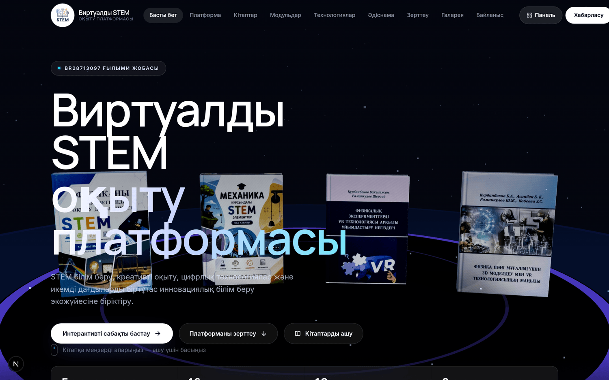

Экранның жалғыз WebGL контексті осында: жарқыраған платформада **төрт нақты GLB кітап** тұрады. Олар айналады, тербеледі, меңзерге қарай еңкейеді, үстіне апарғанда жарқырап бөлшек шығарады, ал басқанда камера жақындап, сол томның мазмұны бар оқу панелі ашылады.

Көрсеткіштер: 5 кіріктірілген пән · 16 инновациялық технология · 10 командалық рөл · 8 бағалау түрі.

Төрт кітап — жобаның нақты қазақша STEM оқулықтары:
1. Физиканы оқыту әдістемесі
2. Механика курсындағы STEM элементтер
3. Физикалық эксперименттерді VR технологиясы арқылы ұйымдастыру негіздері
4. Физика пәні мұғаліміне 3D модельдеу мен VR технологиясының маңызы

### 4.2 About — платформа туралы (§1–2)

Миссия, көрініс және **жеті кезеңді хронология**: зерттеу негізі → STEM білімнің маңызы → креативті тәрбие → пәнаралық оқыту → нақты өмірлік мәселені шешу → бейімделген білім беру → икемді дағдыларды дамыту.

Мұнда бейімделген модельдің **тоғыз кезеңі** және **он оқыту әдісі** де беріледі:

*Тоғыз кезең:* мәселені анықтау → пәнаралық талдау → зерттеу сұрағы → дерек жинау → модель құру → шығармашылық шешім → прототип → таныстыру → рефлексия.

*Он әдіс:* жобалық, проблемалық, зерттеуге негізделген оқыту, рөлдік/іскерлік ойындар, пікірталас, кейс-стади, дизайн-ойлау, командалық тапсырмалар, цифрлық модельдеу, өзара оқыту.

### 4.3 Books — төрт кітап

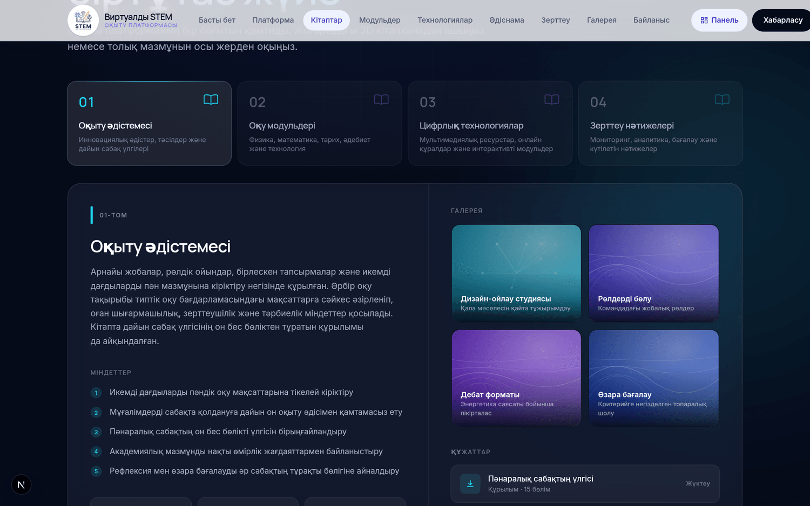

`#books` бөлімі сол төрт томды **қарапайым DOM мазмұны** ретінде көрсетеді және Hero сахнасын `lib/bookBus.ts` арқылы басқарады — екінші canvas орнатылмайды.

### 4.4 Modules — пәндер интеграциясы

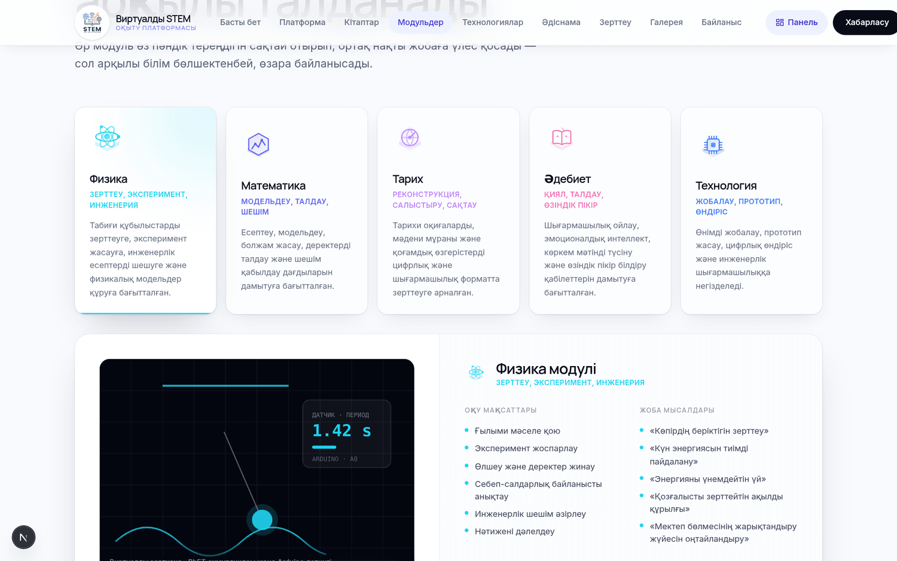

Бес пән картасы, әрқайсысында: сипаттама, 6 оқу мақсаты, 5 жоба мысалы, құралдар тізімі және дамитын икемді дағдылар. Таңдалған модуль төменгі «прожекторда» толық ашылады.

| Пән | Ұраны | Түсі | Мысал жобалар |
|---|---|---|---|
| Физика | Зерттеу, эксперимент, инженерия | `#22d3ee` | Көпірдің беріктігі, күн энергиясы, энергия үнемдейтін үй |
| Математика | Модельдеу, талдау, шешім | `#6366f1` | Қала бюджеті, мектеп аумағы, кәсіпкерлік қаржы моделі |
| Тарих | Реконструкция, салыстыру, сақтау | `#c084fc` | Мультимедиялық реконструкция, Жібек жолы, виртуалды сұхбат |
| Әдебиет | Қиял, талдау, өзіндік пікір | `#f472b6` | Ішкі монолог, цифрлық комикс, қысқаметраж |
| Технология | Жобалау, прототип, өндіріс | `#3b82f6` | Эко-робот, ақылды үй, 3D прототип |

### 4.5 Multimedia — мультимедиялық ресурстар (§4)

13 ресурс түрі: бейнесабақтар, тәжірибе бейнежазбалары, анимациялар, интерактивті презентациялар, виртуалды зертханалар, AR/VR материалдары, электрондық кітаптар, аудиоматериалдар, инфографикалар, онлайн тесттер, викториналар, квест тапсырмалар, чек-парақтар.

Оған қоса **13 біріктірілген онлайн құрал** (§6): Moodle/Google Classroom, Miro, Padlet, Google Workspace, PhET, Labster, Tinkercad, GeoGebra, AR/VR тренажерлары, онлайн пікірталас бөлмелері, цифрлық портфолио, рефлексия күнделігі, peer assessment.

### 4.6 Technologies — 16 инновациялық технология (§12)

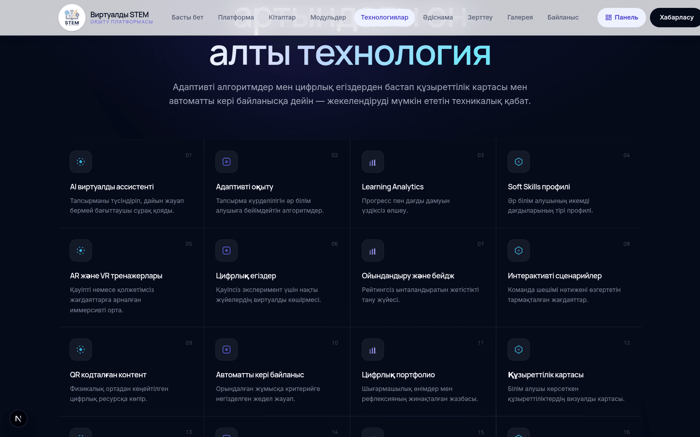

AI ассистенті · адаптивті оқыту · Learning Analytics · Soft Skills профилі · AR/VR тренажерлары · цифрлық егіздер · ойындандыру мен бейдж · интерактивті сценарийлер · QR кодталған контент · автоматты кері байланыс · цифрлық портфолио · құзыреттілік картасы · коммуникацияны талдау · командалық жұмысты бақылау · виртуалды жобалық кеңістік · жетістіктерді визуализациялау.

### 4.7 TrySimulations — бірден сынап көру

Сипаттамадан кейін бірден әрекетке шақыру: симуляцияларға тікелей сілтемелер.

### 4.8 AIAssistant — жасанды интеллект серігі (§7)

Ассистенттің **8 мүмкіндігі** және басты принципі көрсетіледі: *ассистент тапсырманы түсіндіреді, бағыттаушы сұрақ қояды, кезеңдерді жоспарлауға көмектеседі — бірақ ешқашан дайын жауап бермейді*. Бөлімде нақты диалог үлгісі беріледі (көпір моделінің құлауы туралы).

### 4.9 Collaboration — командалық жобалар (§8)

**10 командалық рөл:** жоба жетекшісі · зерттеуші · инженер · математик-аналитик · дизайнер · тарихшы-сарапшы · мәтін авторы · баяндамашы · уақыт менеджері · бағалаушы.

Оған қоса дамитын дағдылар тізімі және қақтығыс сценарийлері.

### 4.10 Analytics — мониторинг (§9)

**11 мониторинг көрсеткіші:** орындалған тапсырмалар, жобаға қатысу белсенділігі, пәндік нәтижелер, командалық жұмыс, коммуникация деңгейі, көшбасшылық белсенділік, шығармашылық өнімдер, өзін-өзі бағалау, өзара бағалау, мұғалім бағалауы, цифрлық портфолио.

**Soft Skills радары (8 ось):** Коммуникация · Топта жұмыс · Шығармашылық · Сыни ойлау · Көшбасшылық · Жауапкершілік · Цифрлық сауат · Өзін реттеу.

> **Диаграмма шешімі.** Барлық белгі **бір реңкте** (`#22d3ee`) және тікелей белгіленген — пәнге бір түстен берілмейді. Бренд аясындағы бес түс түс ажырату шегінен өте алмады (екеуі бір-біріне тым жақын күлгін), ал теңдестіруді белгінің өзі көрсетеді. «Кесте ретінде қарау» ауыстырғышы сол сандарды мәтін түрінде ашады.

### 4.11 Assessment — бағалау (§10)

**8 бағалау түрі:** диагностикалық, қалыптастырушы, жиынтық, жобалық, өзін-өзі бағалау, өзара бағалау, мұғалім бағалауы, цифрлық портфолио.

**11 бағалау критерийі:** мәселені түсіну, ғылыми/логикалық негіздеу, идеяның жаңашылдығы, пәндерді байланыстыру, шығармашылық шешім, цифрлық құралдарды қолдану, командалық үлес, коммуникация, жауапкершілік, таныстыру сапасы, рефлексия.

### 4.12 CreativeEducation — құндылықтар (§11)

12 құндылық: шығармашылық ойлау, адалдық, этика, жауапкершілік, еңбекқорлық, өзара құрмет, экологиялық сана, азаматтық белсенділік, мәдени мұраға құрмет, әлеуметтік жауапкершілік, медиасауаттылық, қауіпсіздік мәдениеті.

### 4.13 Workflow — платформаның жұмыс алгоритмі (§13)

12 қадам: Диагностика → Жеке оқу бағыты → Нақты өмірлік мәселе → Пәндер интеграциясы → Жоба → Цифрлық модельдеу → Командалық жұмыс → Шығармашылық өнім → Бағалау → Рефлексия → Аналитика → Жаңа оқу бағыты.

### 4.14 Research, Gallery, Contact

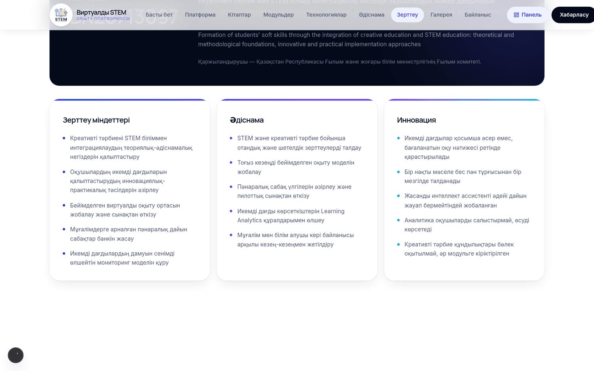

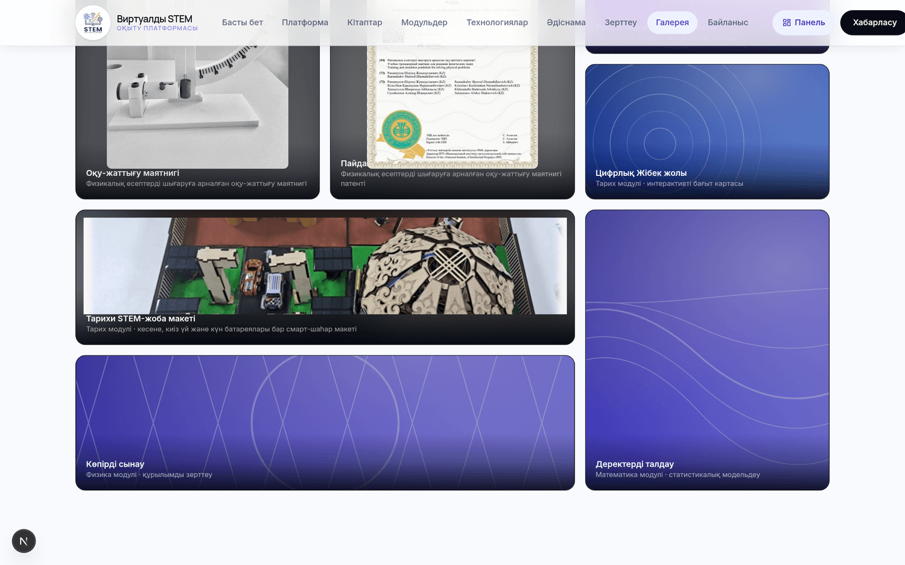

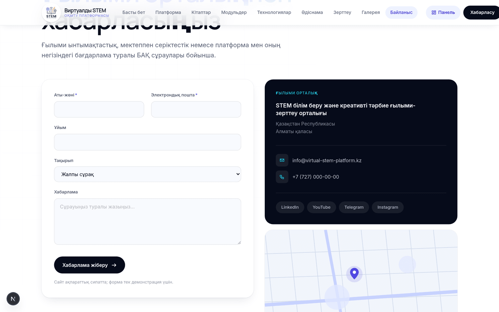

Галереяда нақты жоба материалдары: тарихи STEM моделі, маятник құрылғысы, маятник патенті. Лайтбокс толық пернетақтадан басқарылады (Esc / ← / →).

Байланыс бөлімінде демонстрацияға тапсырыс формасы бар (`aria-live` күй хабарламасымен).

### 4.15 Мобильді көрініс

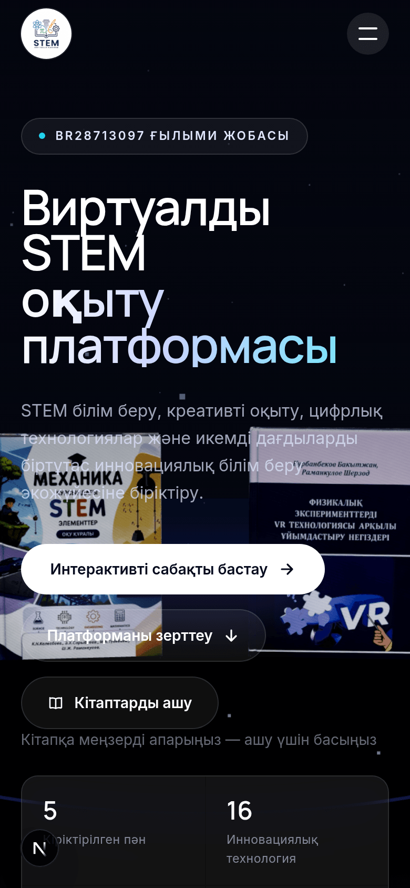

375 px және одан жоғары енде көлденең асып кету жоқ.

---

## 5. Панель (Dashboard)

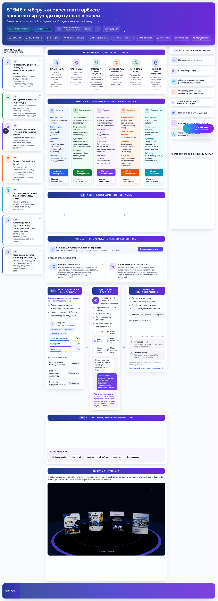

Панель `lib/dashboard.ts` файлындағы жобаның архитектуралық схемасының мәтіндік көшірмесіне сүйенеді. Схемадағы әрбір блок бір экспортқа сәйкес келеді:

| Схема орны | Экспорт | Компонент |
|---|---|---|
| Сол жақ бағана | `platformObjectives` | `ObjectivesRail` |
| Орталық 1 | `coreModules` | `CoreModules` |
| Орталық 2 | `subjectPanels` | `SubjectGrid` |
| Орталық 3 | `lessonStages` | `LessonFlow` |
| Орталық 3б | `lessons` | `LessonCatalogue` |
| Орталық 4 | `personalizedPath` / `adaptiveSystem` / `monitoring` | `AdaptiveRow` |
| Орталық 5 | `teamSimulator` | `TeamSimulator` |
| Орталық 6 | — | `DigitalLibrary` (3D кітапхана) |
| Оң жақ бағана | `multimediaResources` / `onlineTools` | `ResourceRail` |
| Төменгі жол | `outcomes` | `OutcomesFooter` |

### Навигация (`dashboardNav`)

| Белгі | Маршрут |
|---|---|
| Басты бет | `#dash-top` |
| 200 Викторина | `/dashboard/quiz` |
| Сабақтар | `/dashboard/lessons` |
| Кейс тапсырмалар | `/dashboard/cases` |
| Командалық ойын | `/dashboard/team-game` |
| VR/AR Тренажер | `/dashboard/resources/vr` |
| Электр тізбегі | `/dashboard/simulations/circuit` |
| Күн жүйесі | `/dashboard/simulations/astronomy` |
| Python Код | `/dashboard/simulations/code` |
| Мұғалім кабинеті | `/dashboard/teacher` |
| Жеке кабинет | `/dashboard/profile` |
| Кітапхана | `/dashboard/resources` |

### Алты негізгі модуль (`coreModules`)

Жобалық оқыту · Рөлдік ойындар · Модельдеу және симуляция · Шығармашылық тапсырмалар · Командалық жұмыс · Рефлексия және портфолио.

### Ғаламдық іздеу

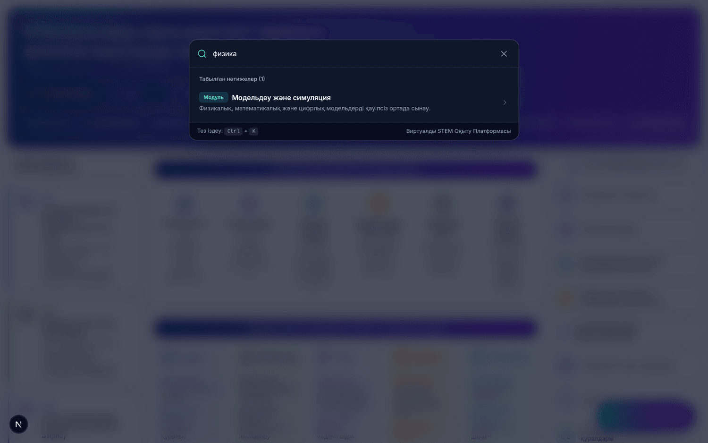

`Ctrl + K` — панель бойынша модульдер, сабақтар, ресурстар мен симуляциялардан іздеу.

### Қараңғы режим

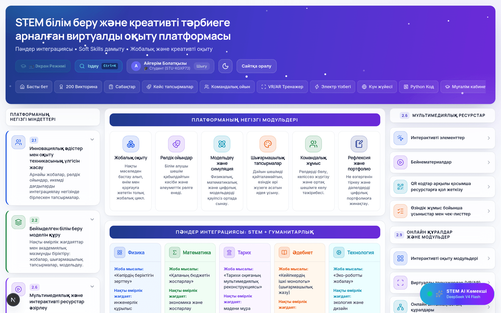

Тақырып `DashThemeShell` арқылы `localStorage`-та сақталады.

### Мобильді панель

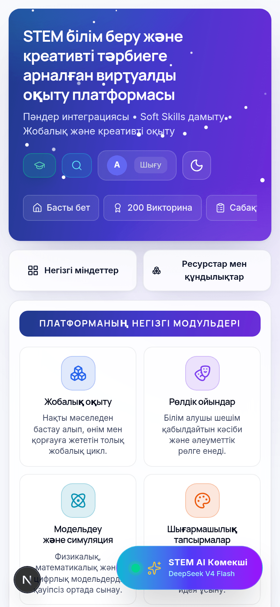

### Жеке кабинет

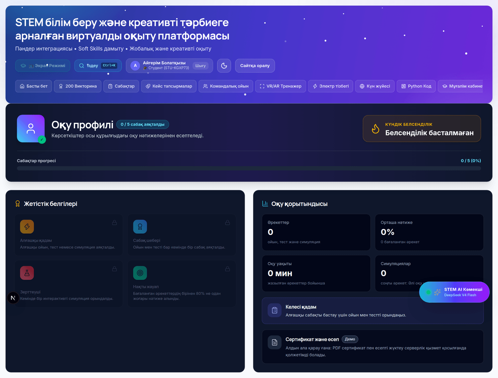

Профильде: пайдаланушы коды (`STU-…`), XP, құзыреттілік деңгейі, жетістіктер, оқу жоспары (`buildStudentPlan`), статистика (`loadStudentStats`), сертификат.

### Цифрлық кітапхана

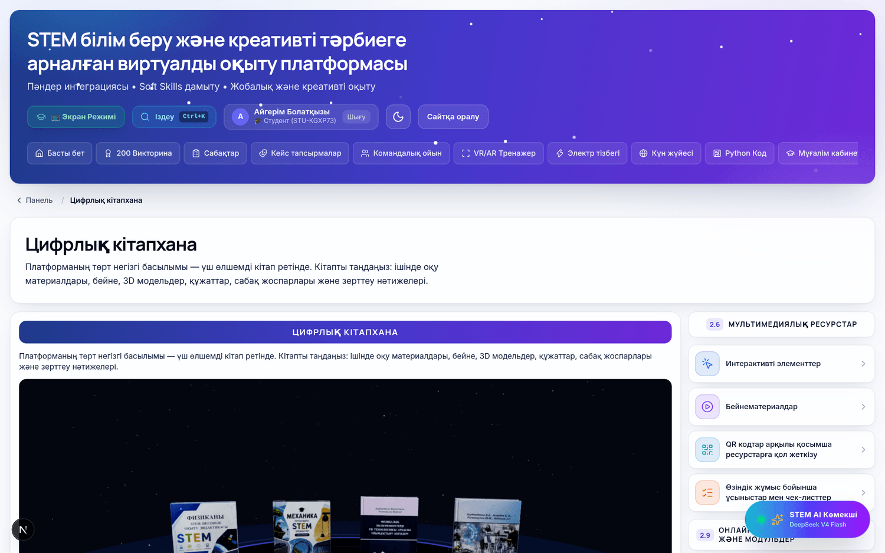

Панельдегі кітапхана сол төрт GLB кітапты 3D-де көрсетеді (`DigitalLibrary` → `BookScene`).

---

## 6. Аутентификация және рөлдер

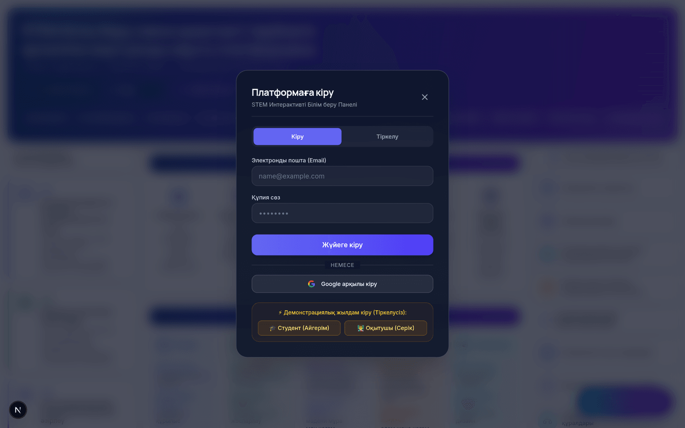

### Рөлдер

`student` · `teacher` · `admin` (`UserRole`).

### Кіру жолдары

1. **Email + құпия сөз** — тіркелу формасында рөл таңдалады.
2. **Google OAuth** — рөл `/auth/callback?role=…` арқылы қайтады немесе callback бетінде «Сіз кімсіз?» экраны бір рет сұрайды.
3. **Демонстрациялық жылдам кіру** — тіркелусіз: 🎓 Студент (Айгерім Болатқызы) немесе 👨‍🏫 Оқытушы (Серік Полатұлы).

### Рөлді қорғау

- Рөл `auth.users.raw_user_meta_data`-ға жазылады, `handle_new_user()` триггері `profiles`-ке көшіреді.
- `protect_profile_identity()` рөл мен кодты кейін өзгертуге жол бермейді.
- `roleLocked = false` тек OAuth тіркелуі мен рөл таңдау арасында ғана болады; `claim_role()` екінші шақыруда қате береді.

### Пайдаланушы коды

Әркімге тіркелген сәтте өзгермейтін қысқа код беріледі: `STU-A7K2M9` / `TCH-PJC3YS`. Ол navbar-да көрінеді, бір басқанда көшіріледі және іздеуде қолданылады.

### Оқытушы ↔ студент байланысы

- `teacher_links` — иерархиялық байланыс (pending / accepted / declined).
- Сұранысты **тек екінші жақ** қабылдай алады — бұл дерекқор триггерінде де бекітілген.
- `friend_links` — студент ↔ студент достығы, симметриялы, жұп реттелмеген түрде бірегей.
- `search_people()` — код, аты-жөні немесе **толық** email арқылы іздеу (email нәтижеде қайтарылмайды).

---

## 7. Оқу мазмұны: пәндер, сабақтар, модульдер, зертханалар

Платформада оқу мазмұнының **төрт тәуелсіз қабаты** бар. Оларды шатастырмау маңызды:

| Қабат | Файл | Саны | Мақсаты |
|---|---|---|---|
| **Пән панельдері** | `lib/dashboard.ts` → `subjectPanels` | 5 | Пәннің интеграциялық сипаттамасы (схеманың көшірмесі) |
| **Интерактивті сабақтар** | `lib/lessons.ts` → `lessons` | 5 | Алты кезеңнен өтетін нақты сабақ плеері |
| **Механика оқу модульдері** | `data/modules.ts` → `ALL_MODULES` | 10 | Bloom таксономиясымен толық курс модулі |
| **Зертханалық жұмыстар** | `data/labWorks.ts` → `LAB_WORKS` | 10 | PASCO жабдығымен орындалатын нақты зертханалық жұмыс |

### 7.1 Интерактивті сабақтар (5)

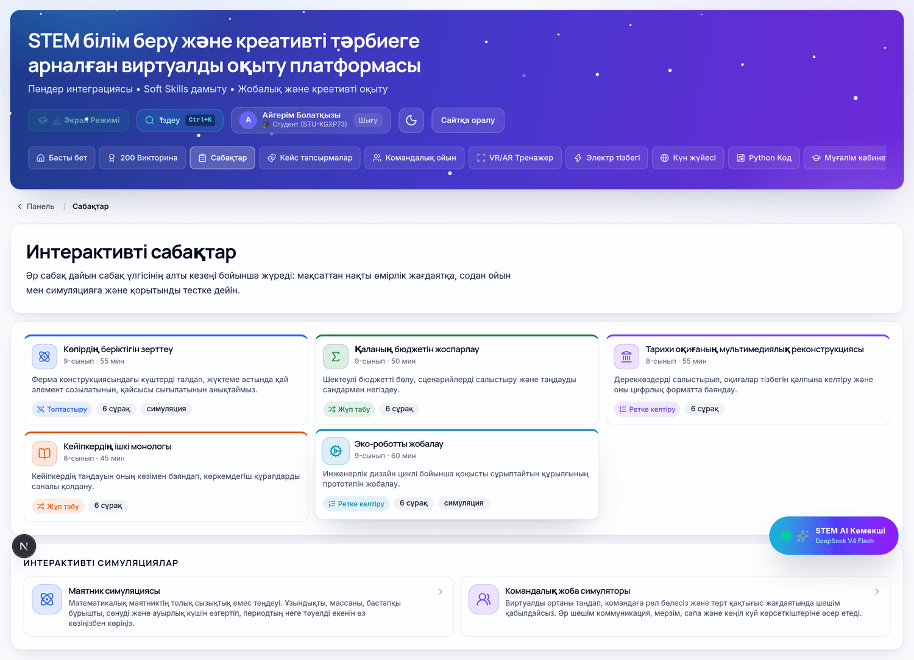

| ID | Пән | Атауы | Сынып | Ұзақтығы |
|---|---|---|---|---|
| `bridge-strength` | Физика | Көпірдің беріктігін зерттеу | 9-сынып | 55 мин |
| `city-budget` | Математика | Қаланың бюджетін жоспарлау | 9-сынып | 50 мин |
| `historic-reconstruction` | Тарих | Тарихи оқиғаның мультимедиялық реконструкциясы | 8-сынып | 55 мин |
| `inner-monologue` | Әдебиет | Кейіпкердің ішкі монологы | 8-сынып | 45 мин |
| `eco-robot` | Технология | Эко-роботты жобалау | 9-сынып | 60 мин |

Жоба атаулары `subjectPanels[].project` тізіміндегі атаулармен **бірдей** — платформа бойы бір жоба туралы айтылып тұрғаны көрініп тұруы үшін.

#### Сабақтың алты кезеңі (`STAGE_ORDER`)

| № | Кезең | Ішінде не бар |
|---|---|---|
| 1 | **Мақсаттар** (`goals`) | Оқу мақсаттары + икемді дағдылар |
| 2 | **Нақты өмірлік жағдаят** (`context`) | Жағдаят, зерттеу сұрағы, деректер |
| 3 | **Іс-әрекет / тапсырмалар** (`activity`) | **Интерактивті ойын** (`GameSpec`) |
| 4 | **Цифрлық ресурстар** (`resources`) | **Симуляция** (`SimId`) + материалдар |
| 5 | **Топтық жұмыс және рефлексия** (`teamwork`) | Талқылау сұрақтары + командалық симулятор |
| 6 | **Бағалау** (`assessment`) | **Тест** (`QuizSpec`) |

**1-кезең — Мақсаттар:**
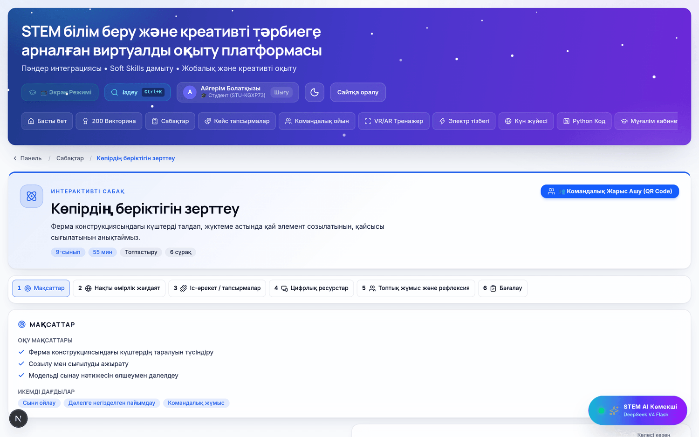

**3-кезең — Ойын (топтастыру):**
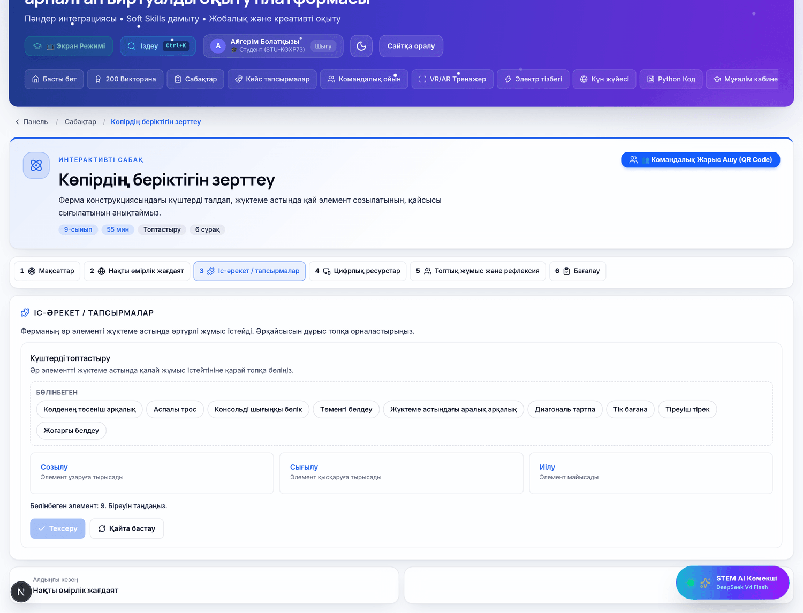

**4-кезең — Цифрлық ресурстар:**
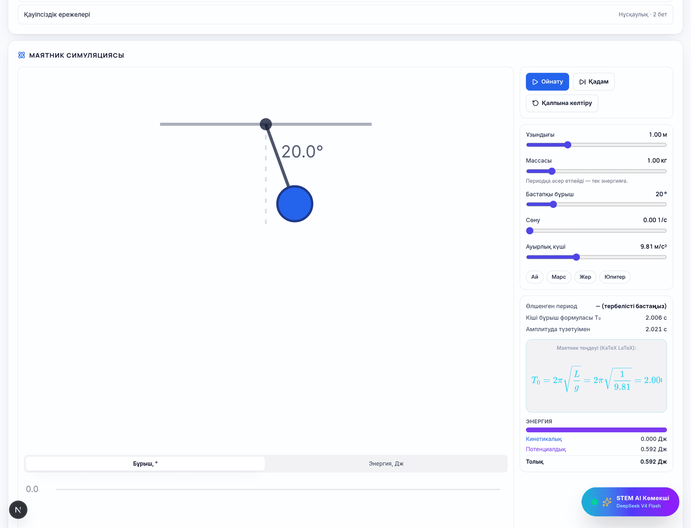

**5-кезең — Топтық жұмыс:**
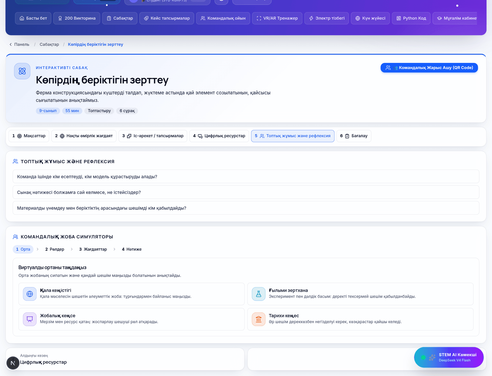

**6-кезең — Бағалау:**
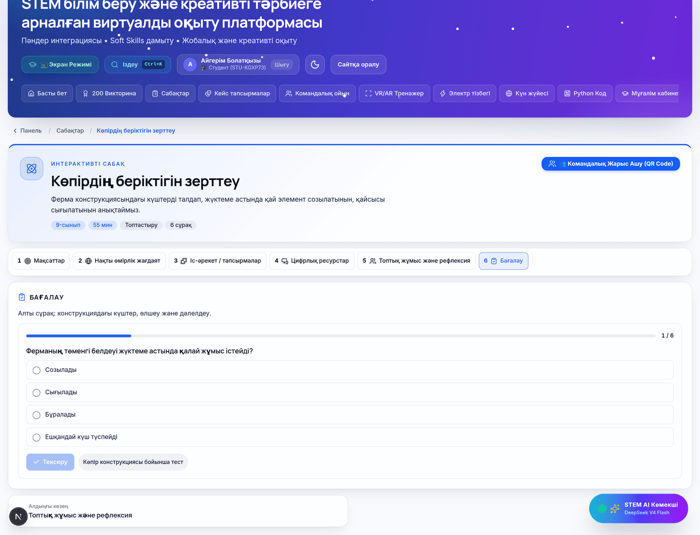

Сабақ бетінен бірден **«Командалық Жарыс Ашу (QR Code)»** түймесі арқылы сол сабақ сұрақтарымен командалық ойын бөлмесін ашуға болады.

### 7.2 Механика оқу модульдері (10)

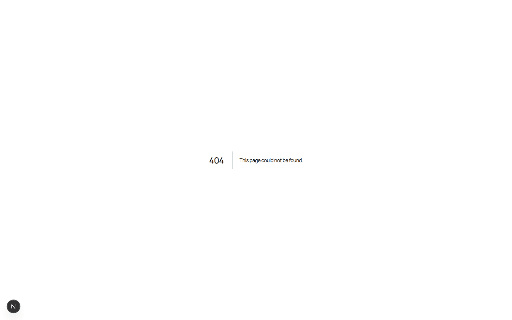

| № | Slug | Атауы |
|---|---|---|
| 1 | `mechanika-kirispe` | Механикаға кіріспе |
| 2 | `kinematika` | Кинематика |
| 3 | `dinamika` | Динамика |
| 4 | `newton-zandary` | Ньютон заңдары |
| 5 | `zhumys-energiya` | Жұмыс және энергия |
| 6 | `impuls` | Импульс |
| 7 | `aynalmaly-qozgalys` | Айналмалы қозғалыс |
| 8 | `tербelister` | Тербелістер |
| 9 | `suiyqtar-mehanikasy` | Сұйықтар механикасы |
| 10 | `ingenerlik-mehanika` | Инженерлік механика |

Әр модульдің құрылымы (`LessonModule` типі):

- `youtubeId` + `videoDurationMinutes` — бейнесабақ
- `objectives` — оқу мақсаттары
- **`bloom`** — Bloom таксономиясының алты деңгейі: remember, understand, apply, analyze, evaluate, create
- `lectureSummary` — дәріс түйіні (абзацтар)
- `keyConcepts` — негізгі ұғымдар
- `glossary` — глоссарий (3–8 термин, `data/glossaryExtra.ts` арқылы кеңейеді)
- `reflectionQuestions` — рефлексия сұрақтары
- **`assignment` (БӨЖ)** — нақты инженерлік жағдаят + тапсырмалар + тапсыру түрлері (`text`, `image`, `pdf`, `video`, `voice`)
- `quiz` — тест сұрақтары
- `game` — ойын

> **Мазмұн тереңдігі.** 1–2 модульдер толық авторлық тереңдікте жазылған (10 тест сұрағынан). 3–10 модульдер `TEMPLATE_SEEDS` арқылы сол схемамен, бірақ жеңілірек мазмұнмен құрастырылады (5 сұрақтан) — мұғалім/әкімші оларды кодқа тимей Мұғалім кабинетінен кеңейте алады.

### 7.3 Зертханалық жұмыстар (10)

| № | Атауы | Жабдық | Сабақ | Сахна |
|---|---|---|---|---|
| 1 | Бірқалыпты түзу сызықты қозғалысты зерттеу | Wireless Motion Sensor, Smart Cart | 2 | 2 |
| 2 | Бірқалыпты үдемелі қозғалысты зерттеу | Wireless Motion Sensor, Smart Cart | 2 | 2 |
| 3 | Ньютонның II заңын эксперименттік тексеру | Smart Cart (кірістірілген күш датчигі) | — | — |
| 4 | Үйкеліс коэффициентін анықтау | — | — | 11 |
| 5 | Импульстің сақталу заңын зерттеу | — | — | 6 |
| 6 | Механикалық энергияның сақталу заңын зерттеу | — | — | 5 |
| 7 | Серіппелі маятниктің тербелісін зерттеу | — | — | 8 |
| 8 | Еркін түсу үдеуін анықтау | — | — | 12 |
| 9 | Айналмалы қозғалысты зерттеу | Rotary Motion Sensor | — | 13 |
| 10 | Айналу моменті және инерция моментін анықтау | — | — | 7 |

> Зертханалық жұмыстар мен сабақтар **бір-біріне сәйкес келмейді**: 2-сабақ үш жұмысты алып жүр, ал 1, 9, 10 сабақтарда жұмыс жоқ. Оларды сабақ нөмірлеуіне мәжбүрлеп сыйдыру — не сабақтарды қайта атау, не сыймаған жұмыстарды үнсіз алып тастау дегенді білдірер еді, сондықтан зертханалық жұмыстардың өз идентификациясы бар.

---

## 8. ТЕСТТЕР — толық тізім

Платформада **бес түрлі тест жүйесі** бар. Барлығы қосқанда **1000 + 60 + 30 + 60 + 7 сұрақтан** тұрады.

### 8.1 Жағдаяттық викториналар — 1000 сұрақ (негізгі жүйе)

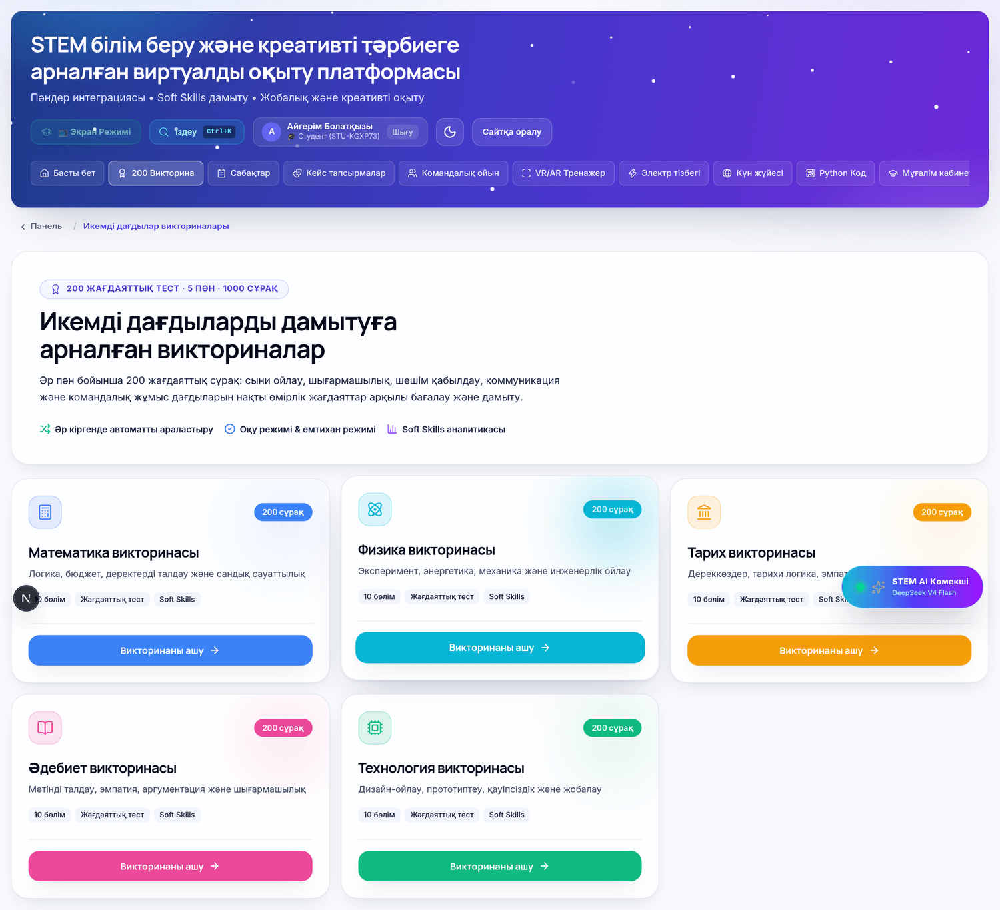

**Файл:** `data/subjectQuizzes.ts` (16 126 жол)
**Маршрут:** `/dashboard/quiz` → `/dashboard/quiz/[id]`
**Плеер:** `components/dashboard/SubjectQuizPlayer.tsx`

| Пән | ID | Сұрақ саны | Түсі | Ұраны |
|---|---|---|---|---|
| Математика | `mathematics` | **200** | `#3b82f6` | Логика, бюджет, деректерді талдау, сандық сауаттылық |
| Физика | `physics` | **200** | — | Механика, эксперимент, энергия, қауіпсіздік |
| Тарих | `history` | **200** | — | Дереккөз, себеп-салдар, эмпатия, аргументация |
| Әдебиет | `literature` | **200** | — | Мәтінді түсіну, эмпатия, пікірталас, шығармашылық |
| Технология | `technology` | **200** | — | Жобалау, прототип, цифрлық жауапкершілік |
| **Барлығы** | | **1000** | | |

#### Сұрақтың құрылымы (`QuizQuestionItem`)

```ts
{
  num: 1,
  id: "physics_q1",
  prompt: "...",                       // жағдаяттық сұрақ
  options: [A, B, C, D],               // әрқашан 4 нұсқа
  answer: 0,                           // 0=A, 1=B, 2=C, 3=D
  answerLetter: "A",
  skill: "Коммуникация және пікірталас мәдениеті",  // өлшенетін икемді дағды
  note: "...",                         // міндетті емес түсіндірме
  section: "IX. Командалық жұмыс және ғылыми коммуникация"
}
```

#### Әр пәннің 10 бөлімі

**Математика:** I. Логикалық ойлау және заңдылықтар · II. Күнделікті есептеулер мен пропорция · III. Қаржылық сауаттылық және бюджет · IV. Деректерді талдау, кесте, диаграмма · V. Геометрия, кеңістік, дизайн · VI. Өлшеу, бағалау, дәлдік · VII. Жоспарлау, уақыт, ресурс · VIII. Командалық жұмыс және математикалық коммуникация · IX. Сыни ойлау және ақпараттық сауаттылық · X. Шығармашылық, жоба, шешім қабылдау

**Физика:** I. Механика және күнделікті өмір · II. Физикалық эксперимент және зерттеушілік әрекет · III. Энергия, экология, тұрақты даму · IV. Электр және қауіпсіздік · V. Жылу құбылыстары және молекулалық физика · VI. Оптика, дыбыс, толқындар · VII. Астрономия, атом, заманауи физика · VIII. Инженерлік дизайн және физикалық жобалар · IX. Командалық жұмыс және ғылыми коммуникация · X. Сыни ойлау, ақпараттық сауаттылық, шешім қабылдау

**Тарих:** 1. Дереккөздермен жұмыс және ақпаратты тексеру · 2. Себеп-салдар, хронология, тарихи логика · 3. Тарихи тұлғалар, эмпатия, көзқарастар · 4. Пікірталас, аргументация, коммуникация · 5. Тарихи жоба, команда, шығармашылық · 6. Карталар, кестелер, статистика · 7. Медиа, жалған ақпарат, тарихи мифтер · 8. Шешім қабылдау және балама сценарийлер · 9. Мәдени мұра, азаматтық жауапкершілік, этика · 10. Зерттеу, презентация, өзін-өзі ұйымдастыру

**Әдебиет:** 1. Мәтінді түсіну және негізгі ой · 2. Кейіпкерді түсіну және эмпатия · 3. Дәлелді пікір және пікірталас мәдениеті · 4. Шығармашылық және қиял · 5. Коммуникация және презентация · 6. Командалық жұмыс және көшбасшылық · 7. Сыни оқу және медиасауаттылық · 8. Құндылықтар және этикалық шешімдер · 9. Зерттеу, ақпарат іздеу, жоба · 10. Рефлексия және өмірмен байланыстыру

**Технология:** сол схема бойынша 10 бөлім (жобалау, прототип, цифрлық жауапкершілік, командалық мәдениет т.б.).

#### Өлшенетін дағдылар

Сұрақтар **290-нан астам** нақтыланған икемді дағды белгісімен таңбаланған. Негізгілері: Сыни ойлау · Мәселені шешу · Деректерді талдау · Шығармашылық · Командалық жұмыс · Коммуникация · Шешім қабылдау · Ақпараттық сауаттылық · Жоспарлау · Өзін-өзі басқару · Қаржылық сауаттылық · Икемділік · Медиасауаттылық · Тарихи эмпатия · Академиялық адалдық · Жүйелік ойлау · Келіссөз жүргізу · Белсенді тыңдау · Рефлексия.

#### Плеердің мүмкіндіктері

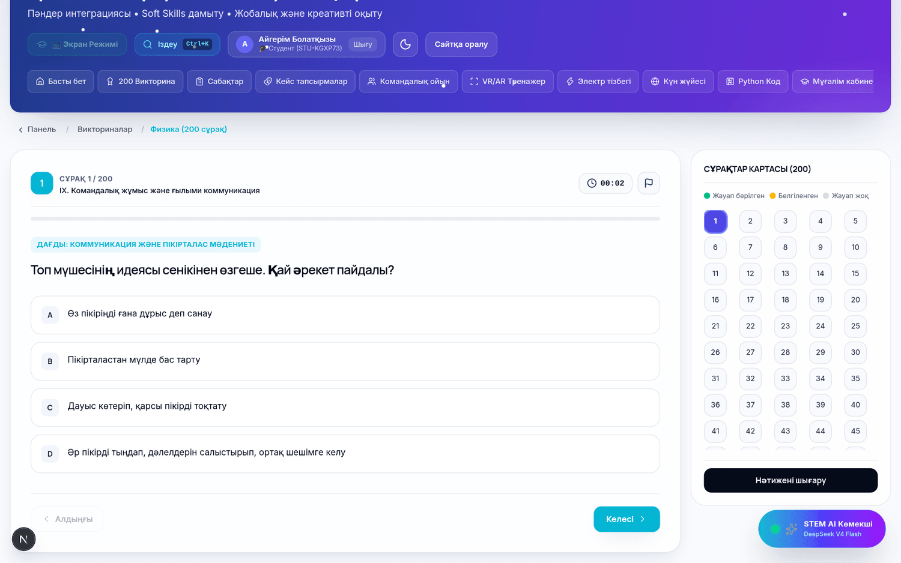

- **200 сұрақтың картасы** оң жақта: жауап берілген (жасыл) / белгіленген (сары) / жауап жоқ (сұр)
- Әр сұраққа **таймер** және **жалауша** (кейін оралу үшін)
- Сұрақтың **бөлімі** мен **дағдысы** тақырып ретінде көрсетіледі
- «Алдыңғы» / «Келесі» навигациясы, кез келген сұраққа тікелей секіру
- **«Нәтижені шығару»** — қорытынды бағалау
- `shuffleQuestions()` — сұрақтарды және нұсқаларды араластыру (дұрыс жауап индексін сақтай отырып)

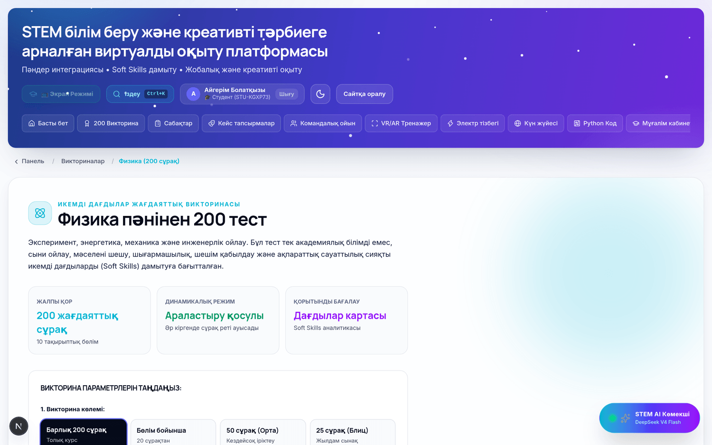

### 8.2 Сабақ тесттері — 30 сұрақ

**Файл:** `lib/lessons.ts` → `QuizSpec`
**Орны:** әр сабақтың 6-кезеңі

| Сабақ | Тест ID | Сұрақ |
|---|---|---|
| Көпірдің беріктігін зерттеу | `bridge-quiz` | 6 |
| Қаланың бюджетін жоспарлау | `budget-quiz` | 6 |
| Тарихи реконструкция | `history-quiz` | 6 |
| Кейіпкердің ішкі монологы | `literature-quiz` | 6 |
| Эко-робот | `robot-quiz` | 6 |
| **Барлығы** | | **30** |

#### Сұрақ түрлері

| Түрі | Саны | Сипаты |
|---|---|---|
| `single` | 16 | Бір дұрыс жауап |
| `multi` | 6 | Бірнеше дұрыс жауап |
| `boolean` | 11 | «Дұрыс» / «Қате» |

#### Бағалау логикасы

```ts
passScore: 70          // барлық сабақта өту шегі — 70%
```

- `multi` сұрағы **толық сәйкестікпен** бағаланады: жартылай ұпай жоқ. Себебі: оқушыға да, мұғалімнің рубрикасына да түсіндіру оңай.
- `boolean` сұрағының нұсқалары тұрақты ретте: `["Дұрыс", "Қате"]`.
- `scoreQuiz()` → `{ correct, total, score }`, мұндағы `score = round(100 × correct / total)`.

### 8.3 Модуль тесттері — 60 сұрақ

**Файл:** `data/modules.ts`

| Модуль | Сұрақ |
|---|---|
| 1. Механикаға кіріспе | 10 |
| 2. Кинематика | 10 |
| 3–10 (шаблондық) | 5 × 8 = 40 |
| **Барлығы** | **60** |

`randomizeQuiz(moduleId)` — Fisher–Yates араластыруы: сұрақтар да, әр сұрақтың нұсқалары да араласады, ал `correctIndex` жаңа орнына сәйкес қайта есептеледі.

### 8.4 Кейс сұрақтары — 60 сұрақ

**Файл:** `lib/caseTasks.ts`

Әр кейсте 3 раунд × 4 рөл = **12 сұрақ**, 5 кейс → **60 сұрақ**.

Ерекшелігі: **сұрақ рөлге байланған**. Тәжірибе жасаушыдан тәжірибенің әділдігі сұралады, бақылаушыдан — байқағанын қалай айту керегі. Әркім өз сұрағын алады, жауаптарды қосқанда команданың ортақ нәтижесі шығады. Бір дұрыс жауап = **10 ұпай** (`POINTS_PER_CORRECT`).

### 8.5 Командалық STEM ойыны сұрақтары — 7 базалық + сабаққа арналған жиынтықтар

**Файл:** `lib/teamGame.ts` → `STEM_QUESTIONS`

| Санат | Мысал сұрақ |
|---|---|
| Физика | Ньютонның екінші заңы: F = m × a |
| Биология | Фотосинтез қай органоидта жүреді |
| Химия | Су молекуласындағы байланыс түрі |
| Математика | Пифагор теоремасы (3, 4 → 5) |
| STEM & Робототехника | Ультрадыбыстық датчик |

Әр сұрақта: `timeLimit` (20 с) және `points` (100). `getQuestionsForLesson(lessonId)` — нақты сабаққа арналған сұрақ жиынтығын қайтарады.

**Жылдамдық бонусы** (`calculatePointsWithSpeedBonus`):

| Қалған уақыт үлесі | Бонус |
|---|---|
| > 75% | +50 |
| > 50% | +30 |
| > 25% | +10 |
| ≤ 25% | 0 |

---

## 9. СИМУЛЯЦИЯЛАР — толық тізім

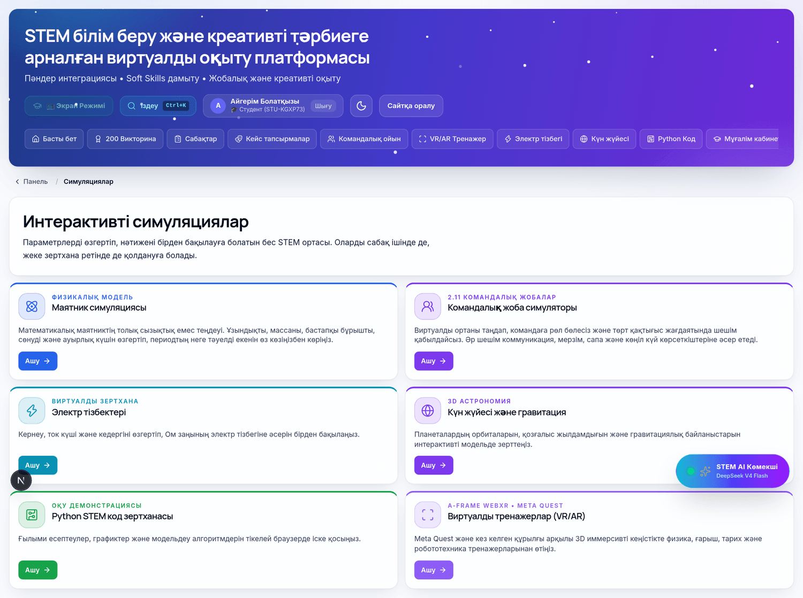

Каталог: `/dashboard/simulations` (`lib/simulations.ts` → `simulationCatalog`).

### 9.1 Маятник симуляциясы

**Маршрут:** `/dashboard/simulations/pendulum`
**Компонент:** `components/dashboard/Pendulum.tsx` + `PendulumChart.tsx`, физика — `lib/pendulum.ts`

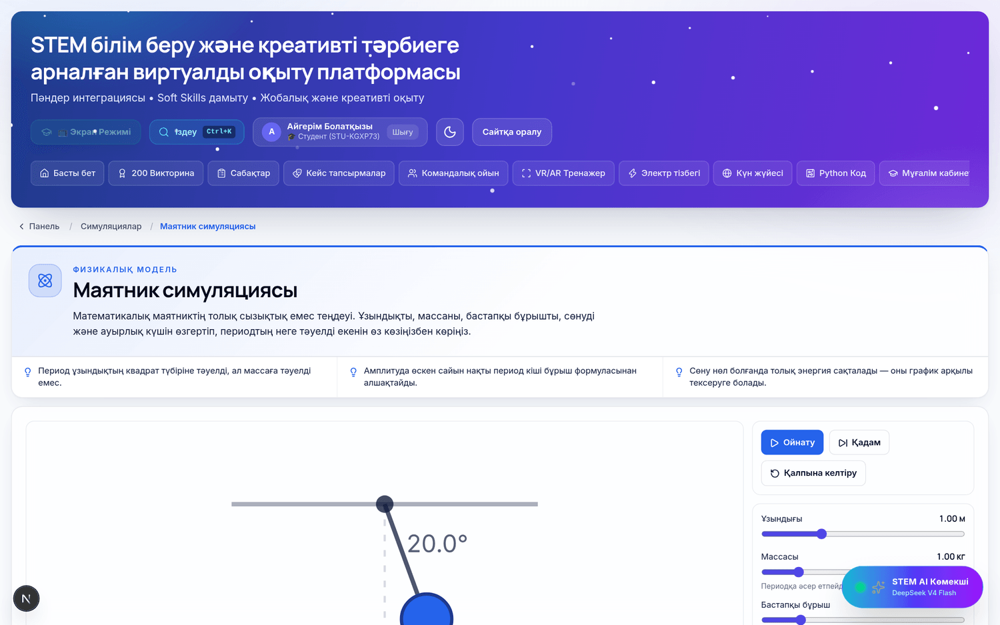

Математикалық маятниктің **толық сызықтық емес теңдеуі** (кіші бұрыш жуықтауы емес).

**Реттелетін параметрлер:** ұзындық (м) · масса (кг) · бастапқы бұрыш · сөну · ауырлық күші.
**Басқару:** Ойнату · Қадам · Қалпына келтіру.
**Көрсетілетін заңдылықтар:**
- Период ұзындықтың квадрат түбіріне тәуелді, ал массаға тәуелді емес (интерфейс массаны өзгерткенде «Периодқа әсер етпейді» деп ескертеді).
- Амплитуда өскен сайын нақты период кіші бұрыш формуласынан алшақтайды.
- Сөну нөл болғанда толық энергия сақталады — оны графиктен тексеруге болады.

### 9.2 Командалық жоба симуляторы

**Маршрут:** `/dashboard/simulations/team-project`
**Компонент:** `TeamSimPlayer.tsx`, логика — `lib/teamSim.ts`

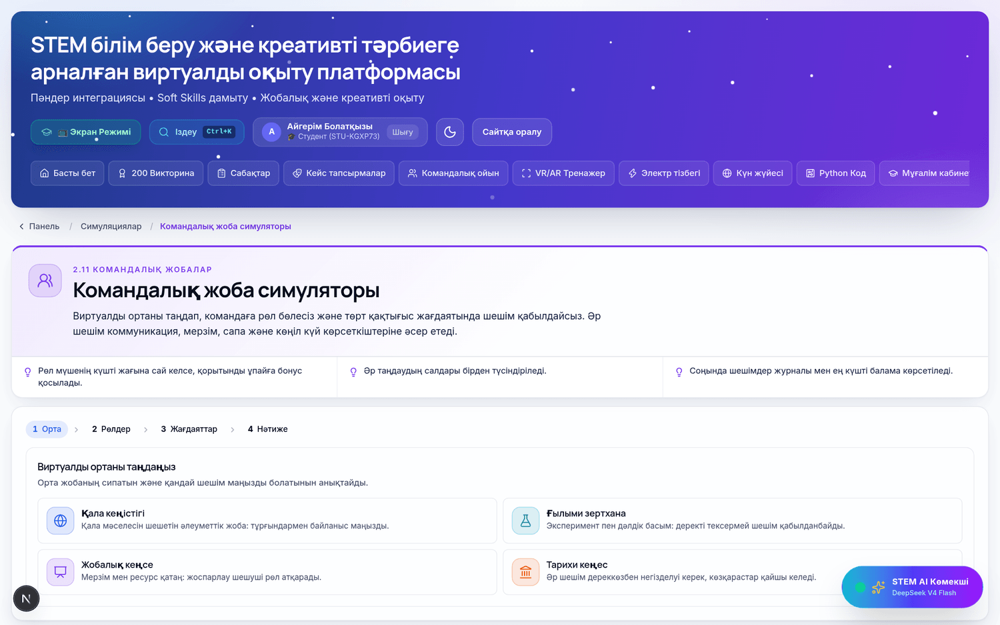

Ойын ағыны: **орта таңдау → рөлдерді бөлу → 4 қақтығыс сценарийі → қорытынды**.

**4 виртуалды орта:**

| ID | Атауы | Ерекшелігі |
|---|---|---|
| `city` | Қала кеңістігі | Тұрғындармен байланыс маңызды |
| `lab` | Ғылыми зертхана | Эксперимент пен дәлдік басым |
| `office` | Жобалық кеңсе | Мерзім мен ресурс қатаң |
| `council` | Тарихи кеңес | Әр шешім дереккөзбен негізделеді |

**6 рөл:** Жоба жетекшісі · Зерттеуші · Инженер · Дизайнер · Аналитик · Баяндамашы.

**6 команда мүшесі**, әрқайсысының мінездемесі мен күшті рөлдері бар (мысалы: Айсұлу — жоспарлауды ұнатады → `lead`, `analyst`).

**4 өлшеуіш (`METERS`), бастапқы мәні 60:** Коммуникация · Мерзім · Сапа · Көңіл күй.

**4 сценарий:** Мерзім қысқарды · Команда келіспеді · Ресурс жетіспейді · Техникалық ақау. Әр сценарийде 3 балама, әр таңдаудың салдары бірден түсіндіріледі.

**Қорытынды ұпай:**

```
score = clamp(round(орташа_өлшеуіш + fitBonus))
fitBonus = min(12, сәйкес_келген_рөл_саны × 3)
```

| Ұпай | Деңгей |
|---|---|
| ≥ 85 | Үлгілі команда |
| ≥ 70 | Тұрақты жұмыс |
| ≥ 55 | Даму үстінде |
| < 55 | Қайта қарау қажет |

Соңында шешімдер журналы және ең күшті балама көрсетіледі. Нәтиже 4 өлшемде беріледі: Жария таныстыру · Дайын өнім · Әлеуметтік әсер · Рефлексия есебі.

### 9.3 Электр тізбектері

**Маршрут:** `/dashboard/simulations/circuit`
**Компонент:** `CircuitSimulator.tsx`

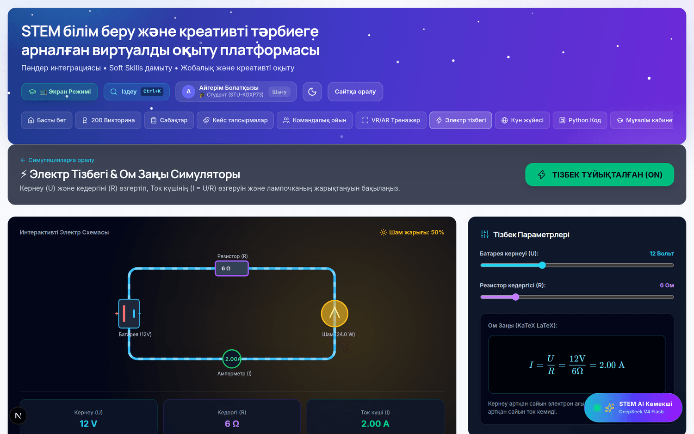

Кернеу, ток күші және кедергіні өзгертіп, **Ом заңының** электр тізбегіне әсерін бірден бақылау.

### 9.4 Күн жүйесі және гравитация

**Маршрут:** `/dashboard/simulations/astronomy`
**Компонент:** `AstronomySimulator.tsx`

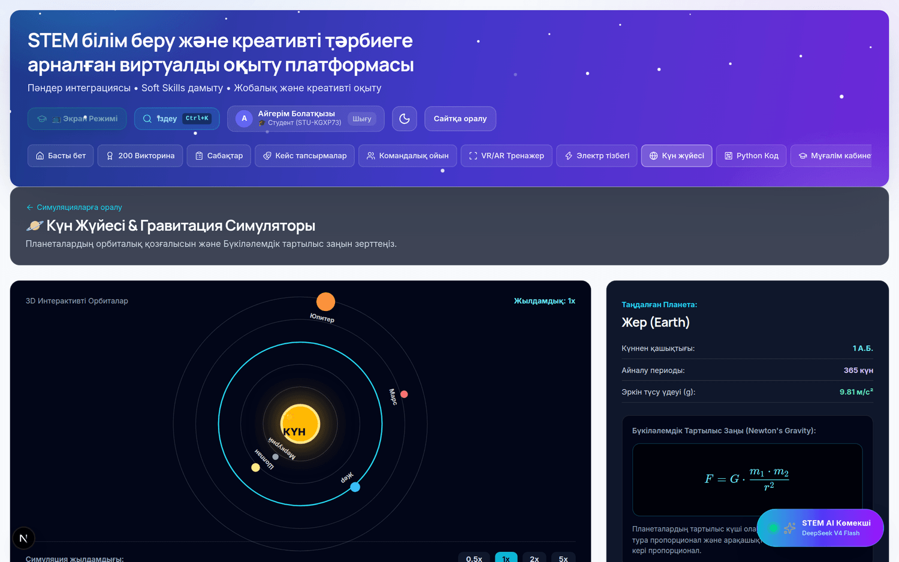

- 3D интерактивті орбиталар: Меркурий, Шолпан, Жер, Марс, Юпитер (және Сатурн).
- Симуляция жылдамдығы: 0.5× / 1× / 2× / 5×.
- Планетаны таңдағанда: Күннен қашықтығы (А.Б.), айналу периоды (күн), еркін түсу үдеуі (м/с²).
- Бүкіләлемдік тартылыс заңы KaTeX арқылы рендерленеді: `F = G · m₁m₂ / r²`.

### 9.5 Python STEM код зертханасы

**Маршрут:** `/dashboard/simulations/code`
**Компонент:** `PythonPlayground.tsx`

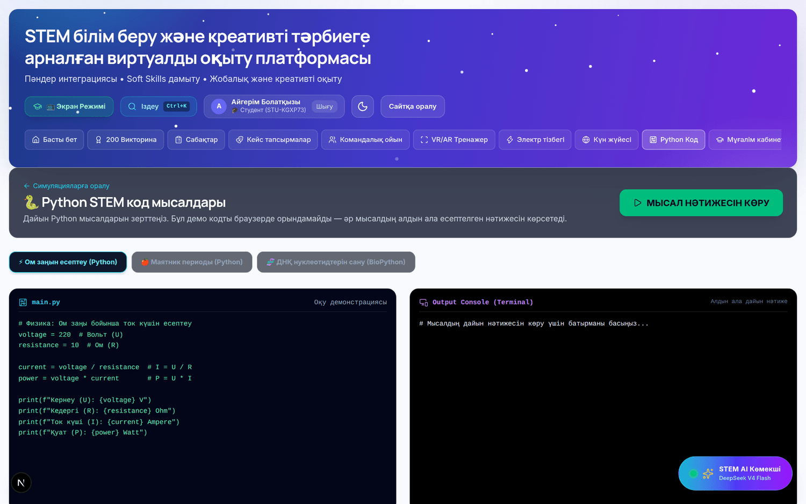

Ғылыми есептеулер, графиктер және модельдеу алгоритмдерін тікелей браузерде іске қосуға арналған оқу демонстрациясы.

### 9.6 VR/AR виртуалды тренажерлар

**Маршрут:** `/dashboard/resources/vr`
**Компонент:** `VRSimulator.tsx` (1351 жол)
**Технология:** Three.js high-fidelity + A-Frame WebXR · Meta Quest қолдауы

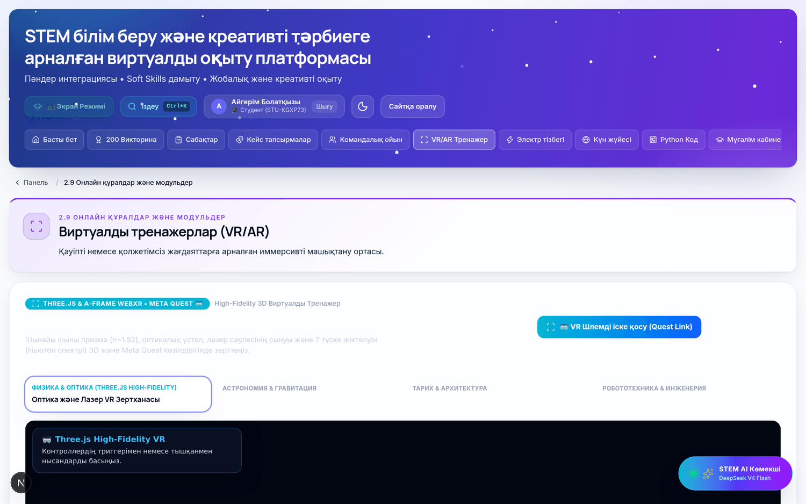

**4 иммерсивті сахна:**

| ID | Атауы | Санат | Тапсырмалар |
|---|---|---|---|
| `physics` | Оптика және Лазер VR Зертханасы | Физика & Оптика | 1) Лазер сәулесін призмаға бағыттап спектрді ашу 2) Призманы 45°-қа бұрып сыну бұрышын өзгерту 3) Спектр сәулесін фото-сенсорға түсіру |
| `space` | Күн Жүйесі және Ғарыштық Кеңістік VR | Астрономия & Гравитация | 1) Жер–Ай орбитасын бақылау 2) Сатурн сақиналары мен Юпитерді зерттеу 3) Орталық гравитацияны талдау |
| `history` | Жібек Жолы Тарихи Мұрасы 3D VR | Тарих & Архитектура | 1) Көгілдір қыш күмбезді қарау 2) Отырар құмырасының ою-өрнегін тексеру 3) Сауда дирхамдарын зерттеу |
| `robotics` | Инженерлік Манипулятор & Цифрлық Егіз | Робототехника & Инженерия | 1) 6-осьтік робот буындарын қозғалту 2) Қармауышты калибрлеу 3) Конвейердегі бөлшекті тасымалдау |

Физика сахнасында шынайы шыны призма (**n = 1.52**), оптикалық үстел, лазер сәулесінің сынуы және 7 түске жіктелуі (Ньютон спектрі) модельденеді.

**«VR Шлемді іске қосу (Quest Link)»** түймесі WebXR сессиясын ашады; онсыз да тінтуірмен/сенсормен басқарылады.

### 9.7 PASCO зертханалық сахналары (13)

**Файл:** `data/simulations.ts` → `SIMULATIONS`

Әр механика модуліне бір 3D сахна. Ауыр сахна компоненті талап бойынша жүктеледі (`SimulationPanel`), бұл файлда canvas орнатылмас бұрын қажет метадерек қана сақталады.

| # | Атауы | Жабдық | Уақыт |
|---|---|---|---|
| 1 | Санақ жүйесі және материалдық нүкте | Smart Cart, Motion Sensor | 8 мин |
| 2 | Бірқалыпты және үдемелі қозғалыс | Smart Cart, Motion Sensor | 12 мин |
| 3 | Ньютонның ІІ заңы: арба мен ілінген жүк | Smart Cart, Smart Gate | 12 мин |
| 4 | Ньютонның үш заңы бір рельсте | Smart Cart, Smart Gate | 14 мин |
| 5 | Көлбеу жазықтықтағы энергия айналымы | Smart Cart, Smart Gate | 12 мин |
| 6 | Серпімді және серпімсіз соққы | Smart Cart, Smart Gate | 14 мин |
| 7 | Инерция моменті: маховик | Smart Gate | 14 мин |
| 8 | Серіппелі және математикалық маятник | Smart Cart, Smart Gate | 15 мин |
| 9 | Архимед күші және қалқу шарты | (өз модельдері) | 12 мин |
| 10 | Көпір арқалығының иілуі мен беріктігі | Smart Cart | 15 мин |
| 11 | Үйкеліс коэффициентін анықтау | Smart Cart | 12 мин |
| 12 | Еркін түсу үдеуін анықтау | Smart Gate | 10 мин |
| 13 | Айналмалы қозғалысты зерттеу | Rotary Motion Sensor | 12 мин |

> 11–13 сахналары нөмірленуі бойынша он сабақтан асып тұр: олар өз сахнасы бұрыннан бар сабақтарға тиесілі белгіленген зертханалық жұмыстарға арналған.

### 9.8 3D модельдер

| Модель | Файл | Қолданылуы |
|---|---|---|
| 4 кітап | `public/models/book-*.glb` | Hero сахнасы, цифрлық кітапхана |
| Жасуша қимасы | `public/models/cell-cross-section.glb` | `Cell3DCanvas.tsx`, `CellModelCanvas.tsx` |
| Жасуша бөлшектері | `public/models/cell/model_0..12.obj` | Бастапқы дереккөз |

---

## 10. Ойындар және геймификация

### 10.1 Сабақ ойындары (3 түр)

**Файл:** `lib/lessons.ts` → `GameSpec`

| Түрі | Қазақша | Иконка | Компонент |
|---|---|---|---|
| `match` | Жұп табу | `Shuffle` | `MatchGame.tsx` |
| `order` | Ретке келтіру | `ListOrdered` | `OrderGame.tsx` |
| `categorize` | Топтастыру | `Group` | `CategorizeGame.tsx` |

Бес сабақта 8 ойын данасы бар (кейбір сабақта бірнеше). Мысалы, `bridge-strength` — «Күштерді топтастыру»: 9 конструкция элементін Созылу / Сығылу / Иілу топтарына бөлу.

### 10.2 Модуль ойындары (12 түр)

**Тип:** `GameType` (`lib/types.ts`)

`matching` · `crossword` · `memory` · `flashcards` · `wordsearch` · `dragdrop` · `fillblank` · `timeline` · `puzzle` · `spinwheel` · `sorting` · `conceptmap`

**Туынды ойындар** (`data/gameContent.ts`) — модуль мазмұнынан **автоматты құрастырылады**, seed арқылы:

| Функция | Ойын | Дереккөз |
|---|---|---|
| `buildCrossword(mod, seed)` | Кроссворд | `keyConcepts`, `glossary` |
| `buildWordSearch(mod, seed)` | Сөзтабу | `keyConcepts` |
| `buildBlanks(mod, seed)` | Бос орынды толтыру | `lectureSummary` |
| `buildSorting(mod, seed)` | Сұрыптау | Термин санаттары (Шама / Заң / Ұғым / Құбылыс) |
| `buildSpeedQuiz(mod, seed)` | Жылдам тест | `quiz` |

`availableDerivedGames()` — модульде жеткілікті материал бар ойындарды ғана қайтарады, сондықтан бос тақта ашылмайды.

### 10.3 Командалық STEM ойыны (реалтайм)

**Маршрут:** `/dashboard/team-game` (хост) және `/play?code=…` (ойыншы)
**Компоненттер:** `TeamGameHost.tsx` (721 жол), `TeamGamePlayer.tsx`, `QrCodeDisplay.tsx`
**Реалтайм:** `lib/supabase/teamGameRealtime.ts`

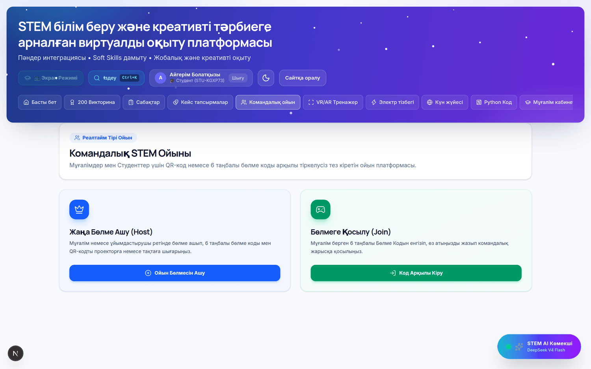

**Хост панелі:**

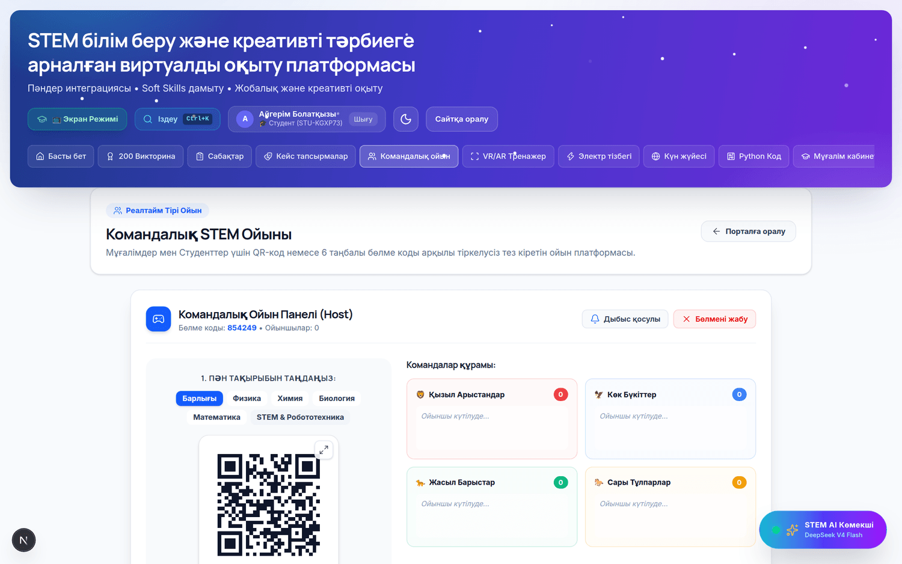

- **6 таңбалы бөлме коды** (мыс. `854249`) + **QR-код** (проекторға шығаруға болады, толық экран режимі бар)
- Пән санатын таңдау: Барлығы / Физика / Химия / Биология / Математика / STEM & Робототехника
- **4 команда:** 🦁 Қызыл Арыстандар · 🦅 Көк Бүкіттер · 🐆 Жасыл Барыстар · 🐎 Сары Тұлпарлар
- Дыбыс эффектілері (`lib/soundEffects.ts`)

**Ойын фазалары (`GamePhase`):** `lobby` → `countdown` → `question` → `reveal` → `leaderboard` → `game_over` → `room_closed`

**Ойыншы:**

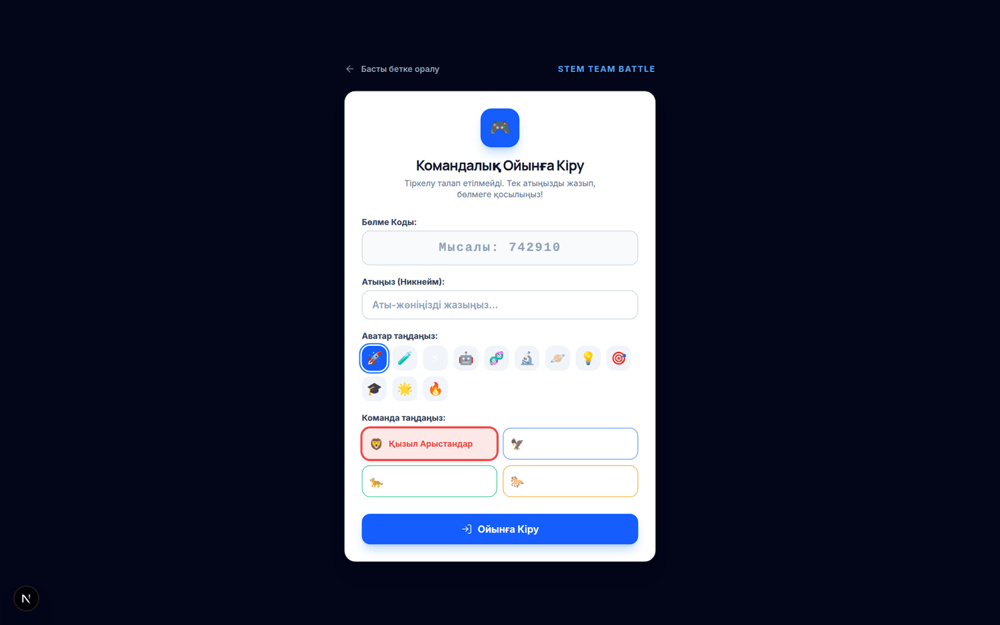

Тіркелусіз: код енгізу → аватар таңдау (12 эмодзи: 🚀 🧪 ⚡ 🤖 🧬 🔬 🪐 💡 🎯 🎓 🌟 🔥) → команда → ойын.

**Реакция эмодзилері:** 👏 🚀 🔥 💡 🎉 💯 ⭐

### 10.4 Кейс рөлдік ойыны (реалтайм)

**Компонент:** `CaseRoleplayRoom.tsx` (942 жол)
**Логика:** `lib/caseRoleplay.ts`, реалтайм — `lib/supabase/caseRoleplayRealtime.ts`
**Маршрут:** `/play/case`

**Фазалар:** `lobby` → `playing` → `finished`
**Бөлме коды:** 6 сан (командалық ойындағыдай)
**Аватарлар (12):** 🦊 🐼 🦉 🐝 🐢 🦁 🐧 🦋 🐰 🐨 🦄 🐬
**Ұпай:** дұрыс жауап = 10 ұпай
**Таймер:** раунд ұзақтығынан есептеледі, күйде бөлек сақталмайды (`secondsLeft()`)
**Чат:** бөлменің ішінде командалық чат бар

### 10.5 Дуэль

**Миграция:** `0006_duels.sql`

Әділдік бір бүтін санға тіреледі: әр тақта — (сабақ, ойын, seed) функциясы, сондықтан бір `seed` екі ойыншыға **бірдей** кроссворд, бірдей араластырылған сұрақтар береді. Нақты уақыттағы байланыс қажет емес — дуэльді автобуста да аяқтауға болады. Триггер өз нәтижеңді ғана жазуға рұқсат етеді және жазылған ұпайды өзгертпейді.

### 10.6 Жетістіктер

`earnedAchievements()` (`lib/progress.ts`):

| Жетістік | Шарты |
|---|---|
| **Зерттеуші** | ≥ 3 симуляция орындалды |
| **Команда сүйенішті** | `team-project` симуляторында ≥ 70 ұпай |
| **Шығармашыл** | ≥ 2 ойын 100 ұпайға аяқталды |

---

## 11. Кейс тапсырмалар

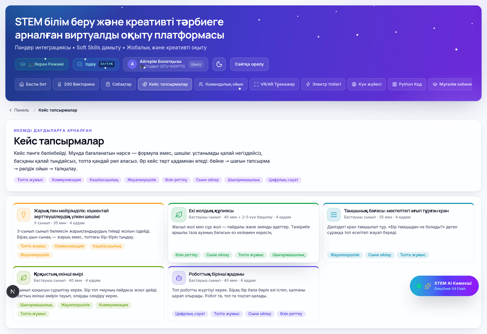

**Файл:** `lib/caseTasks.ts` (1519 жол)
**Маршрут:** `/dashboard/cases` → `/dashboard/cases/[id]`
**Плеер:** `CaseTaskPlayer.tsx`

> **Неге кейстер пән бойынша бөлінбейді.** Сабақтар пән бойынша бөлінеді, ал кейстер бөлінбейді: мұнда өлшенетін нәрсе пәндік білім емес, **икемді дағды** — бір-бірін тыңдау, әділ бөлісу, топта рөл алу, жауапкершілік. Сондықтан әр кейс `SkillAxis` бойынша (аналитикадағы дағды радарының дәл сол осьтері) белгіленеді.

### Бес кейс

| ID | Атауы | Сынып | Ұзақтығы | Дағдылар |
|---|---|---|---|---|
| `light-and-kindness` | Жарық пен мейірімділік: кішкентай зерттеушілердің үлкен шешімі | 3-сынып | 35 мин | Топта жұмыс, Коммуникация, Көшбасшылық, Жауапкершілік |
| `two-roads` | Екі жолдың құпиясы | Бастауыш | 40 мин + 2–3 күн бақылау | Өзін реттеу, Сыни ойлау, Топта жұмыс, Шығармашылық |
| `water-drop` | Тамшының бағасы: мектептегі ағып тұрған кран | Бастауыш | 35 мин | Жауапкершілік, Сыни ойлау, Топта жұмыс |
| `second-life` | Қоқыстың екінші өмірі | Бастауыш | 40 мин | Шығармашылық, Жауапкершілік, Коммуникация, Топта жұмыс |
| `robot-first-step` | Роботтың бірінші қадамы | Бастауыш | 40 мин | Цифрлық сауат, Топта жұмыс, Сыни ойлау, Өзін реттеу |

### Кейстің төрт қадамы

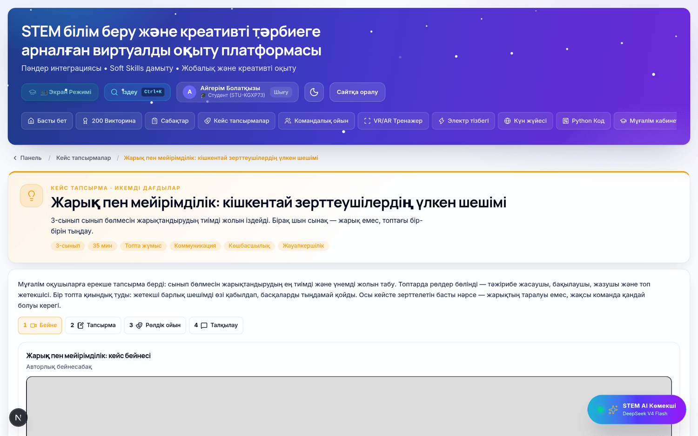

| № | Қадам | Мазмұны |
|---|---|---|
| 1 | **Бейне** | Жағдаятпен танысу. «Бейнеден нені іздейміз» тізімі беріледі |
| 2 | **Тапсырма** | Қысқа жеке жауап (кемінде **80 таңба**), чек-парақ пен нұсқау |
| 3 | **Рөлдік ойын** | Достарды шақырып ойнау; жиналмаса — өткізіп жіберуге болады |
| 4 | **Талқылау** | Сыныпта ауызша қорытындылау (4–5 рефлексия сұрағы) |

**1-қадам — Бейне:**
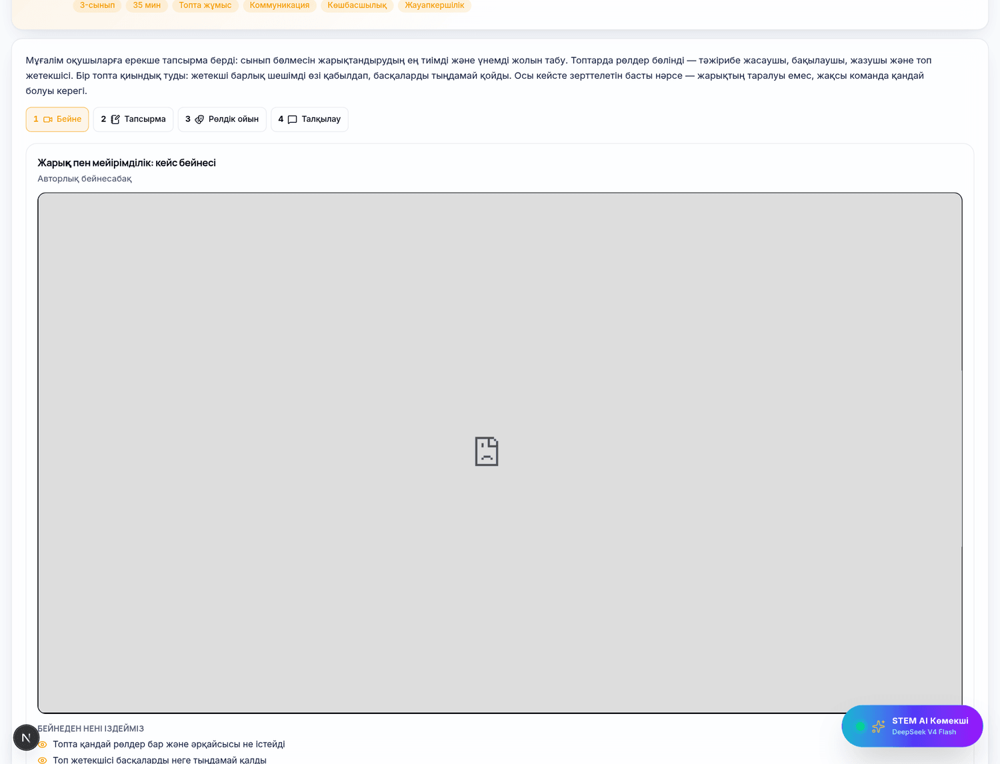

**2-қадам — Тапсырма:**
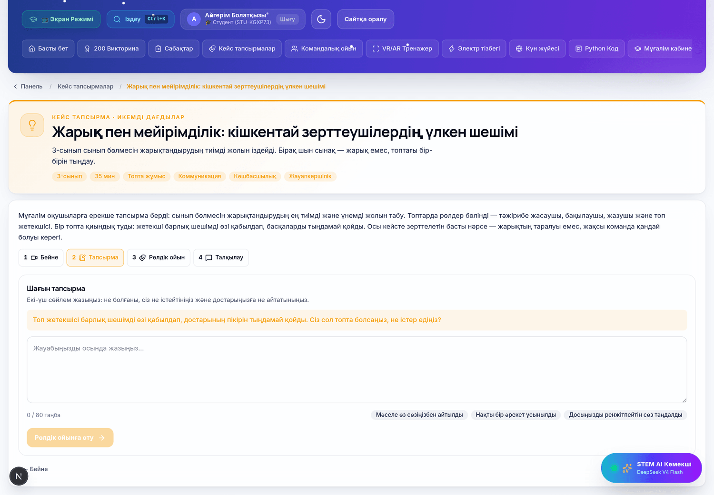

**3-қадам — Рөлдік ойын:**
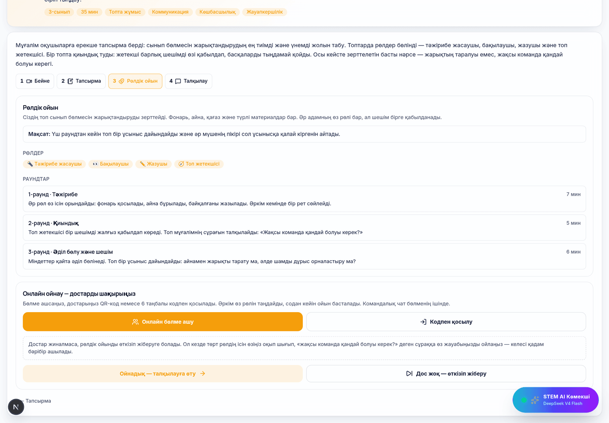

**4-қадам — Талқылау:**
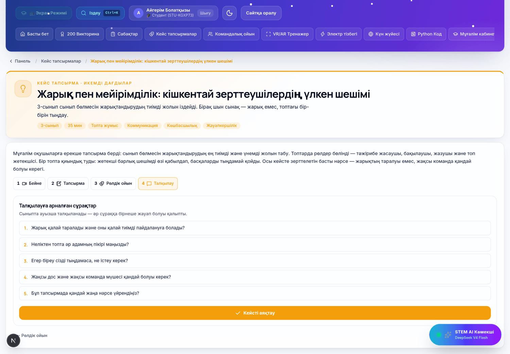

### Рөлдік ойынның құрылымы

Мысал: «Жарық пен мейірімділік»

**4 рөл:** 🔦 Тәжірибе жасаушы · 👀 Бақылаушы · ✏️ Жазушы · 🧭 Топ жетекшісі

Әр рөлде: `mission` (бір жолдық түйін), `brief` (нақты іс), `asks` (басқаларға қоятын сұрақтар).

**3 раунд:**

| Раунд | Атауы | Уақыт | Мазмұны |
|---|---|---|---|
| 1 | Тәжірибе | 7 мин | Әр рөл өз ісін орындайды: фонарь қосылады, айна бұрылады, байқалғаны жазылады |
| 2 | Қиындық | 5 мин | Топ жетекшісі шешімді жалғыз қабылдап көреді; топ «жақсы команда қандай болуы керек?» сұрағын талқылайды |
| 3 | Әділ бөлу және шешім | 6 мин | Міндеттер қайта әділ бөлінеді, топ бір ұсыныс дайындайды |

**Онлайн ойнау:** «Онлайн бөлме ашу» → QR-код немесе 6 таңбалы код → әркім рөлін таңдайды → ойын басталады, чат бөлменің ішінде.

**Жалғыз орындау нұсқасы:** достар жиналмаса, төрт рөлдің ісін өзің оқып шығып, негізгі сұраққа жауабыңды ойлайсың — келесі қадам бәрібір ашылады («Дос жоқ — өткізіп жіберу»).

### Бейне сценарийлері

`docs/case-video-briefs.md` — үш жаңа кейске арналған 30–35 секундтық бейне сценарийлері (higgsfield.ai үшін). Талаптар: қазақша, бастауыш сынып аудиториясы, 16:9, **шешім көрсетілмейді — сұрақпен бітеді**. Бейне дайын болғанда YouTube ID `lib/caseTasks.ts` ішіндегі `video.youtubeId` өрісіне жазылады.

### Жауаптарды тексеру

`0011_case_responses.sql` + `lib/supabase/caseResponses.ts` — оқушының жазба жауабы Supabase-ке сақталады, мұғалім `CaseResponseReview.tsx` арқылы қарайды. Триггер бағандарды бөліп қояды: **жұмыс оқушынікі, баға мұғалімнікі**.

---

## 12. Бағалау жүйесі, аналитика және XP

### 12.1 Құзыреттілік рубрикасы (10 критерий)

**Файл:** `lib/competency.ts`

| Кілт | Критерий | Сипаты |
|---|---|---|
| `knowledge` | Механика білімі | Заңдар мен ұғымдарды меңгеру деңгейі |
| `ict` | АКТ құзыреттілігі | Цифрлық құралдарды тиімді пайдалану |
| `infoSearch` | Ақпарат іздеу дағдысы | Қажетті ақпаратты тауып, іріктей білу |
| `digitalComm` | Цифрлық коммуникация | Онлайн ортада тиімді қарым-қатынас |
| `criticalThinking` | Сыни тұрғыдан ойлау | Талдап, негізделген қорытынды жасау |
| `independentLearning` | Өзіндік оқу дағдысы | Өз бетінше жоспарлап оқуды басқару |
| `aiUsage` | ЖИ құралдарын пайдалану | AI тьюторды тиімді әрі этикалық пайдалану |
| `practicalApplication` | Практикалық қолдану | Теорияны нақты есептерге қолдану |
| `creativity` | Шығармашылық | Түпнұсқа шешімдер ұсыну |
| `reflection` | Рефлексия | Өз оқу үдерісін бағалап жетілдіру |

**5 деңгей:** 1 — Бастапқы (Beginning) · 2 — Дамушы (Developing) · 3 — Құзыретті (Competent) · 4 — Жетік (Advanced) · 5 — Сарапшы (Expert).

`rubricLevelToPercent`: деңгей 1 → 20%, деңгей 5 → 100%.

**Бағалаушы түрлері:** `self` (өзін-өзі) · `ai` · `teacher`.

### 12.2 Қорытынды баға формуласы

`GRADE_WEIGHTS` (қосындысы = 100):

| Компонент | Салмағы |
|---|---|
| Тест (quiz) | **20%** |
| БӨЖ (bozh) | **20%** |
| Google Form | 15% |
| Бейнесабақ (video) | 10% |
| Ойындар (games) | 10% |
| AI белсенділігі | 10% |
| Форум | 5% |
| Портфолио | 5% |
| Қорытынды жоба | 5% |
| Рефлексия күнделігі | 5% |

**Құзыреттілік деңгейі:**

| Пайыз | Деңгей |
|---|---|
| ≥ 90 | Сарапшы |
| ≥ 75 | Жетік |
| ≥ 60 | Құзыретті |
| ≥ 40 | Дамушы |
| < 40 | Бастапқы |

> **`computePartialGrade()` неге керек.** `computeFinalGrade` жоқ компонентті нөл деп есептейді — курс соңында дұрыс, басында қате: екі тестті тамаша тапсырған, бірақ қорытынды жобаға әлі жетпеген оқушыға құлау бағасы көрсетілер еді. Сондықтан ішінара баға **қамтылған салмақтар бойынша қайта нормаланады** және беті «85% — бағаның 30%-ы есептелді» деп жаза алады.

### 12.3 XP жүйесі

**Ереже:** XP жинақталып емес, **есептеліп** шығады — жазбалардан қайта саналады, сондықтан қайталап шақырса да сан өзгермейді.

`compute_xp()` (миграция 0009) және оның клиенттік айнасы `lib/xp.ts`:

| Дереккөз | Формула | Ерекшелігі |
|---|---|---|
| Тест | `round(100 × score / total)` | Сабақ бойынша **ең жақсысы** |
| Ойын | `round(score × 0.5)` | (сабақ, ойын түрі) бойынша ең жақсысы |
| БӨЖ | `round(grade × 0.8)` | Тек `reviewed` мәртебесінде |
| Рубрика | `round(percent × 0.4)` | Сабақ бойынша ең жақсысы |
| Дуэль | жеңіс +30, тең +10, жеңіліс 0 | |

Триггерлер XP-ді әр жазудан кейін жаңартады — соның ішінде **мұғалім баға қойғанда да** (ол басқа адамның жазуы, клиент оны байқамай қалар еді).

### 12.4 Жергілікті прогресс (`lib/progress.ts`)

**Кілт:** `vstem-progress-v1` (localStorage), ең көбі **200 жазба**.

`ProgressRecord` төрт әрекет түрін тіркейді: `quiz` · `game` · `sim` · `case`.

Жазбада: сабақ ID, пән, кезең, ұпай (0–100 немесе `null`), дұрыс/барлығы, әрекет саны, ұзақтық (мс), ойын түрі, **дағдылар** және сұрақ деңгейіндегі жауаптар.

**Маңызды инженерлік ереже:** мұндағы ешбір функция **рендер кезінде** шақырылмайды — `localStorage` серверде жоқ, оны рендерде оқу гидратация сәйкессіздігіне әкеледі. Оқу тек `useEffect` ішінде жүреді.

**Қателерге төзімділік:** бүлінген жазба болса, сол жазба ғана алынып тасталады; орын бітсе, соңғы 50 жазбамен бір рет қайталап көреді.

**Есептелетін көрсеткіштер:**
- `weeklyActivity()` — соңғы 7 күндегі белсенділік
- `skillProfile()` — 8 осьтік дағды радары (кейс өз дағдыларын жазбаның өзіне жазады, сондықтан радарға жетеді)
- `summary()` — жазба саны, орташа ұпай, минут
- `lessonStatus()` — `none` / `started` / **`done`** (ойын да, тест те орындалғанда)

### 12.5 Аналитика панелі

**Компонент:** `AnalyticsPanel.tsx`, `components/sections/Analytics.tsx`

Көрсетілетіндер: апталық/айлық белсенділік, сабақ бойынша орташа ұпай, құзыреттілік радары, жалпы уақыт. Диаграммалардың барлығы бір реңкте, «Кесте ретінде қарау» ауыстырғышы бар.

---

## 13. Мұғалім кабинеті

**Маршрут:** `/dashboard/teacher`
**Компонент:** `TeacherDashboard.tsx`

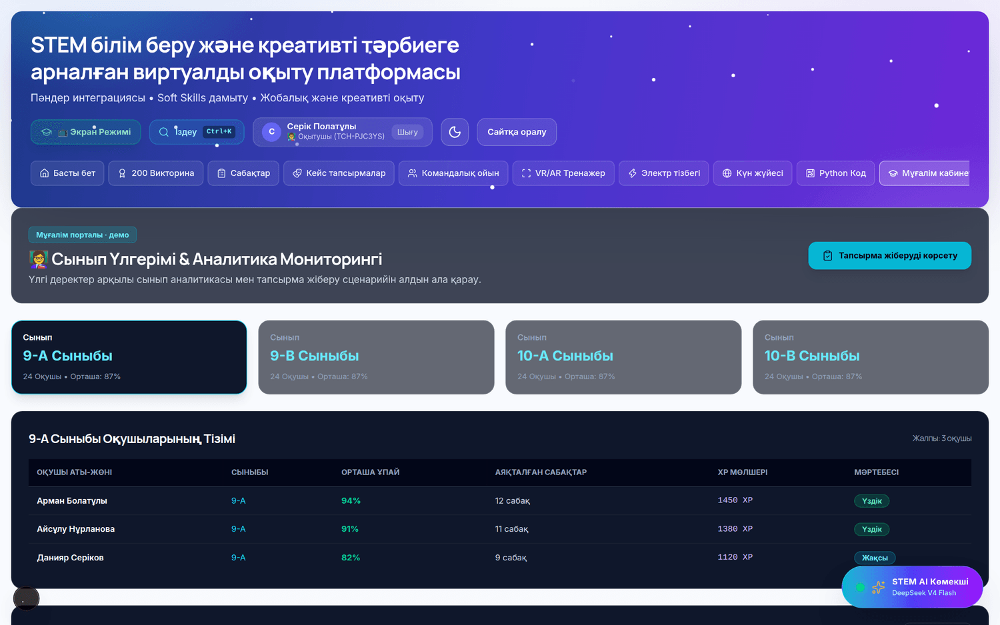

**Мүмкіндіктер:**

- **Сынып таңдау:** 9-А, 9-В, 10-А, 10-В (әрқайсысында оқушы саны мен орташа көрсеткіш)
- **Оқушылар тізімі:** аты-жөні, сыныбы, орташа ұпай, аяқталған сабақтар, XP мөлшері, мәртебесі (Үздік / Жақсы / …)
- **Тапсырма жіберу сценарийі**
- **Квиз аналитикасы** — сұрақ деңгейінде
- **Ұсыныстар** (`data/recommendations.ts` → `buildActions()`): әр жол — қауіптілік деңгейі (`critical` / `warning` / `info`), санат, дәлел (сандармен) және нақты келесі қадам

**Когорта деректері** (`data/cohort.ts`): `COHORT`, `lessonAverages()`, `lessonCompletion()`, `progressDistribution()` (0–20%, 21–40%, 41–60%, 61–80%, 81–100%), `cohortWeekly()`, `cohortSummary()`.

**Сабақ мазмұнын өңдеу** (`0007_lesson_overrides.sql`): он сабақ кодта қалады — ол әркім бастайтын түпнұсқа. Оқытушы сақтайтыны — **айырмашылық (patch)**, ол тек өзі қабылдаған студенттерге жайылады. Сондықтан бір оқытушы басқа топтың курсын бұза алмайды, ал «түпнұсқаға қайтару» — бір жолды өшіру. Симуляция өрістері өңделетін тізімде әдейі жоқ.

**Сынып презентері** (`ClassroomPresenterModal.tsx`) — проекторға шығаруға арналған режим.

---

## 14. AI ассистенті

**Маршрут:** `/api/ai/chat` (Node.js runtime)
**Виджет:** `components/ui/AiTutorWidget.tsx` (панельдің оң жақ төменгі бұрышында)

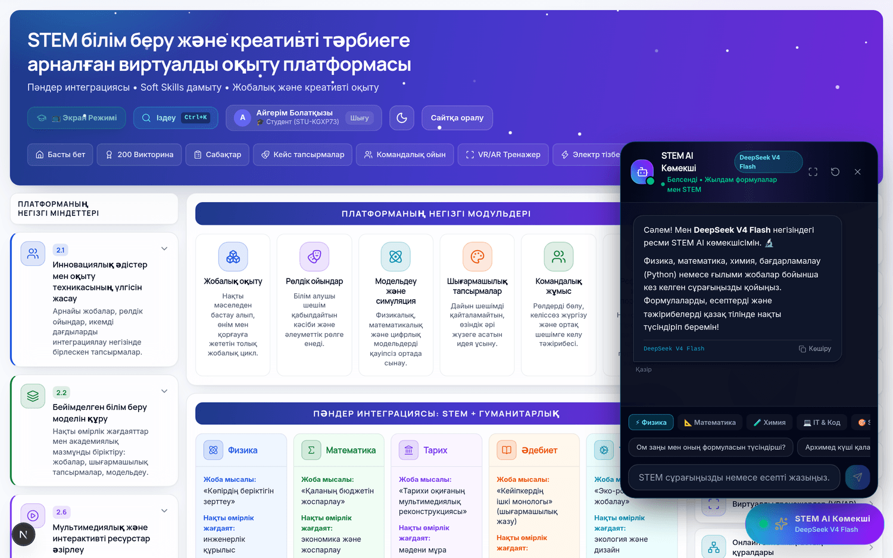

### Техникалық іске асыру

- **Провайдер:** OpenRouter (`https://openrouter.ai/api/v1/chat/completions`)
- **Модель кезегі (fallback):** `OPENROUTER_MODEL` → `deepseek/deepseek-v4-flash` → `deepseek/deepseek-chat` → `openrouter/free`. Бір модель құласа, келесісі сыналады.
- **Стриминг:** `text/event-stream` (`X-Used-Model` тақырыбымен қай модель жауап бергені қайтарылады)
- **Параметрлер:** `temperature: 0.6`, `max_tokens: 2048`
- **Кілт болмаса:** 500 және қазақша түсінікті қате хабары

### Жүйелік нұсқау (system prompt) ережелері

1. Барлық жауап **таза, сауатты қазақ тілінде**, жылы әрі жігерлендіретін ғылыми-педагогикалық үнмен.
2. Физика, математика, химия, биология, бағдарламалау (Python, JavaScript, робототехника) және икемді дағдылар бойынша терең әрі түсінікті түсіндіру.
3. Формулалар **міндетті түрде LaTeX синтаксисімен**: блоктық `\[ E = mc^2 \]` / `$$…$$`, мәтін ішінде `\( F = ma \)` / `$…$`. Оларды `KatexFormula.tsx` рендерлейді.
4. Маңызды түсініктер қара қаріппен, тармақталған тізіммен және мысалдармен.
5. Қажет болса қысқаша мысал есеп немесе өмірден практикалық мысал.

### Педагогикалық принцип

Ассистент тапсырманы түсіндіреді, бағыттаушы сұрақ қояды және жоба кезеңдерін жоспарлауға көмектеседі — **бірақ ешқашан дайын жауап бермейді**. Мақсаты — өздігінен шешім табуға ынталандыру.

---

## 15. Дерекқор (Supabase): схема, RLS, триггерлер

### Миграциялар

| Файл | Не қосады | Міндетті ме |
|---|---|---|
| `0001_accounts_and_links.sql` | `profiles`, `teacher_links`, `handle_new_user()`, `protect_profile_identity()`, `validate_teacher_link()`, `search_people()`, RLS | ✅ |
| `0002_google_oauth.sql` | Google арқылы кіру, `claim_role()` | Google керек болса |
| `0003_fix_oauth_signup.sql` | 0002-дегі OAuth тіркелу қатесін түзету (`meta_role in (...)` `NULL` қайтарып, `role_locked` NOT NULL бағанын құлататын) | **✅ міндетті** |
| `0004_classmates.sql` | `classmates()` — көшбасшылар кестесі үшін тар SECURITY DEFINER терезесі | |
| `0005_friends.sql` | `friend_links` — студент ↔ студент достығы (симметриялы, жұп реттелмеген түрде бірегей) | |
| `0006_duels.sql` | `game_duels` — seed арқылы әділ дуэль | |
| `0007_lesson_overrides.sql` | `lesson_overrides` — оқытушының сабақ patch-і | |
| `0008_learning_records.sql` | `quiz_attempts`, `game_results`, `assignment_submissions`, `competency_assessments`, `certificates` | **✅ міндетті** |
| `0009_xp.sql` | `compute_xp()`, `refresh_xp()`, `refresh_my_xp()`, `touch_xp()` + 5 триггер | |
| `0010_text_module_ids.sql` | `module_id` бағандарын `text`-ке ауыстыру (сабақтар енді `bridge-strength` сияқты slug-пен анықталады) | |
| `0011_case_responses.sql` | `case_responses` + баған қорғау триггері | |

### Негізгі кестелер

| Кесте | Мазмұны |
|---|---|
| `profiles` | Рөл, аты-жөні, тобы, ортақ код, `xp`, `role_locked` |
| `teacher_links` | Оқытушы ↔ студент (pending / accepted / declined) |
| `friend_links` | Студент ↔ студент достығы |
| `game_duels` | Дуэль нәтижелері |
| `lesson_overrides` | Оқытушының сабақ өзгертулері |
| `quiz_attempts` | Тест талпыныстары |
| `game_results` | Ойын нәтижелері |
| `assignment_submissions` | БӨЖ жұмыстары мен бағалары |
| `competency_assessments` | Рубрика бойынша бағалау |
| `certificates` | Сертификаттар (QR + верификация сілтемесі) |
| `case_responses` | Кейс жауаптары |

### RLS қағидасы

> **Студент өз жазбаларының иесі, оқытушы қабылдаған студенттерінің жазбаларын оқиды.**

- `is_linked(a, b)` — екі граф туралы да біледі (teacher_links + friend_links)
- `is_my_student(student)` — оқытушының көру терезесі
- `search_people()` — код / аты-жөні / **толық** email арқылы іздеу, email нәтижеде қайтарылмайды

### Баған қорғау триггерлері

- `protect_profile_identity()` — рөл мен код өзгермейді
- `validate_teacher_link()` — рөлдерді тексереді, **өз сұранысын өзі қабылдауға жол бермейді**
- `validate_friend_link()`, `validate_duel()`, `validate_lesson_override()`
- `protect_submission_columns()` — БӨЖ екі жақ жазатын жалғыз кесте, бірақ триггер бағандарды бөліп қояды: **жұмыс студенттікі, баға оқытушынікі**
- `protect_case_response_columns()` — сол қағида кейс жауаптары үшін

### Auth баптаулары

- **Google:** Dashboard → Authentication → Providers → Google қосулы; Redirect URLs тізіміне `http://localhost:3000/auth/callback` (және нақты доменнің callback-і).
- **Email:** «Confirm email» қосулы болса, тіркелген адам поштадағы сілтемені ашпайынша кіре алмайды. Демонстрация үшін оны өшіріп қою ыңғайлы. Қосулы қалса, Site URL дұрыс орнатылуы керек.

### Әлі жергілікті сақталатыны

Хабарламалар және кейбір демонстрациялық analytics cache деректері әзірге `localStorage`-та. Негізгі тест, ойын, БӨЖ, құзыреттілік және сертификат жазбалары `lib/dataStore.ts` арқылы Supabase-пен жұмыс істейді.

---

## 16. 3D графика және модельдерді оңтайландыру

### Оңтайландыру нәтижесі

| | Бастапқы (Meshy экспорты) | Репозиторийдегі |
|---|---|---|
| Бір кітап | ~56 МБ | **~0.28 МБ** |
| Төрт кітап | 226 МБ | **1.14 МБ** |
| Үшбұрыш | ~2 млн | **39.5 мың** |
| Текстура | 2048px JPEG | 1024px WebP × 3 |

**99.5% қысқарту.**

### Пайплайн

```bash
npm run optimize:models -- <бастапқы-GLB-каталогы>
```

`dedup → resample → weld → simplify (2%) → texture resize 1024 + WebP → prune → meshopt quantisation`

### Екі әдейі жасалған таңдау

1. **Meshopt, Draco емес.** drei-дің `useGLTF` meshopt декодерін three-stdlib арқылы бірге жеткізеді, ал оның Draco жолы Google CDN-нен декодерді орындалу кезінде жүктейді. Сондықтан `Book.tsx` `useGLTF(url, false, true)` шақырады.
2. **HTML белгілер, drei `<Text>` емес.** troika-three-text әдепкі қаріпін `fonts.gstatic.com`-нан алады. Үстіне апарғандағы тақырыптар drei `<Html>` арқылы рендерленеді — сайттың өз қаріпінде, таңдалатын және қолжетімді.

### WebGL контексті

Hero — беттің **жалғыз** WebGL контексті. `#books` бөлімі сол төрт томды қарапайым DOM ретінде көрсетіп, Hero сахнасын `lib/bookBus.ts` арқылы басқарады.

---

## 17. Қолжетімділік, тіл және типографика

### Тіл

Сайттың негізгі тілі — **қазақша** (`<html lang="kk">`). Барлық мәтін `lib/content.ts`, `lib/dashboard.ts` және `data/` ішінде.

### Қаріптер

| Қаріп | Қолданылуы |
|---|---|
| **Manrope** | Тақырыптар (display) |
| **Inter** | Негізгі мәтін |

Қаріптер кирилл әліпбиін, оның ішінде **`cyrillic-ext`** ішкі жиынын қолдауы міндетті — қазақтың **ә, ғ, қ, ң, ө, ұ, ү, һ** әріптері сонда орналасқан.

> Бастапқы нұсқада қолданылған **Sora** қаріпінде кирилл әліпбиі мүлдем жоқ (тек `latin` / `latin-ext`), сондықтан ол ауыстырылды. Қаріпті ауыстырғанда `cyrillic` және `cyrillic-ext` ішкі жиындарының бар-жоғын міндетті түрде тексеріңіз.

### Қолжетімділік

- **`prefers-reduced-motion`** толық құрметтеледі: Lenis инициализацияланбайды, скролл ашылымдары статикалық рендерленеді, 3D айналу/тербелу/бөлшектер тоқтайды.
- WebGL canvas-та фокус алатын нысан жоқ, сондықтан Hero әр кітапқа **нақты түйме** де рендерлейді — фокус түскенше көрінбейді.
- Skip link, `focus-visible` сақиналары, белгіленген форма өрістері, демо формасында `aria-live` күйі.
- Галерея лайтбоксы пернетақтадан толық басқарылады: `Esc` / `←` / `→`.
- Сабақ кезеңдерінде `aria-current="step"`, модуль прожекторында `aria-pressed`.
- Диаграммаларда «Кесте ретінде қарау» — сол сандар мәтін түрінде.
- 375 px-те де, десктопта да көлденең асып кету жоқ.

---

## 18. Скрипттер және деректер файлдары

### Скрипттер (`scripts/`)

| Файл | Не істейді |
|---|---|
| `optimize-models.mjs` | Негізгі GLB оңтайландыру пайплайны (`npm run optimize:models`) |
| `optimize-cell-glb.mjs` | Жасуша моделін оңтайландыру |
| `convert-cell.mjs` | OBJ → GLB түрлендіру (Node) |
| `convert_cell_to_glb.py` | OBJ → GLB түрлендіру (Python) |
| `analyze-cell-objs.mjs` | Жасуша OBJ файлдарын талдау |
| `generate-quizzes.mjs` | Құжаттардан 1000 викторина сұрағын генерациялау |

### Деректер файлдары (`data/`)

| Файл | Жол | Мазмұны |
|---|---|---|
| `subjectQuizzes.ts` | 16 126 | 5 пән × 200 = 1000 жағдаяттық сұрақ |
| `modules.ts` | 513 | 10 механика оқу модулі |
| `gameContent.ts` | 457 | Туынды ойындарды құрастырушылар |
| `labWorks.ts` | — | 10 зертханалық жұмыс |
| `simulations.ts` | — | 13 PASCO сахна метадерегі |
| `cohort.ts` | — | Демонстрациялық когорта және агрегаттар |
| `recommendations.ts` | — | Мұғалімге ұсыныстар генераторы |
| `glossaryExtra.ts` | — | Глоссарийді кеңейту |

### Домен логикасы (`lib/`)

| Файл | Жол | Мазмұны |
|---|---|---|
| `caseTasks.ts` | 1519 | 5 кейс, 20 рөл, 15 раунд, 60 сұрақ |
| `dashboard.ts` | 1016 | Панель мазмұны (схеманың көшірмесі) |
| `lessons.ts` | 918 | 5 интерактивті сабақ, 6 кезең, тест және ойын спецификациялары |
| `content.ts` | 811 | Көпшілік сайттың барлық мәтіні |
| `teamSim.ts` | 363 | Командалық жоба симуляторының логикасы |
| `dataStore.ts` | 451 | Оқу жазбаларына қатынау (Supabase / mock) |
| `progress.ts` | 317 | Жергілікті прогресс + Supabase persistence |
| `types.ts` | 295 | Домен типтері |
| `teamGame.ts` | 220 | Командалық ойын логикасы |
| `competency.ts` | — | Рубрика және қорытынды баға |
| `xp.ts` | — | XP синхронизациясы |
| `caseRoleplay.ts` | — | Кейс рөлдік ойынының күйі |
| `pendulum.ts` | — | Маятниктің сызықтық емес теңдеуі |
| `supabase/*` | — | accounts, links, friends, duels, content, caseResponses, teamGameRealtime, caseRoleplayRealtime, client, mock |

**Жалпы көлемі:** `app/`, `components/`, `lib/`, `data/`, `utils/`, `supabase/`, `scripts/` ішінде **158 файл**, **51 415 жол**.

---

## 19. Тексеру нәтижелері және шектеулер

### Осы құжат дайындалғанда орындалған тексерулер

| Тексеру | Нәтиже |
|---|---|
| `npm install` | ✅ 622 пакет, қатесіз |
| `npm run lint` | ✅ **0 қате**, 1 ескерту (`data/subjectQuizzes.ts:16104` — `originalAnswerText` қолданылмайды) |
| `npm run build` | ✅ Сәтті. Барлық маршрут құрастырылды, SSG беттері генерацияланды |
| Барлық беттің браузерде ашылуы | ✅ 20+ маршрут 200 қайтарды, рендер сәтті |
| 3D кітап сахнасы | ✅ **Визуалды расталды** — төрт кітап рендерленеді (скриншот 01) |
| Маятник, Күн жүйесі, электр тізбегі симуляциялары | ✅ Визуалды расталды |
| VR тренажер беті | ✅ Визуалды расталды |
| Викторина плеері (200 сұрақ, карта, таймер) | ✅ Визуалды расталды |
| Сабақ плеерінің 6 кезеңі | ✅ Барлығы визуалды расталды |
| Кейс плеерінің 4 қадамы | ✅ Барлығы визуалды расталды |
| Командалық ойын хосты (QR + 4 команда) | ✅ Визуалды расталды |
| Мұғалім кабинеті | ✅ Визуалды расталды |
| Ctrl+K ғаламдық іздеу | ✅ Визуалды расталды |
| Қараңғы режим | ✅ Визуалды расталды |
| Мобильді көрініс (390 px) | ✅ Визуалды расталды |

**Өнімдік құрастырудың жүктеме көрсеткіштері:**

| Бет | Бет коды | Бірінші жүктеме JS |
|---|---|---|
| Ортақ (барлық бетте) | — | **103 kB** |
| `/dashboard` | 9.05 kB | 282 kB |
| `/dashboard/lessons/[id]` | 8.38 kB | 384 kB |
| `/dashboard/quiz/[id]` | 97.8 kB | 256 kB |
| `/dashboard/simulations/[id]` | 2.54 kB | 343 kB |
| `/dashboard/resources/[id]` | 18.7 kB | 136 kB |
| Middleware | — | 92.9 kB |

### Скриншоттар туралы ескертпе

Скриншоттар оқшауланған (интернетке шықпайтын) орындау ортасында түсірілді. Сондықтан:

- **YouTube кірістірмелері бос көрсетіледі** (кейс бейнесі, модуль бейнесабақтары). Нақты браузерде олар қалыпты жүктеледі.
- **drei-дің `Environment preset="city"`** HDR картасын CDN-нен алады. Скриншот түсіру үшін ол жергілікті орынбасармен алмастырылды; кодта өзгеріс жоқ. Интернеті бар браузерде түпнұсқа HDR жүктеледі және жарықтандыру одан да сапалы болады.
- **AI ассистенті** нақты жауап бермейді (OpenRouter-ге шыға алмайды) — интерфейсі ғана көрсетілген.
- **Supabase** қосылмаған, сондықтан барлық бет **демонстрациялық режимде** (localStorage) түсірілді. Оқушы «Айгерім Болатқызы (STU-KGXP73)», мұғалім «Серік Полатұлы (TCH-PJC3YS)».

### Белгілі шектеулер

1. **3–10 механика модульдері** шаблондық тереңдікте (5 тест сұрағы, 3 ойын жұбы). Мұғалім кабинетінен кеңейтуге арналған.
2. **Үш кейстің бейнесі** әлі түсірілмеген (`video.youtubeId` бос) — сценарийлері `docs/case-video-briefs.md` ішінде дайын.
3. **Хабарламалар** және кейбір analytics cache деректері әлі localStorage-та.
4. ESLint-те бір қолданылмайтын айнымалы ескертуі бар.

---

## Қосымша: скриншоттар индексі

| Файл | Сипаты |
|---|---|
| `01-home.png` | Басты экран (3D кітаптармен) |
| `01b-home-full.png` | Басты беттің толық биіктігі |
| `02-dashboard.png` | Панельдің толық көрінісі |
| `03-quiz-hub.png` | Викториналар хабы |
| `04-quiz-physics.png` | Физика викторинасының беті |
| `05-lessons.png` | Сабақтар каталогы |
| `06-lesson-bridge.png` | «Көпірдің беріктігі» сабағы |
| `07-cases.png` | Кейстер каталогы |
| `08-case-light.png` | «Жарық пен мейірімділік» кейсі |
| `09-simulations.png` | Симуляциялар каталогы |
| `10-sim-pendulum.png` | Маятник симуляциясы |
| `11-sim-circuit.png` | Электр тізбегі |
| `12-sim-astronomy.png` | Күн жүйесі |
| `13-sim-code.png` | Python зертханасы |
| `14-sim-team-project.png` | Командалық жоба симуляторы |
| `15-vr.png` | VR/AR тренажер |
| `16-team-game.png` | Командалық ойын порталы |
| `17-teacher.png` | Мұғалім кабинеті (толық) |
| `18-profile.png` | Жеке кабинет |
| `19-resources.png` | Цифрлық кітапхана |
| `20-play.png` | Тіркелусіз ойынға кіру |
| `21-mobile-dashboard.png` | Мобильді панель |
| `22-section-books.png` … `27-section-contact.png` | Сайттың бөлімдері |
| `28-modules-1.png` | Механика модулінің беті |
| `29-auth-modal.png` | Кіру терезесі |
| `30-quiz-in-progress.png` | Тест барысында (200 сұрақ картасы) |
| `32-lesson-stage-goals.png` … `42-lesson-stage-teamwork.png` | Сабақтың 6 кезеңі |
| `34-case-task.png`, `43-case-roleplay.png`, `44-case-discussion.png` | Кейстің қадамдары |
| `35-team-game-host.png` | Командалық ойын хосты (QR + 4 команда) |
| `36-ai-tutor.png` | AI ассистенті |
| `37-global-search.png` | Ctrl+K іздеу |
| `38-teacher-top.png` | Мұғалім кабинетінің жоғарғы бөлігі |
| `41-dashboard-dark.png` | Қараңғы режим |
| `45-mobile-home.png` | Мобильді басты бет |
