# Оқыту платформасы – Soft Skills дамытуға арналған интеграцияланған цифрлық білім беру ортасы

*ҒЗЖ есебіне енгізуге арналған бөлім. Грант: BR28713097 «Креативті тәрбие мен STEM білімді интеграциялау негізінде оқушылардың икемді дағдыларын қалыптастыру». Платформа: «Виртуалды STEM оқыту платформасы» (репозиторий: `bibaermek-stack/softskills`).*

> **Сипаттаманың негізі.** Мәтін платформаның жұмыс істейтін нұсқасын (Next.js 15, өндірістік құрастыру) браузерде ашып, әр бөлімді оқушы және оқытушы рөлінде өту арқылы жазылды: батырмалар басылды, тапсырмалар орындалды, ұпай есептеу тексерілді, көп қатысушылы бөлмелер (бір хост және үш ойыншы) нақты іске қосылды. Негізге платформадан көрінген функциялар алынды; әзірлеушілердің жоспары немесе сайттың жарнамалық мәтіні дәлел ретінде қолданылған жоқ. Supabase кілттері берілмегендіктен платформа демонстрациялық режимде (нәтижелер браузерде сақталады) тексерілді. Сыртқы қызметтер (YouTube, сыртқы CDN, OpenRouter) сынақ ортасында қолжетімсіз болды. Әр бөлімнің тексерілу дәрежесі **А қосымшасында** берілген. Суреттер **Б қосымшасындағы** тәртіппен нөмірленген.

---

## 1. Платформаны әзірлеудің мақсаты мен педагогикалық қажеттілігі

Қазіргі білім беруде икемді дағдылар (Soft Skills) — коммуникация, командалық жұмыс, көшбасшылық, жауапкершілік, сыни және креативті ойлау, шешім қабылдау, өзін-өзі реттеу, рефлексия — оқу нәтижесінің толыққанды құрамдас бөлігі ретінде қарастырылады. Бұл дағдыларды тек лекция немесе жеке тест арқылы қалыптастыруға болмайды: олар тек нақты әрекетте — топта жұмыс істегенде, рөл атқарғанда, келіспеушілікті шешкенде, өз шешімін дәлелдегенде — көрінеді. Мұғалімге бұл әрекетті ұйымдастыру, бақылау және бағалау үшін құрал қажет.

Платформаның бастапқы идеясы осы қажеттіліктен шығады және мына қағидаға сүйенеді: **Soft Skills – пәндік оқу мақсатын орындау барысында қалыптасатын интеграциялық оқу нәтижесі.** Сондықтан платформада икемді дағдыларға бөлек «тренинг» ұйымдастырылмаған: әр сабақ, кейс және симуляция пәндік мазмұнмен (физика, математика, тарих, әдебиет, технология) бірге беріледі, ал дағды әр тапсырмаға белгі ретінде тіркеледі.

Басты панельде платформаның жеті міндеті көрсетілген (2.1, 2.2, 2.6, 2.8, 2.9, 2.10, 2.11): инновациялық оқыту әдістерінің үлгісін жасау, бейімделген білім беру моделін құру, мультимедиялық және интерактивті ресурстар әзірлеу, дайын сабақ үлгілерін жасау, цифрлық құралдар мен онлайн модульдерді енгізу, жекелендірілген оқыту платформасын әзірлеу, командалық жобалар симуляторын енгізу. Осы міндеттердің әрқайсысына панельде бөлім немесе модуль сәйкес келеді; олардың нақты іске асу дәрежесі 3–10-бөлімдерде және А қосымшасында көрсетілген.

## 2. Платформаның жалпы құрылымы

Платформа үш қатынау контурынан тұрады.

1. **Көпшілік сайт (`/`).** Жобаны таныстыратын 16 бөлімнен тұрады: басты бет, платформа, төрт кітап, модульдер, мультимедиа, технологиялар, симуляциялар, AI ассистент, ынтымақтастық, аналитика, бағалау, құндылықтар, әдістеме, зерттеу, галерея, байланыс. Басты беттегі төрт 3D кітап — төрт басылымның (әдістеме, оқу модульдері, цифрлық технологиялар, зерттеу нәтижелері) көрнекі кіруі.
2. **Оқу панелі (`/dashboard`).** Нақты оқу әрекеті осында өтеді. Панельдің бірыңғай навигациясы 12 бөлімнен тұрады: Басты бет, 200 Викторина, Сабақтар, Кейс тапсырмалар, Командалық ойын, VR/AR Тренажер, Электр тізбегі, Күн жүйесі, Python Код, Мұғалім кабинеті, Жеке кабинет, Кітапхана. Тақырып жолында әмбебап іздеу (Ctrl+K), мұғалімнің «Экран режимі», күндізгі/түнгі тема ауыстырғыш және STEM AI көмекші бар.
3. **Тіркелусіз кіру беттері (`/play`, `/play/case`).** Оқушы 6 таңбалы код немесе QR-код арқылы аккаунтсыз командалық ойынға не кейстің рөлдік ойынына қосылады.

**Пайдаланушы рөлдері.** Тіркеу кезінде «студент» немесе «оқытушы» рөлі таңдалады (оқу тобын көрсетуге болады); кіру терезесінде электрондық пошта, «Google арқылы кіру» батырмасы және демо-аккаунттар (студент, оқытушы) бар; демо-аккаунттар арқылы кіру тексерілді, ал пошта мен Google арқылы кіру Supabase қосылмаған ортада тексерілмеді. Әр пайдаланушыға рөлге сәйкес код беріледі (`STU-…`, `TCH-…`). Supabase кілттері болмаса, платформа демонстрациялық режимде жұмыс істейді және оқу нәтижелері құрылғының жергілікті жадында сақталады.

**Біртұтас орта белгілері.** Модульдер бір-біріне жай сілтеме жасамайды, ортақ механизмдер арқылы байланысады:

- ортақ **дағдылар таксономиясы** — сегіз ось (коммуникация, топта жұмыс, шығармашылық, сыни ойлау, көшбасшылық, жауапкершілік, цифрлық сауат, өзін реттеу); сабақтар, кейстер және аналитика радары бірдей осьтерді қолданады;
- ортақ **нәтиже жазбасы** — сабақтың ойыны мен тесті, кейс, маятник пен командалық жоба симуляциясы бір сақтау қабатына жазылады да, профильге және аналитикаға түседі;
- ортақ **бөлме механизмі** — командалық ойын да, кейстің рөлдік ойыны да 6 таңбалы код пен QR-кодқа сүйенеді;
- ортақ **сабақ үлгісі** — алты кезеңді құрылым (мақсат → жағдаят → әрекет → ресурс → топтық жұмыс және рефлексия → бағалау) барлық интерактивті сабаққа қолданылады.

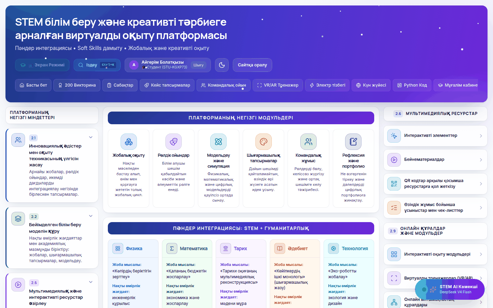

**Сурет 1 – Soft Skills дамытуға арналған интеграцияланған цифрлық оқыту платформасының басты панелі**

Суретте оқу панелінің жоғарғы бөлігі көрсетілген: бірыңғай навигация, платформаның негізгі міндеттері (2.1–2.11), алты негізгі модуль (жобалық оқыту, рөлдік ойындар, модельдеу, шығармашылық тапсырмалар, командалық жұмыс, рефлексия және портфолио), бес пәндік панель және мультимедиялық ресурстар бағанасы. Бұл бөлім оқушыға кез келген оқу әрекетіне бір орыннан өтуге, ал мұғалімге сабақты пәндік мазмұн мен икемді дағды мақсатымен бірге жоспарлауға мүмкіндік береді. Педагогикалық тұрғыдан панель пәндік білім мен Soft Skills мақсатын бір оқу кеңістігінде көрсетіп, дағдыны пәндік тапсырмаға байланысты қалыптастыруға бағытталған.

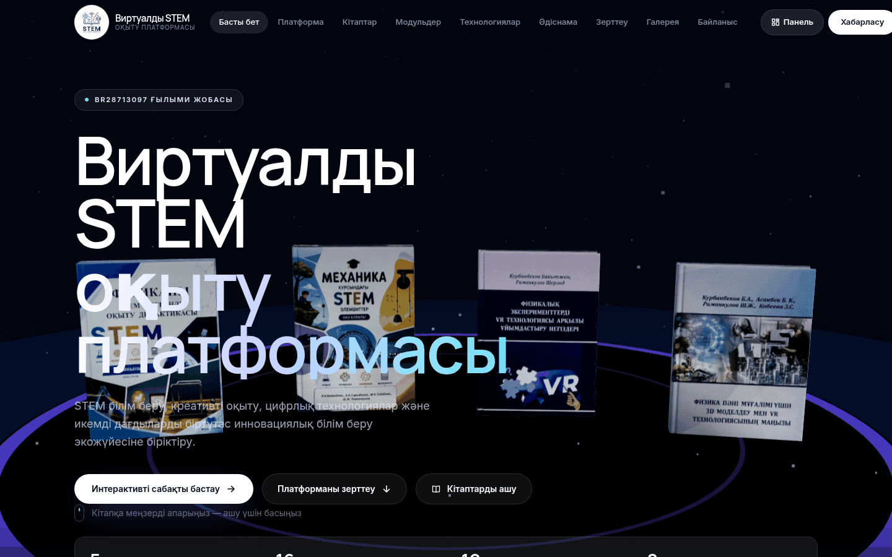

**Сурет 2 – Платформаның көпшілік порталы (басты бет)**

Суретте көпшілік сайттың басты беті, бөлімдер мәзірі және төрт 3D кітап көрсетілген. Бұл бөлім жоба туралы мәліметті, әдіснаманы және оқу панеліне өту жолын (батырма «Панель») бір бетте береді. Педагогикалық тұрғыдан портал мұғалім мен оқушыға платформаның оқыту моделімен алдын ала танысуға, ал зерттеу нәтижесін кең аудиторияға түсіндіруге бағытталған.

## 3. Негізгі функционалдық модульдері

Төменде әр модуль үшін мақсаты, оқушы мен мұғалімнің әрекеті, дамитын Soft Skills және педагогикалық әдіс берілген. Soft Skills бағанында платформада тапсырмаға тіркелген дағдылар (сабақ, кейс) көрсетілген; тіркеме жоқ модульдерде дағды әрекет сипатына қарай әдістемелік тұрғыда байланыстырылған және бұл арнайы белгіленген (†).

**3.1. Басты панель (Dashboard).** *Қызметі:* платформаның барлық модуліне кіру, пәндер интеграциясы, дайын сабақ үлгісі, жекелендіру мен мониторинг блоктары. *Оқушы:* сабақты, кейсті, симуляцияны таңдайды; өз нәтижесінің жиынтығын көреді. *Мұғалім:* сабақ үлгісінің құрылымын (алты кезең мен уақыт бөлінісі: 5/7/20/10/8/5 минут) және пәндер бойынша жоба мысалдарын қолданады. *Дағды:* өзін реттеу, цифрлық сауат†. *Әдіс:* пәнаралық интеграция, жобалық оқыту.

**3.2. «200 Викторина» (икемді дағдылар викториналары).** *Қызметі:* бес пән (математика, физика, тарих, әдебиет, технология) бойынша 200 жағдаяттық сұрақ, барлығы — 1 000 сұрақ. Әр сұраққа дағды белгісі тіркелген. *Оқушы:* көлемін (барлығы 200, бөлім бойынша 20, 50 немесе 25 сұрақтық «блиц»), араластыруды, жауапты бірден тексеру режимін таңдайды; сұрақтар арасында жылжиды, белгілейді (закладка), соңында дағдылар картасын көреді, қателерін қайта қарайды. *Мұғалім:* диагностикалық құрал ретінде қолданады. *Дағды:* сыни ойлау, шешім қабылдау, мәселені шешу, коммуникация, жоспарлау, жауапкершілік. *Әдіс:* жағдаяттық (situational) тест, диагностикалық бағалау.

**3.3. Сабақтар.** *Қызметі:* бес интерактивті сабақ (физика, математика, тарих, әдебиет, технология); әрқайсысы алты кезеңнен өтеді. *Оқушы:* мақсатпен танысады, нақты жағдаятты талдайды, интерактивті ойын (топтастыру, жұп табу, ретке келтіру) ойнайды, симуляциямен жұмыс істейді, топтық жұмыс сұрақтарын талқылайды, алты сұрақтық тест тапсырады. *Мұғалім:* сабақтың «Командалық жарыс (QR)» батырмасы арқылы сыныпта ойын бөлмесін ашады. *Дағды:* әр сабақта үш дағды (мысалы, көпір сабағында — сыни ойлау, топта жұмыс, цифрлық сауат). *Әдіс:* жобалық және проблемалық оқыту, ойын арқылы оқыту.

**3.4. Кейс тапсырмалар.** *Қызметі:* бес кейс (3-сынып пен бастауыш сынып деңгейі), әрқайсысы төрт қадам: бейне → жеке жазбаша жауап → рөлдік ойын → талқылау. Кейс пәнге емес, дағдыға бөлінген. *Оқушы:* бейнені көреді, 80 таңбадан кем емес жауап жазады, достарымен бөлмеде рөл атқарады. *Мұғалім:* кабинетте оқушының жауабын көреді және пікір жазады. *Дағды:* топта жұмыс, коммуникация, көшбасшылық, жауапкершілік, өзін реттеу, сыни ойлау. *Әдіс:* кейс-стади, рөлдік ойын.

**3.5. Командалық ойын (STEM Team Battle).** *Қызметі:* мұғалім немесе ұйымдастырушы бөлме ашады; оқушылар QR-код не код арқылы тіркелусіз қосылады, төрт командаға бөлінеді, STEM сұрақтарына таймермен жауап береді. *Оқушы:* ат, аватар және команда таңдайды; жауап береді; эмодзи-реакция жібереді. *Мұғалім:* пән санатын таңдайды, өз сұрақтарын қосады, жауаптарды ашады, қорытындыны шығарады. *Дағды:* командалық жұмыс, шешім қабылдау (уақыт қысымында), жауапкершілік†. *Әдіс:* ойын арқылы оқыту (геймификация), командалық жарыс.

**3.6. Кейстің рөлдік ойыны.** *Қызметі:* кейске байланған онлайн бөлме; әр оқушы өз рөлін таңдайды, раундтарда рөліне сәйкес жеке сұрақ алады, команда чатта сөйлеседі. *Оқушы:* қосылады, рөл таңдайды, рөл нұсқауын оқиды, жауап береді. *Мұғалім:* бөлмені басқарады (таймер, жауаптарды ашу, келесі раунд). *Дағды:* коммуникация, көшбасшылық, жауапкершілік, командалық жұмыс. *Әдіс:* рөлдік ойын, ынтымақтастықта оқыту. Толық сипаттамасы 6-бөлімде.

**3.7. Командалық жоба симуляторы.** *Қызметі:* төрт қадам: виртуалды орта таңдау → рөлдерді бөлу → төрт қақтығыс жағдаяты → нәтиже. *Оқушы:* алты виртуалды мүшеге (әрқайсысының мінезі мен күшті жағы бар) алты рөлдің біреуін береді; әр жағдаятта шешім таңдайды. *Мұғалім:* симуляторды сабақтың топтық жұмыс кезеңінде қолданады. *Дағды:* қақтығысты басқару, шешім қабылдау, жоспарлау, коммуникация, жауапкершілік. *Әдіс:* әлеуметтік өзара әрекет симуляциясы.

**3.8. VR/AR тренажер.** *Қызметі:* төрт 3D сахна (оптика және лазер зертханасы, Күн жүйесі, Жібек жолы мұрасы, инженерлік манипулятор), VR-шлемге шығу батырмасы, үш зертханалық тапсырма тізімі. *Оқушы:* сахнаны таңдайды, 3D кеңістікте нысандарды басқарады. *Мұғалім:* ресурсты сабақ кезеңіне сәйкес таңдайды. *Дағды:* сыни ойлау, мәселені шешу†. *Әдіс:* иммерсивті (виртуалды) модельдеу, зерттеуге негізделген оқыту.

**3.9. Симуляциялар: маятник, электр тізбегі, Күн жүйесі.** *Қызметі:* параметрлерді өзгертіп, құбылысты бақылау. *Оқушы:* ұзындық, масса, бұрыш, сөну, ауырлық күші (маятник), кернеу мен кедергі (тізбек), планета мен жылдамдық (орбита) параметрлерін өзгертеді. *Дағды:* сыни ойлау, дәлелді қорытынды†. *Әдіс:* виртуалды эксперимент.

**3.10. Python Код.** *Қызметі:* үш дайын мысал (Ом заңы, маятник периоды, ДНҚ нуклеотидтерін санау). Бетте көрсетілгендей, бұл демо кодты браузерде орындамайды: әр мысалдың алдын ала есептелген нәтижесі көрсетіледі. *Дағды:* цифрлық сауат†.

**3.11. Цифрлық кітапхана және мультимедиялық ресурстар.** *Қызметі:* төрт кітап 3D форматта; кітапты таңдағанда мақсаттар, негізгі көрсеткіштер, галерея мен құжаттар тізімі ашылады. Оң бағанадағы сегіз ресурс беті (интерактивті элементтер, бейнематериалдар, QR кодтар, чек-листтер, интерактивті модульдер, VR/AR, ынтымақтастық құралдары, цифрлық зертханалар) құрамы мен қолдану тәртібін сипаттайды. *Ескерту:* VR/AR беті ғана жұмыс істейтін құрал; қалған жеті бет — сипаттамалық, олардың ішінде жұмыс істейтін QR-генератор, бейнекітапхана немесе чек-лист құралы жоқ.

**3.12. Мұғалім кабинеті.** *Қызметі:* 9-A, 9-B, 10-A, 10-B сыныптарының үлгі деректері бойынша оқушылар кестесі (орташа ұпай, аяқталған сабақ, XP, мәртебе) және «Тапсырма жіберуді көрсету» демо-батырмасы; төменгі «Кейс жауаптары» блогы нақты деректермен жұмыс істейді. *Мұғалім:* оқушының кейстегі жазбаша жауабы мен рөлдік ойын нәтижесін көреді, пікір жазып сақтайды. Кабинеттің сыныптық аналитикасы демонстрациялық, ал кейс жауаптары нақты. *Әдіс:* қалыптастырушы бағалау, кері байланыс.

**3.13. Жеке кабинет.** *Қызметі:* оқу профилі: сабақтар прогресі, күндік белсенділік (қатарынан күн саны), төрт жетістік белгісі, әрекет саны, орташа нәтиже, оқу уақыты, «Келесі қадам» ұсынысы. *Дағды:* өзін реттеу, жауапкершілік. *Әдіс:* өзін-өзі бақылау, рефлексиялық талдау.

**3.14. STEM AI көмекші.** *Қызметі:* барлық бетте қолжетімді чат; пән санаттары (физика, математика, химия, IT және код, Soft Skills) мен дайын сұрақтар. Сервер OpenRouter кілті арқылы DeepSeek моделіне сұрау жібереді; кілт болмаса, көмекші жергілікті STEM дерекқорынан жауап береді (жауаптың соңында «Жергілікті STEM дерекқорынан алынды» белгісі шығады). *Дағды:* өзіндік оқу, ақпарат іздеу†.

**3.15. Іздеу және «Экран режимі».** *Қызметі:* Ctrl+K әмбебап іздеу терезесі (модульдер мен беттерді табады); мұғалімнің интерактивті экран режимі — тақтаға шығарылатын 3 сұрақтық сыныптық квиз, 100/125/150 % үлкейту, толық экран. *Мұғалім:* сабақты тақтадан өткізеді. *Әдіс:* фронтальды интерактивті оқыту.

### Кесте 1. Платформаның негізгі модульдері және олардың педагогикалық қызметі

| № | Платформа бөлімі | Негізгі қызметі | Оқу әрекеті | Дамитын Soft Skills |
|---|---|---|---|---|
| 1 | Басты панель | Модульдерге кіру, пәндер интеграциясы, сабақ үлгісі, мониторинг | Таңдау, бағдарлану, нәтижені қарау | Өзін реттеу, цифрлық сауат† |
| 2 | 200 Викторина | 1 000 жағдаяттық сұрақ, дағды белгісі, диагностикалық карта | Жағдаятты талдап, шешім таңдау | Сыни ойлау, шешім қабылдау, мәселені шешу |
| 3 | Сабақтар (5) | Алты кезеңді интерактивті сабақ | Ойын, симуляция, талқылау, тест | Сыни ойлау, топта жұмыс, шығармашылық, коммуникация, өзін реттеу, көшбасшылық, цифрлық сауат, жауапкершілік |
| 4 | Кейс тапсырмалар (5) | Бейне → жазбаша жауап → рөлдік ойын → талқылау | Рефлексиялық жауап, рөлдік әрекет | Топта жұмыс, коммуникация, көшбасшылық, жауапкершілік |
| 5 | Командалық ойын | Тіркелусіз командалық жарыс (код, QR) | Таймермен жауап беру, команда ұпайы | Командалық жұмыс, шешім қабылдау† |
| 6 | Кейстің рөлдік ойыны | Рөлге байланған жеке сұрақтар, чат, нәтиже | Рөл таңдау, рөлге сай әрекет, талқылау | Коммуникация, көшбасшылық, жауапкершілік |
| 7 | Командалық жоба симуляторы | Орта, рөл, қақтығыс, нәтиже | Рөл бөлу, қақтығыс шешу | Қақтығысты басқару, шешім қабылдау, жоспарлау |
| 8 | VR/AR тренажер | 3D виртуалды сахналар | Нысанды басқару, бақылау | Сыни ойлау, мәселені шешу† |
| 9 | Маятник, тізбек, Күн жүйесі | Параметрлі виртуалды эксперимент | Параметр өзгерту, нәтиже салыстыру | Сыни ойлау, дәлелдеу† |
| 10 | Python Код | Дайын мысал мен алдын ала есептелген нәтиже | Мысалды оқу, нәтижені талдау | Цифрлық сауат† |
| 11 | Цифрлық кітапхана | 3D кітаптар, ресурс беттері | Материалмен танысу | Өзіндік оқу† |
| 12 | Мұғалім кабинеті | Үлгі сынып кестесі; кейс жауаптары мен пікір | Бағалау, кері байланыс беру | (мұғалім құралы) |
| 13 | Жеке кабинет | Прогресс, жетістік белгілері, келесі қадам | Өзін-өзі бақылау | Өзін реттеу, жауапкершілік |
| 14 | STEM AI көмекші | Сұрақ-жауап чаты | Сұрақ қою, түсініктеме алу | Өзіндік оқу, ақпарат іздеу† |
| 15 | Іздеу, Экран режимі | Іздеу; тақтадағы квиз | Іздеу; сыныптық жауап беру | Коммуникация† |

*† — платформада дағды белгісі жоқ; дағды әрекет сипатына қарай әдістемелік тұрғыда байланыстырылған.*

---

## 4. Жекелендірілген виртуалды оқыту мүмкіндіктері

### 4.1. Жекелендіру логикасы және оның платформадағы іске асуы

Жекелендірілген оқыту мына тізбек ретінде қарастырылды: **диагностика → деңгей анықтау → тапсырма таңдау → орындау → кері байланыс → прогресті бағалау → келесі тапсырманы бейімдеу.** Платформа бұл тізбектің алғашқы алты буынын жұмыс істейтін құралдармен қамтиды; жетінші буын (келесі тапсырманы автоматты бейімдеу) толық іске асырылмаған.

1. **Диагностика — іске асырылды.** «200 Викторина» бөлімі бес пән бойынша жағдаяттық тест береді; әр сұраққа дағды белгісі тіркелген (1 000 сұрақтың барлығында белгі бар; бар болғаны 291 әртүрлі белгі, олардың түрлері — сыни ойлау, шешім қабылдау, коммуникация, жоспарлау, рефлексия, эмпатия, көшбасшылық, қақтығысты басқару және т.б.). Оқушы тест көлемін, араластыруды және «оқу» не «емтихан» кері байланыс режимін таңдайды; оқу режимінде әр жауаптан кейін түсініктеме шығады.
2. **Деңгей анықтау — іске асырылды.** Тест аяқталғанда нәтиже төрт деңгейдің біріне жатқызылады: ≥ 80 % — «Жоғары деңгей: дағдылар тұрақты көрінеді»; 60–79 % — «Жақсы деңгей: жекелеген дағдыларды жетілдіру қажет»; 40–59 % — «Орташа деңгей: жүйелі жаттығу қажет»; < 40 % — «Бастапқы деңгей: қадамдық қолдау қажет». Әр деңгейге мәтіндік ұсыныс беріледі, ал «Икемді дағдылар картасы» әр дағды бойынша пайыз бен дұрыс жауап санын көрсетеді (Сурет 7).
3. **Тапсырма таңдау — іске асырылды (оқушы таңдайды).** Сабақтар карточкасында сынып, ұзақтығы, ойын түрі, сұрақ саны, симуляция белгісі; кейс карточкасында дағды белгілері көрсетілген. Тапсырманы платформа автоматты түрде тағайындамайды: таңдауды оқушы немесе мұғалім жасайды.
4. **Орындау — іске асырылды.** Сабақ алты кезеңмен, кейс төрт қадамдық жолмен жүреді. Сабақтың кезеңдері бір-біріне еркін ауысады, ал кейсте келесі қадам алдыңғысы орындалғанда ашылады (мысалы, жазбаша жауап 80 таңбадан кем болса, рөлдік ойынға өту батырмасы белсенді болмайды).
5. **Кері байланыс — іске асырылды.** Сабақ тесті мен 200-тесттің оқу режимінде әр жауаптан кейін дұрыс жауап пен түсініктеме бірден көрсетіледі; командалық жоба симуляторында әр шешімнің салдары мен төрт көрсеткішке әсері көрсетіледі; рөлдік ойында раунд соңында жауаптар ашылады. Кейс жауабына мұғалім жазбаша пікір қалдырады (оқушы жағында бұл пікірді көрсету интерфейсте әзірге жоқ).
6. **Прогресті бағалау — іске асырылды.** Оқушының нәтижелері жеке кабинетте (сабақтар прогресі, күндік белсенділік, жетістік белгілері, орташа нәтиже, оқу уақыты) және басты панельдегі «Мониторинг және аналитика» блогында (апталық белсенділік, дағдылар радары, портфолио жетістіктері) жиналады. Қосымша деректер болмаса, блок демонстрациялық мәнмен толтырылады және бұл «Демонстрациялық деректер» деген жазумен белгіленеді; оқушы әрекеті жазылған соң блок оның өз нәтижесіне ауысады («2 нәтиже · орташа 100 % · 4 мин»). Дағдылар радарында әр осьтің мәні сол дағды тіркелген сабақ пен кейстің орташа ұпайынан есептеледі; нәтижесі жоқ осьтер демонстрациялық мәнде қалады (Сурет 5).
7. **Келесі тапсырманы бейімдеу — ішінара.** Жеке кабинеттегі «Келесі қадам» блогы ереже бойынша жұмыс істейді: сабақ аяқталмаса — «алғашқы сабақты бастау үшін ойын мен тестті орындаңыз»; басталған сабақ болса — «басталған сабақты аяқтаңыз немесе келесі сабақты бастаңыз»; бәрі аяқталса — «жаңа симуляцияларды зерттеңіз». Бұл ереже дағдылар картасындағы әлсіз дағдыға қарап жаңа тапсырма таңдамайды.

**Демонстрациялық блоктар.** Басты панельдегі «Жекелендірілген оқыту жолы» блогы үлгі оқушы профилін (Айсұлу Н., 9-сынып, орта деңгей; қиындық 64 %, қарқын 72 %, қажет қолдау 38 %; үш жеке тапсырма) көрсетеді, ал «Адаптивті жүйе (AI)» блогы алдын ала жазылған диалогты және мүмкіндіктер карточкаларын көрсетеді. Бұл екі блок кірген оқушының деректеріне байланыспайды және жекелендірудің **моделін** көрнекі түрде түсіндіреді (Сурет 4). Ал нақты жұмыс істейтін AI құрал — барлық бетте ашылатын STEM AI көмекші чаты (3.14).

**Қорытынды.** Диагностика, деңгей анықтау, орындау, кері байланыс және прогресті бағалау құралдары платформаға енгізілді, ал бейімдеудің автоматты механизмі толық іске асырылмаған. Сондықтан **платформа құрылымы жекелендірілген оқу траекториясын ұйымдастыруға мүмкіндік береді**: диагностика нәтижесі, дағдылар картасы мен профиль деректері мұғалімге немесе оқушыға келесі тапсырманы саналы таңдауға негіз болады, бірақ тапсырманы алгоритм өзі тағайындамайды.

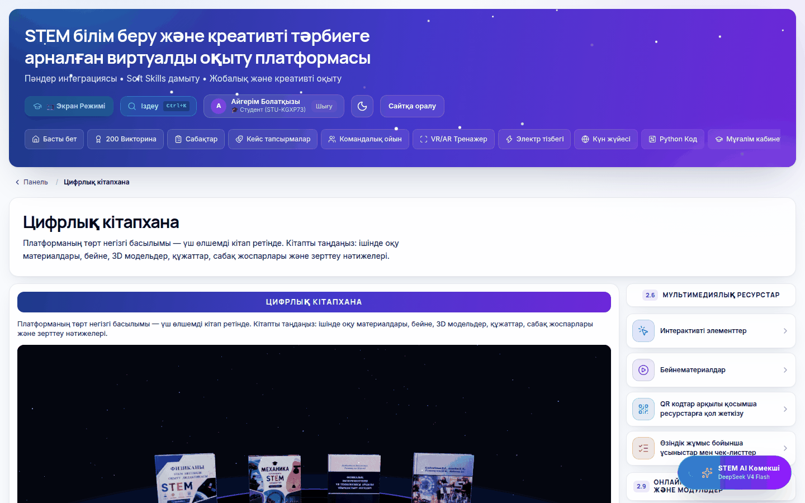

**Сурет 3 – Цифрлық кітапхана: төрт негізгі басылымның 3D көрінісі және ресурс бағанасы**

Суретте үш өлшемді сахнадағы төрт кітап, олардың астындағы таңдағыш және оң жақтағы мультимедиялық ресурстар бағанасы көрсетілген. Бұл бөлім кітапты таңдап, оның мақсаттарын, негізгі көрсеткіштерін, галереясын және құжаттар тізімін ашуға мүмкіндік береді; құжаттар тізімі атау мен көлем түрінде берілген, файлды жүктеу функциясы жоқ. Педагогикалық тұрғыдан бөлім өзіндік оқу мен ақпаратпен жұмыс істеу дағдысына бағытталған.

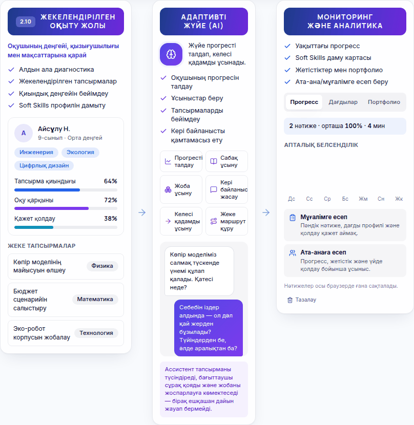

**Сурет 4 – Жекелендірілген оқыту жолы, адаптивті жүйе және мониторинг блоктары (демонстрациялық сипатта)**

Суретте панельдің орталық бөлігіндегі үш блок көрсетілген: үлгі оқушы профилі мен жеке тапсырмалар, AI ассистенттің мүмкіндіктері, мониторинг және аналитика. Бұл блоктар жекелендірілген оқыту моделінің кезеңдерін (талдау → ұсыныс → бейімдеу → кері байланыс) мұғалімге көрсетуге мүмкіндік береді; сол жақ екі блоктың деректері үлгі ретінде берілген. Педагогикалық тұрғыдан бөлім өзін реттеу және оқу траекториясын жоспарлау дағдысын қалыптастыру идеясын түсіндіруге бағытталған; мониторинг блогы ғана оқушының нәтижесімен жаңарады.

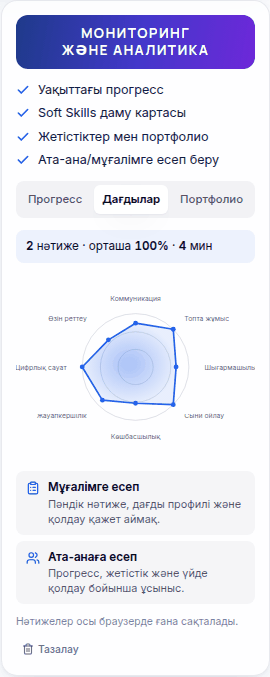

**Сурет 5 – Оқушы нәтижелері бойынша жаңартылатын Soft Skills дағдылар радары**

Суретте «Дағдылар» қойындысындағы сегіз осьті радар көрсетілген; ол оқушы сабақ ойыны мен тестін орындаған соң жаңарған. Бұл бөлім оқушы мен мұғалімге дағдылар профилін көруге және әлсіз осьті анықтауға мүмкіндік береді. Педагогикалық тұрғыдан радар өзін-өзі бағалау және рефлексия дағдыларын дамытуға бағытталған; нәтижесі жоқ осьтер демонстрациялық мәнде қалатынын ескеру қажет.

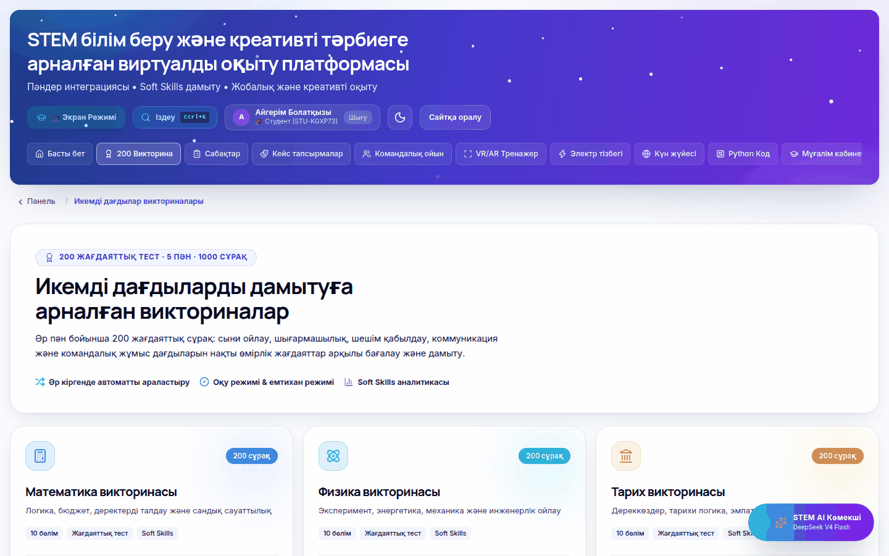

**Сурет 6 – Икемді дағдыларға арналған жағдаяттық викториналар бөлімі (5 пән × 200 сұрақ)**

Суретте бес пән бойынша викторина карточкалары, әрқайсысында 200 сұрақ, 10 бөлім және «Soft Skills» белгісі көрсетілген. Бұл бөлім оқушыға пән таңдап, нақты өмірлік жағдаят арқылы сыни ойлау, шешім қабылдау, коммуникация және командалық жұмыс дағдыларын тексеруге мүмкіндік береді. Педагогикалық тұрғыдан бөлім диагностикалық бағалауға және жағдаяттық оқытуға бағытталған.

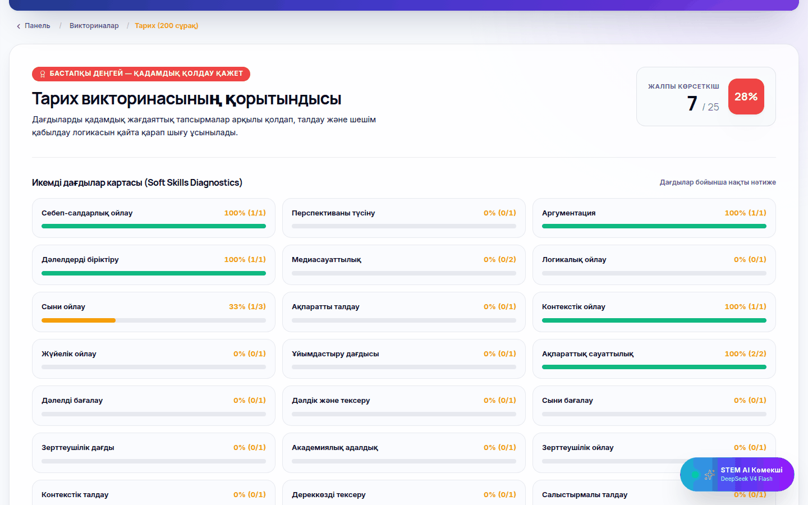

**Сурет 7 – Викторина қорытындысындағы икемді дағдылар диагностикалық картасы**

Суретте тест нәтижесі (7/25 — 28 %, «Бастапқы деңгей» мәртебесі) және әр дағды бойынша пайыз бен дұрыс жауап саны көрсетілген; нәтиже сынақ тапсыру кезінде алынған. Бұл бөлім оқушыға қай дағдының қалыптасқанын, қайсысына қосымша жаттығу қажет екенін көруге мүмкіндік береді. Педагогикалық тұрғыдан карта сыни ойлау, шешім қабылдау және өзін-өзі бағалау дағдыларын дамытуға бағытталған; дағды белгілері жеке сұрақ деңгейінде берілгендіктен, қысқа сессияда әр белгі бойынша сұрақ саны аз болады.

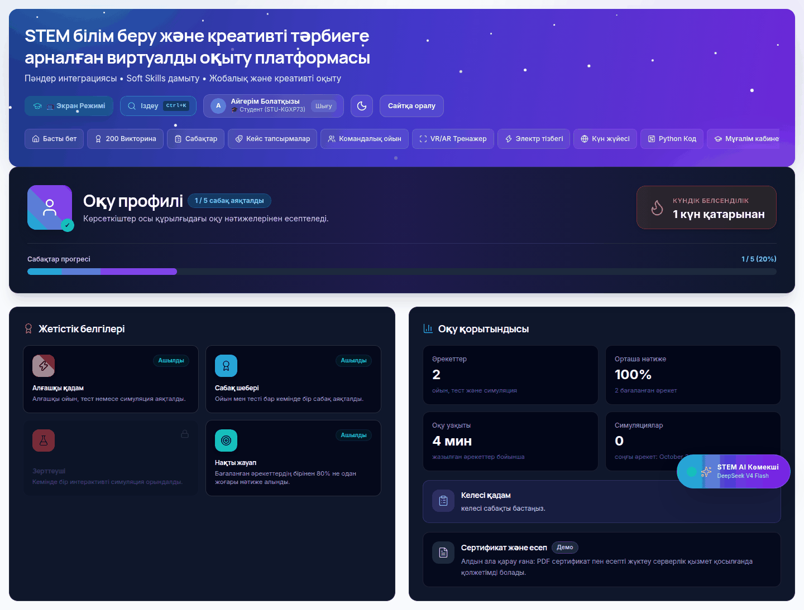

**Сурет 8 – Оқушының жеке кабинеті: прогресс, жетістік белгілері және келесі қадам**

Суретте оқу профилі көрсетілген: сабақтар прогресі (1/5), күндік белсенділік, төрт жетістік белгісінің үшеуі ашылған, әрекеттер саны, орташа нәтиже, оқу уақыты және «Келесі қадам» ұсынысы. Бұл бөлім оқушыға өз прогресін бақылауға мүмкіндік береді. «Сертификат және есеп» блогы «Демо» белгісімен берілген: PDF жүктеу интерфейсте көрсетілген, бірақ іске асырылмаған. Педагогикалық тұрғыдан бөлім өзін реттеу, табандылық және жауапкершілік дағдыларын дамытуға бағытталған.

## 5. Мультимедиялық және интерактивті ресурстар

### 5.1. Интерактивті сабақтар

Бес сабақ дайын сабақ үлгісінің алты кезеңі бойынша құрылған (Сурет 10): мақсаттар → нақты өмірлік жағдаят → іс-әрекет → цифрлық ресурстар → топтық жұмыс және рефлексия → бағалау. Әр сабақтың мақсаттары екі топқа бөлінген — **оқу мақсаттары** және **икемді дағдылар** — сондықтан пәндік және дағдылық нәтиже бір экранда көрінеді (Сурет 11).

- **Физика.** «Көпірдің беріктігін зерттеу» (9-сынып, 55 мин): ойын — созылу, сығылу және иілу бойынша 9 элементті топтастыру; ресурс — маятник симуляциясы; топтық кезең — командалық жоба симуляторы; тест — 6 сұрақ. Дағдылары: сыни ойлау, топта жұмыс, цифрлық сауат.
- **Математика.** «Қаланың бюджетін жоспарлау» (9-сынып, 50 мин): ойын — терминдерді сәйкестендіру; топтық кезең — командалық жоба симуляторы. Дағдылары: сыни ойлау, жауапкершілік, цифрлық сауат.
- **Тарих.** «Тарихи оқиғаның мультимедиялық реконструкциясы» (8-сынып, 55 мин): ойын — хронологияны ретке келтіру; Ұлы Жібек жолы туралы цифрлық экспозиция жағдаяты. Дағдылары: сыни ойлау, коммуникация, шығармашылық.
- **Әдебиет.** «Кейіпкердің ішкі монологы» (8-сынып, 45 мин): ойын — көркемдегіш құралдарды сәйкестендіру. Дағдылары: шығармашылық, коммуникация, өзін реттеу.
- **Технология.** «Эко-роботты жобалау» (9-сынып, 60 мин): ойын — инженерлік дизайн циклін ретке келтіру; ресурс және топтық кезең — командалық жоба симуляторы. Дағдылары: топта жұмыс, көшбасшылық, цифрлық сауат.

Барлық бес сабақтың топтық жұмыс кезеңінде командалық жоба симуляторы ұсынылады. Ойындар үш түрде әзірленді: «жұп табу», «ретке келтіру», «топтастыру»; олар басу арқылы жұмыс істейді (сүйреу қолданылмайды), сондықтан пернетақтада және сенсорлы экранда бірдей. Тесттің үш сұрақ түрі бар: бір жауапты, көп жауапты және «дұрыс/қате»; көп жауапты сұрақ толық сәйкестікпен бағаланады, өту шегі — 70 %. Қайта тапсыруға болады.

Сабақтың «Цифрлық ресурстар» кезеңінде материалдар тізімі (мысалы, «Эксперимент жоспарының үлгісі — әдістеме, 6 бет») атау мен көлем түрінде көрсетілген; файлды ашу функциясы жоқ. Сол кезеңде маятник симуляциясы тікелей сабақ бетінде жұмыс істейді.

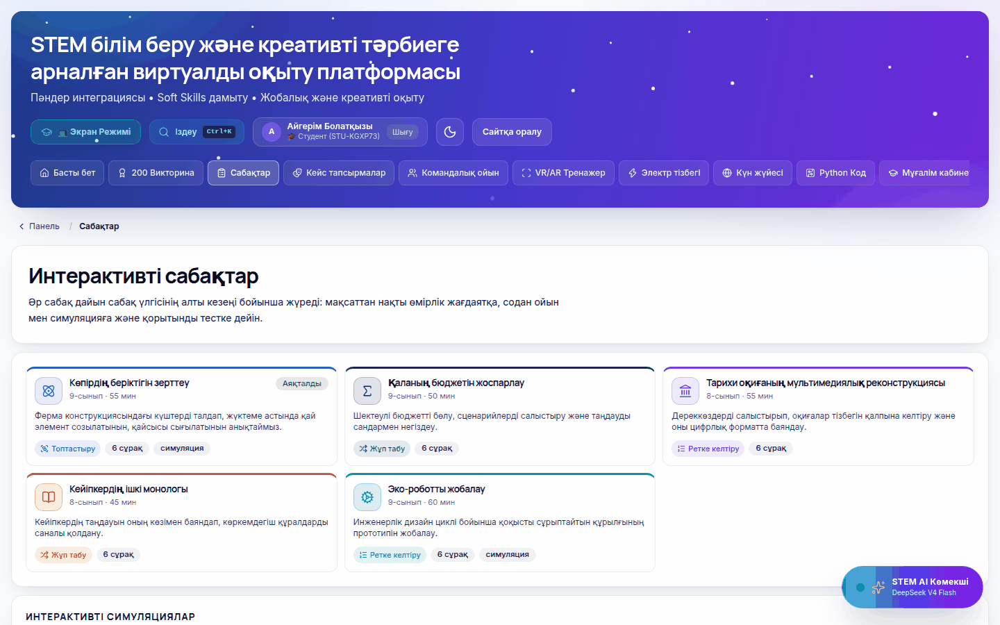

**Сурет 9 – Интерактивті сабақтар каталогы**

Суретте бес сабақ карточкасы көрсетілген: пән, сынып, ұзақтығы, ойын түрі, сұрақ саны және симуляция белгісі; аяқталған сабақ «Аяқталды» белгісімен ерекшеленген. Бұл бөлім оқушыға сабақты таңдауға, ал мұғалімге пәндік тақырыпты икемді дағдымен бірге жоспарлауға мүмкіндік береді. Педагогикалық тұрғыдан каталог пәнаралық интеграция мен өзін реттеу дағдысына бағытталған.

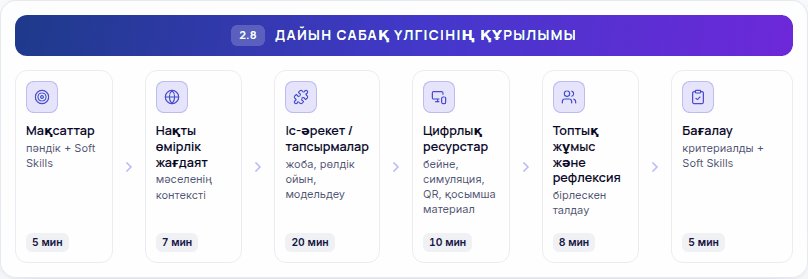

**Сурет 10 – Дайын сабақ үлгісінің алты кезеңдік құрылымы**

Суретте сабақ кезеңдері мен уақыт бөлінісі көрсетілген: мақсаттар (5 мин), нақты өмірлік жағдаят (7 мин), іс-әрекет (20 мин), цифрлық ресурстар (10 мин), топтық жұмыс және рефлексия (8 мин), бағалау (5 мин). Бұл құрылым мұғалімге сабақты бірдей логикамен жоспарлауға мүмкіндік береді. Педагогикалық тұрғыдан құрылым пәндік мақсатты, бірлескен әрекетті және рефлексияны бір сабақ ішінде байланыстыруға бағытталған.

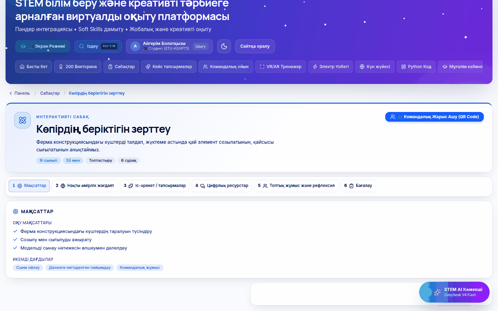

**Сурет 11 – Сабақ плеері: «Мақсаттар» кезеңі (оқу мақсаттары және икемді дағдылар)**

Суретте «Көпірдің беріктігін зерттеу» сабағының алты кезеңлі навигациясы және бірінші кезең көрсетілген: үш пәндік оқу мақсаты мен үш икемді дағды (сыни ойлау, дәлелге негізделген пайымдау, командалық жұмыс). Бұл бөлім оқушыға сабақ басында нәтижені екі қырынан көруге мүмкіндік береді. Педагогикалық тұрғыдан кезең мақсат қою және өзін-өзі бағыттау дағдысына бағытталған.

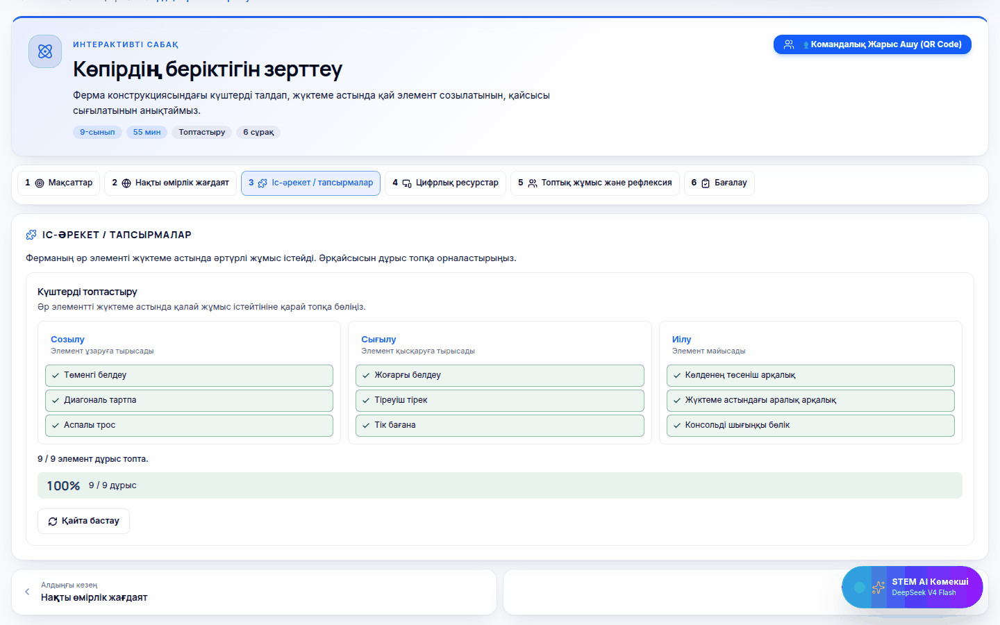

**Сурет 12 – Сабақтағы интерактивті ойын («Күштерді топтастыру»)**

Суретте оқушы тоғыз элементті «созылу», «сығылу», «иілу» топтарына бөлген және нәтиже 9/9 деп көрсетілген. Бұл бөлім ұғымды әрекет арқылы бекітуге және қатені бірден көруге мүмкіндік береді. Педагогикалық тұрғыдан ойын сыни ойлау мен дәлелдеу дағдысына бағытталған.

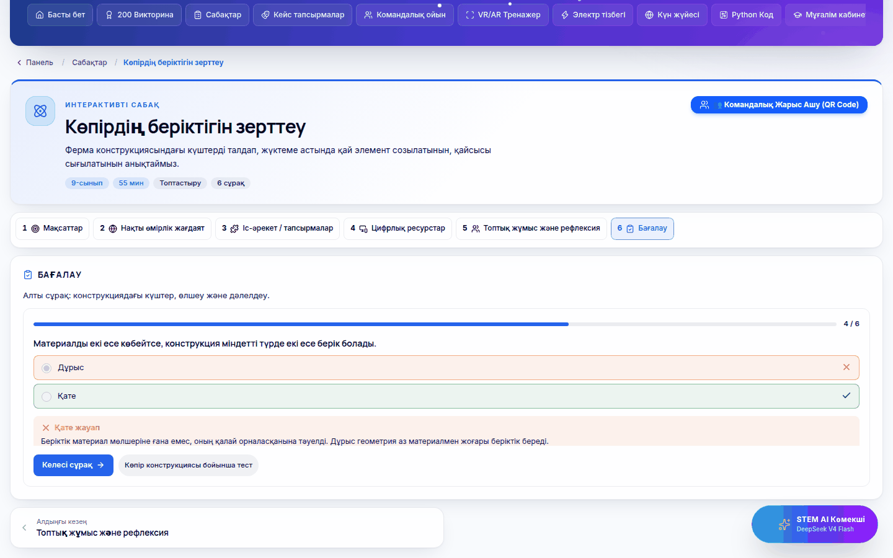

**Сурет 13 – Сабақ тесті: жауаптан кейін бірден кері байланыс**

Суретте қате жауап (қызыл) мен дұрыс жауап (жасыл) белгіленген және қатенің себебі түсіндірілген. Бұл бөлім оқушыға қатесін сол сәтте түсініп, келесі сұраққа өтуге мүмкіндік береді. Педагогикалық тұрғыдан бұл қалыптастырушы кері байланыс — өзін-өзі бағалау және өзін реттеу дағдысына бағытталған.

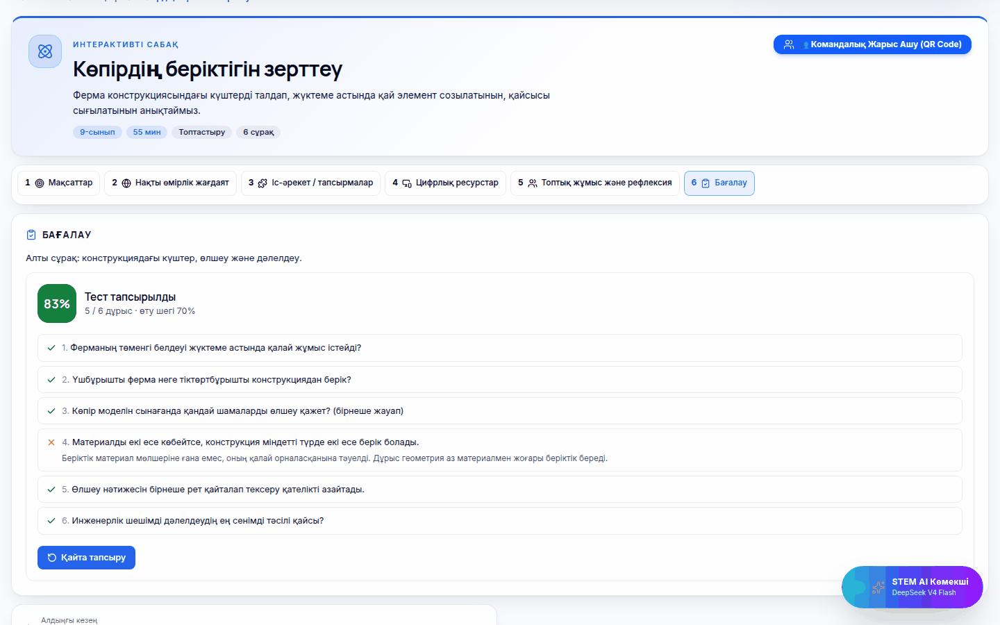

**Сурет 14 – Сабақ тестінің қорытындысы**

Суретте нәтиже 83 % (5/6, өту шегі 70 %), әр сұрақтың күйі және қате сұрақтың түсініктемесі көрсетілген. Бұл бөлім оқушыға нәтижені шектен салыстырып, «Қайта тапсыру» батырмасымен жақсартуға мүмкіндік береді. Нәтиже профильге жазылады және дағдылар радарын жаңартады. Педагогикалық тұрғыдан бөлім табандылық пен жауапкершілікке бағытталған.

### 5.2. Бейне, QR-код және қосымша ресурстар

- **Бейнематериалдар.** Бес кейстің әрқайсысының бірінші қадамында бейне YouTube арқылы енгізілген; бейне жағдаятты көрсетеді, ал оқушыға «бейнеден нені іздеу керек» деген нұсқау беріледі. Сынақ ортасында сыртқы желі жабық болғандықтан, бейненің ойнатылуы тексерілмеді (интерфейс пен сұрақтар тексерілді). Басты панельдегі «Бейнематериалдар» ресурс беті сипаттамалық, бейнекітапхана емес.
- **QR-код.** QR-код үш нақты функцияда жұмыс істейді: (1) командалық ойын бөлмесіне қосылу — QR `/play?code=…` сілтемесіне апарады; (2) кейстің рөлдік ойын бөлмесіне қосылу — QR `/play/case?code=…&case=…` сілтемесіне апарады, сондықтан оқушы бірден дұрыс кейс пен бөлмеге түседі; (3) әр сабақтағы «Командалық жарыс ашу (QR Code)» терезесі сабақ бойынша бөлме ашады. QR үлкейтіледі, сілтемені көшіру батырмасы бар. «QR кодтар арқылы қосымша ресурстарға қол жеткізу» беті сипаттамалық: онда QR жасау немесе қосымша материалға өту құралы жоқ.
- **Визуализация және виртуалды модельдер.** Жұмыс істейтін құралдар: маятниктің теңдеуі мен энергия графигі, электр тізбегі (Ом заңы мен шамның жарықтануы), Күн жүйесінің 3D орбиталары, VR/AR тренажердің 3D сахналары, формулалар KaTeX арқылы көрсетіледі. Бұл құралдар оқушыға параметрді өзгертіп, нәтижені көзбен салыстыруға мүмкіндік береді.
- **Өзіндік жұмыс.** Оқушының өзіндік жұмысына арналған құралдар: 200 сұрақтық викторина (оқу режимі, қателерді қайта қарау), сабақ тесттері, симуляциялар, STEM AI көмекші. «Өзіндік жұмыс бойынша ұсыныстар мен чек-листтер» беті сипаттамалық; жұмыс істейтін чек-лист құралы жоқ (кейс тапсырмасында жауапты өзі тексеру үшін үш критерийлік қысқа тізім бар).
- **Мұғалімнің экран режимі.** Тақтаға шығарылатын 3 сұрақтық квиз (формулалар KaTeX-пен), үлкейту және толық экран; нәтижелер құрылғыда сақталады.

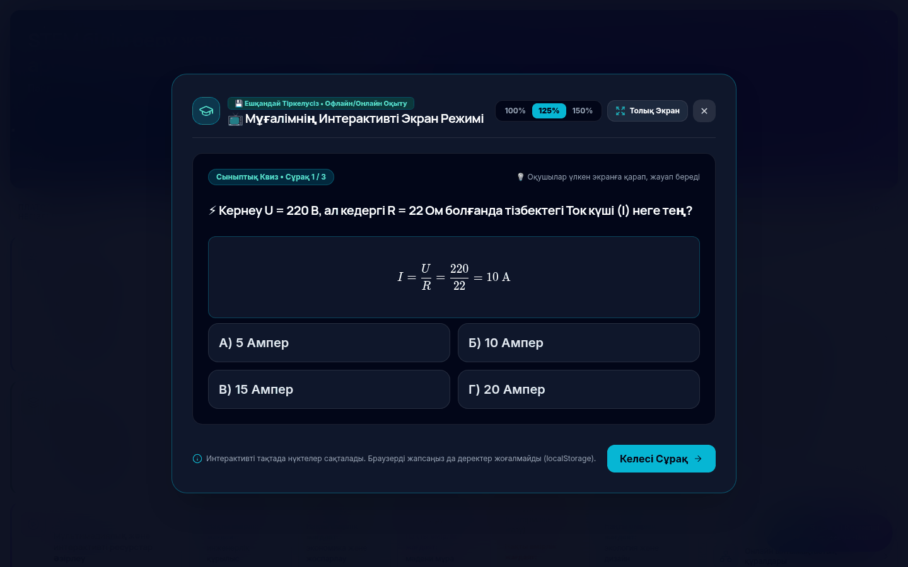

**Сурет 15 – Мұғалімнің интерактивті экран режимі**

Суретте сыныптық квиздің бірінші сұрағы (Ом заңы), формула, төрт жауап нұсқасы, мәтінді үлкейту батырмалары және толық экран батырмасы көрсетілген. Бұл бөлім мұғалімге сұрақты тақтаға шығарып, оқушылардың жауабын ауызша жинауға мүмкіндік береді. Педагогикалық тұрғыдан бөлім сыныптағы коммуникация мен бірлескен талқылауға бағытталған.

---

## 6. Командалық және рөлдік ойын модульдері

Платформаның педагогикалық өзегі — оқушылардың виртуалды ортада бірге әрекет ететін модульдері: кейс тапсырмалар мен рөлдік ойын, командалық STEM ойыны және командалық жоба симуляторы (7-бөлім). Бұл модульдер оқушының топқа қосылуын, рөл таңдауын, ортақ тапсырманы орындауын, пікір алмасуын, шешім қабылдауын және ортақ нәтижеге жауап беруін нақты интерфейс әрекетіне айналдырды.

### 6.1. Кейс тапсырмалар

Бөлім бес кейстен тұрады. Беттегі анықтамаға сәйкес, кейс пәнге бөлінбейді: онда бағаланатын нәрсе — формула емес, шешім: ұстанымды қалай негіздейсің, басқаны қалай тыңдайсың, топта қандай рөл аласың. Әр кейс төрт қадамнан өтеді: **бейне → шағын тапсырма → рөлдік ойын → талқылау.**

- **«Жарық пен мейірімділік»** (3-сынып, 35 мин). Рөлдер: тәжірибе жасаушы, бақылаушы, жазушы, топ жетекшісі. Дағдылар: топта жұмыс, коммуникация, көшбасшылық, жауапкершілік. Жағдаят: топ жетекшісі барлық шешімді өзі қабылдап, достарын тыңдамайды.
- **«Екі жолдың құпиясы»** (бастауыш сынып, 40 мин + 2–3 күн бақылау). Рөлдер: тәжірибе жасаушы, бақылаушы, жазушы, постер жасаушы. Дағдылар: өзін реттеу, сыни ойлау, топта жұмыс, шығармашылық.
- **«Тамшының бағасы: мектептегі ағып тұрған кран»** (бастауыш сынып, 35 мин). Рөлдер: өлшеуші, есептеуші, хабаршы, топ жетекшісі. Дағдылар: жауапкершілік, сыни ойлау, топта жұмыс.
- **«Қоқыстың екінші өмірі»** (бастауыш сынып, 40 мин). Рөлдер: сұрыптаушы, зерттеуші, дизайнер, үгітші. Дағдылар: шығармашылық, жауапкершілік, коммуникация, топта жұмыс.
- **«Роботтың бірінші қадамы»** (бастауыш сынып, 40 мин). Рөлдер: бағдарламашы, тестілеуші, құрастырушы, құжаттаушы. Дағдылар: цифрлық сауат, топта жұмыс, сыни ойлау, өзін реттеу.

Әр кейстің рөлдік ойыны үш раундтан тұрады, әр раундтың ұзақтығы белгіленген (мысалы, бірінші кейсте 7, 5 және 6 минут). **Екінші қадам** — оқушы кейстің проблемалық жағдаятына жеке көзқарасын жазады: «Топ жетекшісі барлық шешімді өзі қабылдап, достарының пікірін тыңдамай қойды. Сіз сол топта болсаңыз, не істер едіңіз?». Жауап кемінде 80 таңбадан тұруы тиіс; мәтін сақталады және мұғалім кабинетінде көрінеді. **Төртінші қадам** — сыныпта ауызша талқылауға арналған бес сұрақ (мысалы, «Неліктен топта әр адамның пікірі маңызды?», «Бұл тапсырмада қандай жаңа нәрсе үйрендіңіз?»); сол экранда рөлдік ойындағы нәтиже («1/3 рөлдік ойындағы нәтижеңіз») дағды профиліне қосылғаны көрсетіледі, ал «Кейсті аяқтау» батырмасы кейсті жабады.

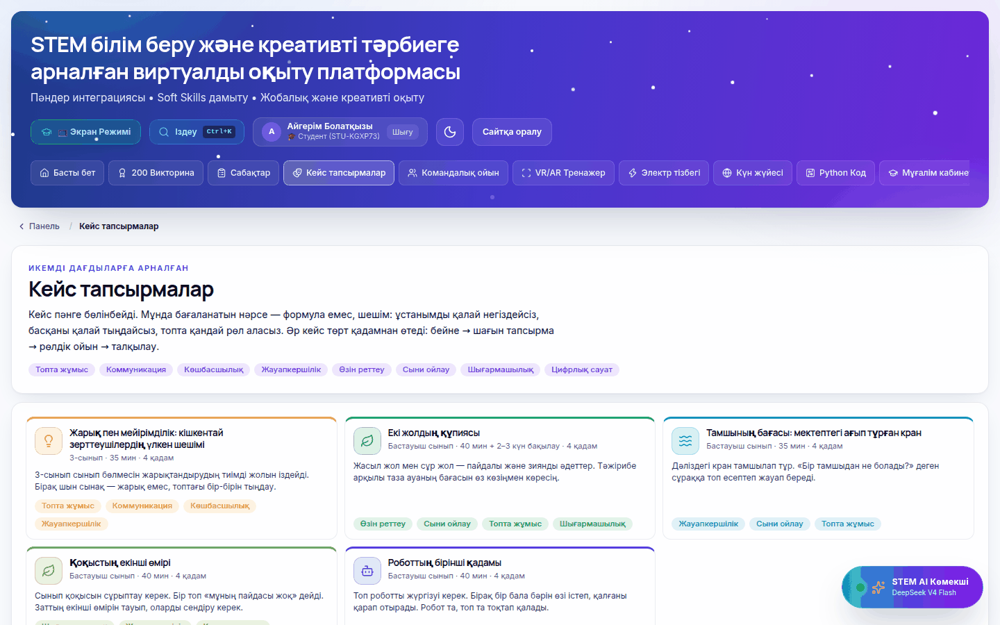

**Сурет 16 – Кейс тапсырмалар бөлімі**

Суретте кейс каталогы көрсетілген: бөлім сипаттамасы, дағды белгілері (топта жұмыс, коммуникация, көшбасшылық, жауапкершілік, өзін реттеу, сыни ойлау, шығармашылық, цифрлық сауат) және бес кейс карточкасы. Бұл бөлім оқушы мен мұғалімге кейсті пән бойынша емес, дамытатын дағды бойынша таңдауға мүмкіндік береді. Педагогикалық тұрғыдан бөлім кейс-стади әдісі арқылы коммуникация, көшбасшылық және жауапкершілік дағдыларын дамытуға бағытталған.

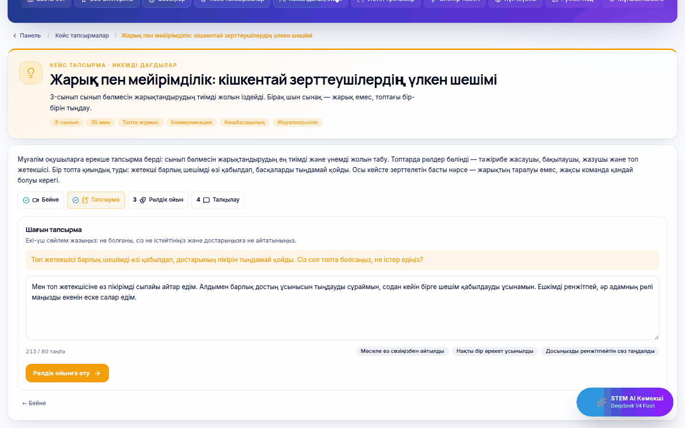

**Сурет 17 – Кейс тапсырма: жеке жазбаша жауап қадамы**

Суретте кейстің екінші қадамы көрсетілген: проблемалық сұрақ, таңба санағыш (213 / 80), үш критерийлік өзін-өзі тексеру тізімі және «Рөлдік ойынға өту» батырмасы. Бұл бөлім оқушыға рөлдік ойынға дейін өз ұстанымын сөзбен тұжырымдауға мүмкіндік береді. Педагогикалық тұрғыдан қадам рефлексия, коммуникация және өзін-өзі реттеу дағдыларына бағытталған.

### 6.2. Рөлдік ойын модулі

Рөлдік ойын кейстің үшінші қадамында жүреді және мына логикамен құрылған: **кейс/бейне → проблемалық жағдаят → рөлдерді бөлу → рөлге сәйкес әрекет → командалық шешім → талқылау → рефлексия.**

1. **Кейс және проблемалық жағдаят.** Бейне мен жазбаша тапсырма жағдаятты ашады; рөлдік ойын бетінде сценарий мен мақсат көрсетіледі («Үш раундтан кейін топ бір ұсыныс дайындайды және әр мүшенің пікірі сол ұсынысқа қалай кіргенін айтады»).
2. **Рөлдерді бөлу.** Хост «Онлайн бөлме ашу» батырмасын басады; платформа 6 таңбалы код пен QR-код жасайды. Оқушылар QR немесе «Кодпен қосылу» арқылы кіреді, атын жазып, аватар таңдайды. Әр оқушы өз рөлін таңдайды; бір рөлді екі адам ала алмайды, рөлдер кімде екені барлық қатысушыға көрінеді. Ойын «барлығы рөл таңдағанда, кемінде 2 адам болғанда» басталады.
3. **Рөлге сәйкес әрекет.** Әр оқушы «Сіздің рөліңіз» карточкасын алады: рөлдің мақсаты, «НЕ ІСТЕЙСІЗ» тізімі (нақты мінез-құлық нұсқаулары) және «СҰРАҚТАРЫҢЫЗ» (басқаларға қоятын сұрақтар). Мысалы, **бақылаушы**: жарықтың қай жерде жарқын екенін салыстырады; тек көргенін айтады, болжамды бөлек айтады. **Топ жетекшісі**: әр адамға кезекпен сөз береді; өз идеясын соңында айтады; шешімді «мен шештім» емес, «біз келістік» деп жариялайды. Әр раундта әр рөл өзіне арналған жеке сұрақ алады (мысалы, бақылаушыдан «Бақылаушының сөзі қайсысы?», жазушыдан «Топтың шешімін қалай жазған дұрыс?»).
4. **Командалық шешім.** Үшінші раундта топ бір ұсыныс дайындайды; қатысушылар командалық чатта пікір алмасады (чатта жүйелік хабарлар — «қосылды», «рөл таңдады», «раунд басталды» — автоматты жазылады). Раунд таймерін хост басқарады («Бастау», «Тоқтату»), жауаптарды ашады және келесі раундқа өтеді.
5. **Нәтиже.** Соңында «Ойын нәтижесі» көрсетіледі: команда ұпайы (әр дұрыс жауап — 10 ұпай), әр қатысушының рөлі және дұрыс жауап саны. Платформа ұпайды былай түсіндіреді: «Ұпай — бір-бірін тыңдаған команданың нәтижесі».
6. **Талқылау және рефлексия.** Нәтиже экранынан соң «талқылауға өту» батырмасы төртінші қадамды ашады; бес рефлексиялық сұрақ сыныпта ауызша талқыланады. Достар жиналмаса, «Дос жоқ — өткізіп жіберу» батырмасы арқылы оқушы төрт рөлдің нұсқауын өзі оқып шығады да, келесі қадамға өтеді.

**Рөлдер арқылы дағдыларды қалыптастыру.**

- *Коммуникация:* чат пен раундтағы талап «әркім кемінде бір рет сөйлейді»; бақылаушы көргенін мен болжамды айырады, жазушы шешімді себебімен жазады.
- *Эмпатия және тыңдау:* топ жетекшісінің нұсқауы («әр адамға кезекпен сөз береді», «Кім әлі айтқан жоқ?») басқаның пікірін тыңдау әрекетін міндетті етеді.
- *Көшбасшылық:* жетекші басқаруды өкімдік емес, келісім түрінде жүргізеді («біз келістік»).
- *Жауапкершілік:* әр оқушы өз рөліне байланған сұраққа жауап береді, ал команда ұпайы барлық мүшенің жауаптарының қосындысынан құралады.
- *Шешім қабылдау:* үшінші раундта топ жарықты таратудың екі нұсқасының біреуін таңдап, ортақ ұсыныс жасайды.
- *Қақтығысты басқару:* екінші раунд әдейі қиындықпен құрылған — жетекші бір шешімді жалғыз қабылдап көреді, ал топ мұғалімнің сұрағын талқылайды («Жақсы команда қандай болуы керек?»).

**Әдістемелік шек.** Платформа рөл нұсқауын, рөлге байланған сұрақты, чатты және нәтиже есептеуді қамтамасыз етеді; ал қатысушылардың нақты мінез-құлқының сапасын (тыңдады ма, келіспеушілікті қалай шешті) автоматты өлшемейді. Сондықтан бұл бақылауды мұғалім талқылау қадамында және бақылау парағы арқылы жүргізеді (9-бөлім).

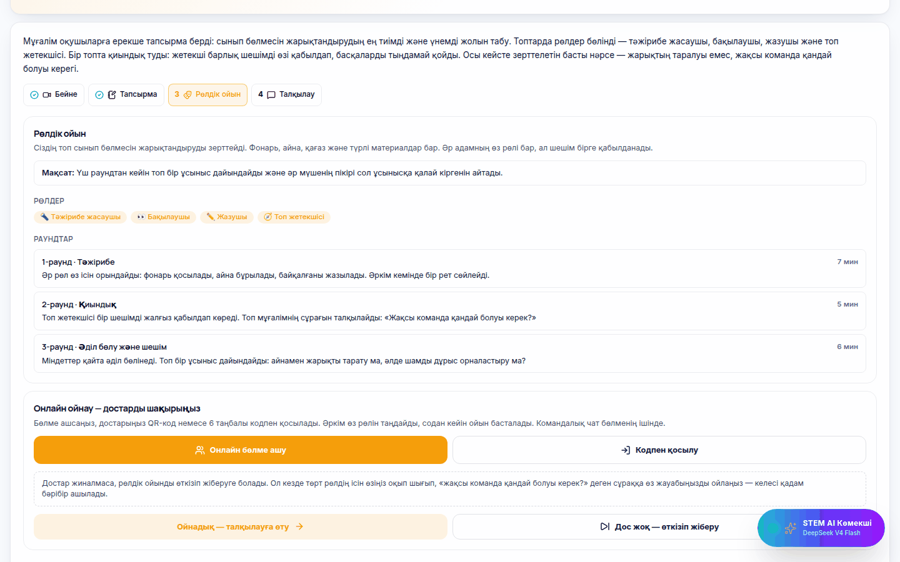

**Сурет 18 – Кейстің рөлдік ойыны: сценарий, рөлдер және раундтар**

Суретте «Жарық пен мейірімділік» кейсінің үшінші қадамы көрсетілген: сценарий мен мақсат, төрт рөл (тәжірибе жасаушы, бақылаушы, жазушы, топ жетекшісі), үш раунд және онлайн бөлме ашу не кодпен қосылу батырмалары. Бұл бөлім оқушыға ойынның құрылымын алдын ала көруге, ал мұғалімге бөлмені ашуға мүмкіндік береді. Педагогикалық тұрғыдан бөлім рөлдік ойын әдісі арқылы командалық жұмыс пен көшбасшылық дағдыларына бағытталған.

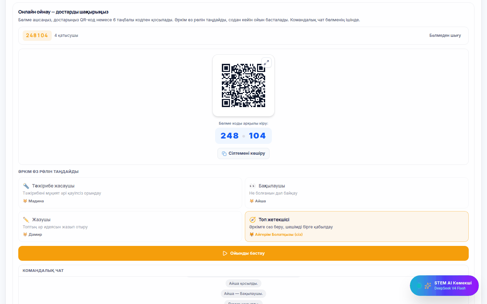

**Сурет 19 – Рөлдік ойын бөлмесі: QR-код, бөлме коды және рөл таңдау**

Суретте хост бөлмесі көрсетілген: 6 таңбалы код (248 104), QR-код, «Сілтемені көшіру» батырмасы, рөл карточкалары (әр рөлдің қасында таңдаған оқушының аты), «Ойынды бастау» батырмасы және командалық чат. Бұл бөлім оқушылардың топқа қосылуына және рөлді бөлуге мүмкіндік береді; нәтижесінде төрт қатысушы бір бөлмеде төрт түрлі рөл алды. Педагогикалық тұрғыдан бөлім коммуникация, жауапкершілік және бірлесіп шешім қабылдау дағдыларына бағытталған.

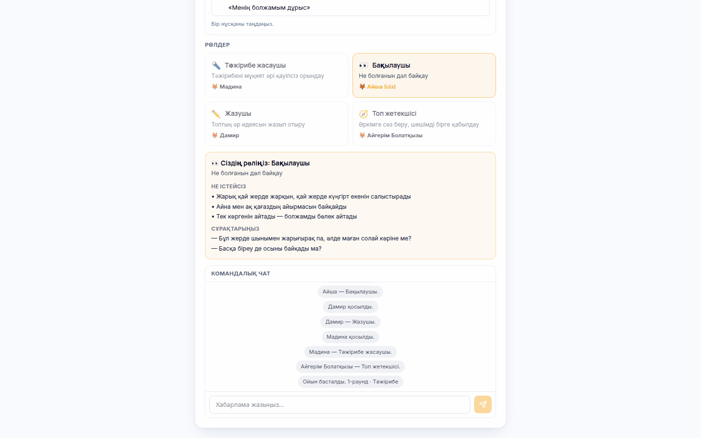

**Сурет 20 – Оқушының рөл карточкасы және командалық чат**

Суретте «Бақылаушы» рөлін таңдаған оқушының экраны көрсетілген: барлық рөл мен олардың иелері, «Сіздің рөліңіз» карточкасы («НЕ ІСТЕЙСІЗ», «СҰРАҚТАРЫҢЫЗ») және командалық чат. Бұл бөлім оқушыға өз рөлінің нақты міндетін және серіктестерге қоятын сұрақтарын көруге мүмкіндік береді. Педагогикалық тұрғыдан карточка рөлдік мінез-құлықты үлгілеп, эмпатия мен коммуникация дағдыларын дамытуға бағытталған.

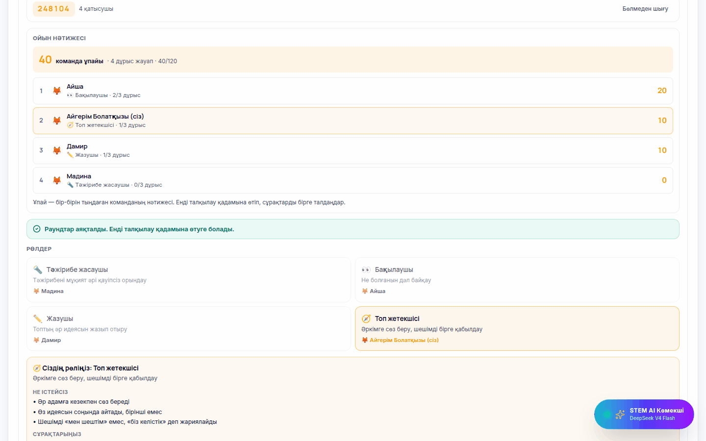

**Сурет 21 – Рөлдік ойын нәтижесі**

Суретте үш раундтан кейінгі «Ойын нәтижесі» көрсетілген: команда ұпайы (40/120, 4 дұрыс жауап), әр қатысушының рөлі, дұрыс жауап саны және ұпайы; төменде «Раундтар аяқталды. Енді талқылау қадамына өтуге болады» хабары берілген. Бұл бөлім команданың ортақ нәтижесін және әр мүшенің үлесін көруге мүмкіндік береді. Педагогикалық тұрғыдан нәтиже экраны ортақ нәтижеге жауапкершілікке және рефлексияға бағытталған; көрсетілген мәндер сынақ ойынынан алынды.

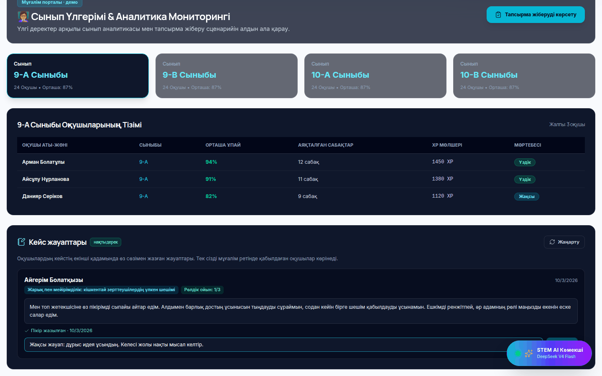

**Сурет 22 – Мұғалім кабинеті: оқушының кейс жауабы және мұғалімнің пікірі**

Суретте мұғалім кабинетінің «Кейс жауаптары — нақты дерек» блогы көрсетілген: оқушының аты, кейс атауы, рөлдік ойындағы нәтижесі (1/3), жазбаша жауабы, пікір жазу өрісі және «Пікір жазылған» белгісі. Бұл бөлім мұғалімге оқушының өз сөзімен жазған жауабын көріп, жазбаша кері байланыс беруге мүмкіндік береді; жауаптар мұғалімді қабылдаған оқушылардан ғана көрінеді. Педагогикалық тұрғыдан бөлім қалыптастырушы кері байланысқа бағытталған; пікірді оқушы жағында көрсету интерфейсте әзірге іске асырылмаған.

### 6.3. Командалық STEM ойыны (STEM Team Battle)

Бөлім мұғалімге немесе ұйымдастырушыға аккаунтсыз, бір минутта сыныптық жарыс өткізуге мүмкіндік береді.

- **Хост панелі.** «Ойын бөлмесін ашу» батырмасынан соң хост бөлме коды мен QR-кодты тақтаға шығарады; пән санатын таңдайды (барлығы, физика, химия, биология, математика, STEM және робототехника); қажет болса, өз сұрағын қосады; ойыншылар қосылған сайын төрт команданың құрамы нақты уақытта өзгереді (Қызыл Арыстандар, Көк Бүкіттер, Жасыл Барыстар, Сары Тұлпарлар).
- **Ойыншы беті.** Оқушы `/play` бетінде код, ат, аватар (12 нұсқа) және команда таңдап, тіркелусіз кіреді.
- **Ойын барысы.** Кері санау → сұрақ (7 сұрақ, әрқайсысы 20 секунд) → хост «Дұрыс жауапты ашу» → «Келесі сұрақ» → «Финалдық нәтижені көру». Хост экранында «Жауап берді: 3 / 3» санағышы көрінеді. Ойыншылар эмодзи-реакция (7 нұсқа) жібереді, дыбыс қосылады/өшіріледі.
- **Ұпай.** Дұрыс жауап — 100 ұпай және жылдамдық бонусы: уақыттың 75 %-ынан астамы қалса +50, 50 %-дан астамы +30, 25 %-дан астамы +10. Команда ұпайы мүшелердің ұпайларының қосындысы ретінде көрсетіледі; соңында 1-, 2-, 3-орын подиумы шығады.
- **Сабақпен байланыс.** Әр сабақтың «Командалық жарыс ашу (QR Code)» батырмасы осы механизмді сабақ контексінде ашады: көпір, бюджет және эко-робот сабақтарында сабаққа арналған сұрақтар (сәйкесінше 2, 1 және 1 сұрақ) қолданылады, қалған сабақтарда жалпы STEM сұрақтар жиыны (7 сұрақ) беріледі.

Командалық ойын бөлмелерінің синхрондауы Supabase Realtime арқылы немесе кілт болмаса, бір браузердің қойындылары арасында жүзеге асады. Тексеру бір браузердегі қойындылар арқылы (хост және үш ойыншы) орындалды; бірнеше құрылғыда бір бөлмеге қосылу Supabase қосылмаған ортада тексерілмеді.

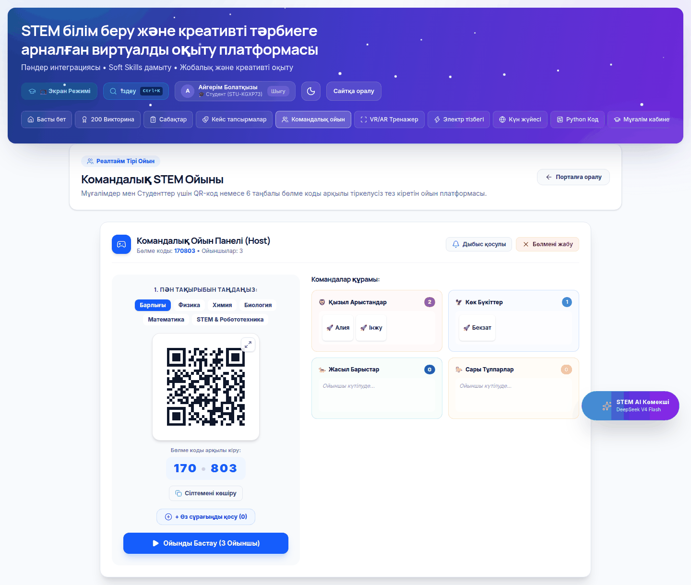

**Сурет 23 – Командалық STEM ойыны: хост панелі (QR-код, пән санаты, командалар құрамы)**

Суретте бөлме коды (189 046), QR-код, пән санаттары, «Өз сұрағыңды қосу» және «Ойынды бастау» батырмалары, сондай-ақ үш ойыншының екі командаға бөлінгені көрсетілген. Бұл бөлім мұғалімге сыныпты бірнеше секундта ойынға қосуға, ал оқушыға тіркелусіз кіруге мүмкіндік береді. Педагогикалық тұрғыдан бөлім командалық жұмыс пен оқу белсенділігіне бағытталған.

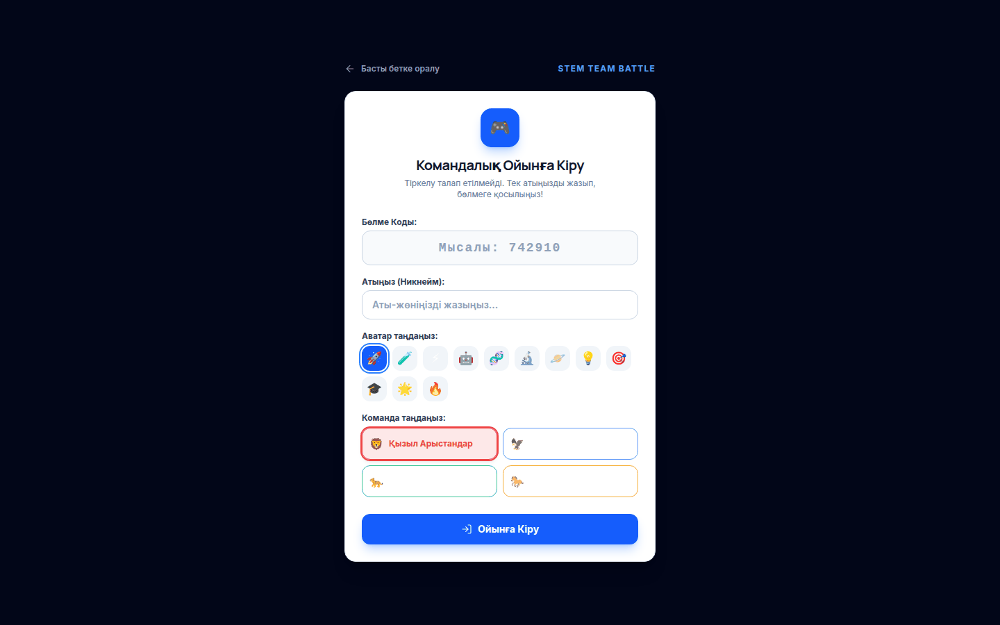

**Сурет 24 – QR-код немесе код арқылы командалық ойынға қосылу беті**

Суретте тіркелусіз қосылу формасы көрсетілген: бөлме коды, ат, аватар таңдау және төрт команда. Бұл бөлім оқушыға QR-кодты сканерлеп (код өрісі автоматты толады) не кодты қолмен енгізіп, бір әрекетпен бөлмеге түсуге мүмкіндік береді. Педагогикалық тұрғыдан бөлім цифрлық ресурсқа тез қолжетімділікті қамтамасыз етіп, командаға тиесілілік сезімін қалыптастыруға бағытталған. Таңдалмаған командалардың атаулары бұл экранда көрінбейді (мәтін түсі карточка фонымен үйлесіп кетеді); оқушы команданы белгісі мен түсі бойынша таңдайды.

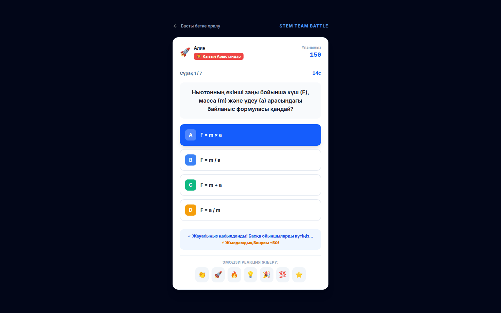

**Сурет 25 – Командалық ойын: ойыншы экраны**

Суретте оқушы экранында команда белгісі, жеке ұпай (150), сұрақ нөмірі мен таймер, төрт жауап нұсқасы, «Жауабыңыз қабылданды… Жылдамдық бонусы +50!» хабары және эмодзи-реакция батырмалары көрсетілген. Бұл бөлім оқушыға уақыт қысымында шешім қабылдауға және жауабының нәтижесін бірден көруге мүмкіндік береді. Педагогикалық тұрғыдан бөлім шешім қабылдау және өзін реттеу дағдыларына бағытталған.

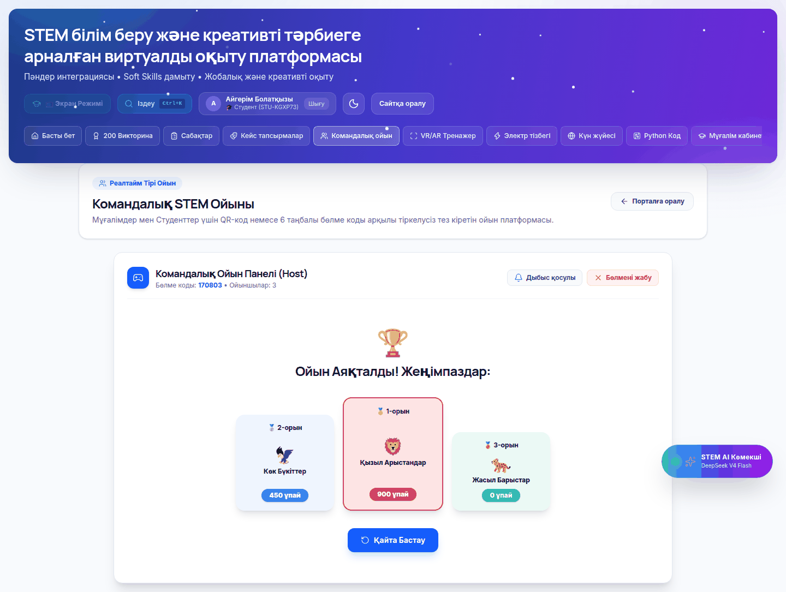

**Сурет 26 – Командалық ойынның қорытындысы: команда рейтингі**

Суретте «Ойын аяқталды» экраны: жеңімпаздар подиумы (1-орын — Қызыл Арыстандар, 900 ұпай; 2-орын — Көк Бүкіттер, 450 ұпай) көрсетілген; ойыншы жағында жеке жинаған ұпай (450) шығады. Бұл бөлім ойынды жинақтауға және мұғалімге сұрақтарды талқылауға өтуге мүмкіндік береді. Педагогикалық тұрғыдан бөлім командалық жұмыс пен ортақ нәтижеге жауапкершілікке бағытталған; жылдамдық бонусы бәсекені күшейтетіндіктен, мұғалім жауап ашылған сәтте түсініктемені талқылауы әдістемелік талап болып табылады.

## 7. Виртуалды тренажерлар мен симуляциялық тапсырмалар

### 7.1. Командалық жоба симуляторы

Симулятор әлеуметтік өзара әрекетті модельдейді және төрт қадамнан тұрады.

1. **Орта.** Төрт виртуалды ортаның бірі таңдалады: қала кеңістігі, ғылыми зертхана, жобалық кеңсе, тарихи кеңес; әр ортаның өз сипаты бар (мысалы, зертханада деректі тексермей шешім қабылданбайды).
2. **Рөлдер.** Алты виртуалды мүшенің әрқайсысының мінезі мен күшті жағы көрсетілген (Айсұлу — жоспарлауды ұнатады; Дәулет — құрастыруға шебер; Мадина — дереккөзбен ұқыпты; Ерасыл — көпшілік алдында сөйлеуден қорықпайды; Аружан — визуалды шешімге бейім; Нұрлан — сандармен жұмыс істейді). Оқушы оларға алты рөлді береді: жоба жетекшісі, зерттеуші, инженер, дизайнер, аналитик, баяндамашы. Бір рөлді бір мүше алады; күшті жағына сай келген таңдау жұлдызшамен (★) белгіленеді.
3. **Жағдаяттар.** Төрт қақтығыс: «Мерзім қысқарды», «Команда келіспеді», «Ресурс жетіспейді», «Техникалық ақау». Әр жағдаятта үш шешім ұсынылады; әр шешімнің төрт көрсеткішке (коммуникация, мерзім, сапа, команда көңіл күйі; бастапқы мән — 60) нақты әсері бар, ал салдары бірден түсіндіріледі (мысалы, ауқымды қысқартқанда: мерзім +18, сапа +6, көңіл күй +4). Ең күшті таңдау белгіленеді.
4. **Нәтиже.** 0–100 аралығындағы қорытынды ұпай мен деңгей атауы, төрт көрсеткіш пайызы, рөл сәйкестігі (мысалы, 6/6 және +12 балл бонус), шешімдер журналы және «Қайта өту» батырмасы көрсетіледі. Нәтиже оқушының профиліне жазылады.

Қорытынды ұпай кездейсоқ емес: ол шешімдердің салдарынан және рөл сәйкестігінен есептеледі. Симулятор басты панельде таныстырылады, сабақтың топтық жұмыс кезеңінде және `/dashboard/simulations/team-project` бетінде жұмыс істейді. Симуляция жеке орындалады (бір оқушы барлық рөлді бөледі), сондықтан ол нақты командалық әрекеттің орнын баспайды, оны алдын ала машықтандыратын тренажер болып табылады.

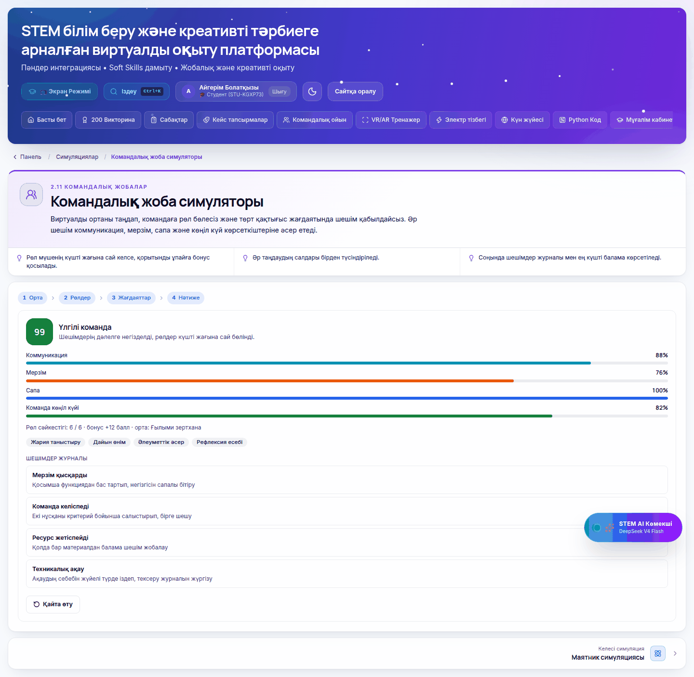

**Сурет 27 – Командалық жоба симуляторының нәтижесі: көрсеткіштер, рөл сәйкестігі, шешімдер журналы**

Суретте төрт қадамдық навигация, қорытынды ұпай (99, «Үлгілі команда»), төрт көрсеткіш (коммуникация 88 %, мерзім 76 %, сапа 100 %, көңіл күй 82 %), рөл сәйкестігі (6/6, +12 балл) және төрт шешім журналы көрсетілген. Бұл бөлім оқушыға рөлді бөлу мен қақтығысты шешу шешімдерінің салдарын көруге мүмкіндік береді. Педагогикалық тұрғыдан симулятор қақтығысты басқару, шешім қабылдау, жоспарлау және коммуникация дағдыларына бағытталған.

### 7.2. Виртуалды лабораториялар

- **Маятник симуляциясы.** Толық сызықтық емес теңдеу бойынша жұмыс істейді; ұзындықты, массаны, бастапқы бұрышты, сөнуді және ауырлық күшін (Ай, Марс, Жер, Юпитер) өзгертуге болады; «Ойнату», «Қадам», «Қалпына келтіру» батырмалары, бұрыш пен энергия графигі, өлшенген период пен кіші бұрыш формуласының салыстыруы, KaTeX формуласы бар. Симуляция 5 секундтан артық жұмыс істегенде әрекет ретінде (ұпайсыз) жазылады да, профильдегі «Зерттеуші» белгісіне есептеледі.
- **Электр тізбегі.** Кернеу мен кедергі өзгертіледі; ток күші (I = U/R), шамның қуаты және жарықтануы нақты уақытта өзгереді.
- **Күн жүйесі.** Планеталар (Меркурий, Шолпан, Жер, Марс, Юпитер) 3D орбитада қозғалады; жылдамдық 0,5×–5× ауыстырылады; таңдалған планета бойынша қашықтық, айналу периоды және еркін түсу үдеуі көрсетіледі; Бүкіләлемдік тартылыс заңы формуласы беріледі.
- **VR/AR тренажер.** Төрт сахна: оптика және лазер зертханасы, Күн жүйесі, Жібек жолы тарихи мұрасы, инженерлік манипулятор және цифрлық егіз. Оптика сахнасында оптикалық үстел, лазер, шыны призма және спектр көрсетіледі, 3D сахнаның ішінде қазақша ақпараттық тақта бар; «Интерактивті зертханалық тапсырмалар» тізімі (0/3) үш міндетті атайды. **VR-шлемге шығу** (Meta Quest, «Quest Link» батырмасы) және сахналардағы тапсырмалардың 3D-ішінде орындалуы интерфейсте көрсетілген, бірақ қолжетімділік шектеулі (VR-құрылғы жоқ) болғандықтан ішкі функционалы толық тексерілмеді.
- **Python Код.** Үш дайын мысал (Ом заңы, маятник периоды, ДНҚ нуклеотидтерін санау) және олардың алдын ала есептелген нәтижесі көрсетіледі. Бетте көрсетілгендей, демо кодты браузерде орындамайды: оқушы өз кодын жаза немесе іске қоса алмайды, ол дайын мысалды оқып, нәтижені талдайды.

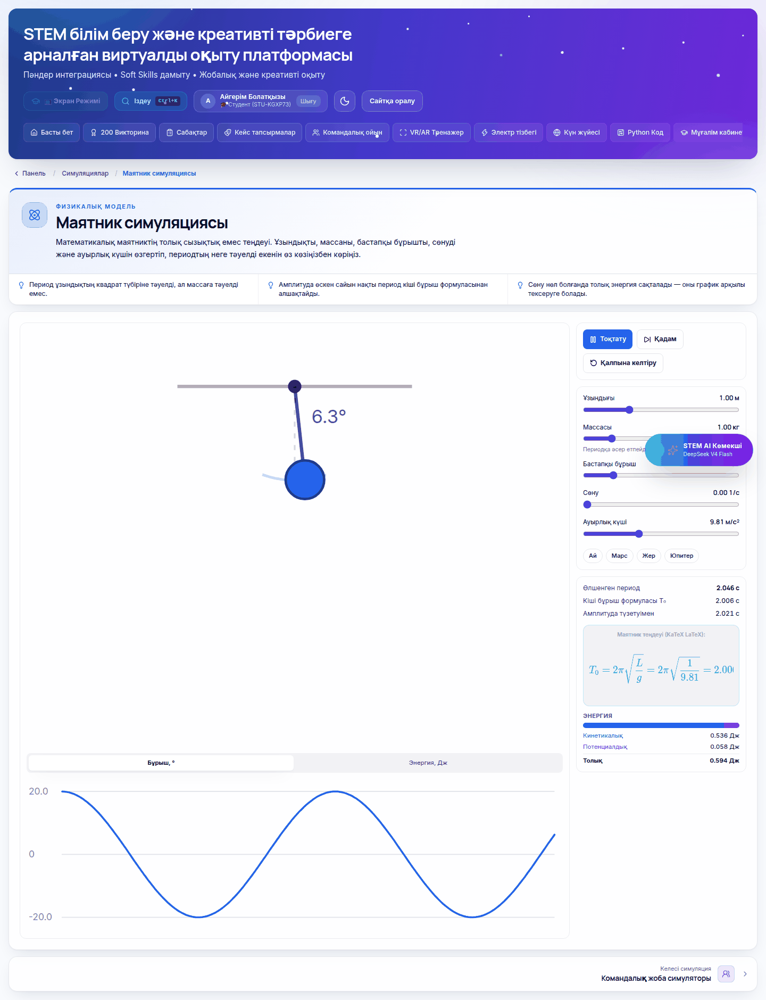

**Сурет 28 – Маятник симуляциясы**

Суретте маятник суреті, басқару батырмалары, ұзындық пен масса жүгірткілері, ауырлық күші нұсқалары және период пен энергия көрсеткіштері бар виртуалды эксперимент ортасы көрсетілген. Бұл бөлім оқушыға параметрді өзгертіп, периодтың ұзындыққа тәуелді, массаға тәуелсіз екенін өз көзімен тексеруге мүмкіндік береді. Педагогикалық тұрғыдан симулятор зерттеушілік әрекет арқылы сыни ойлау мен дәлелді қорытынды жасау дағдысына бағытталған†.

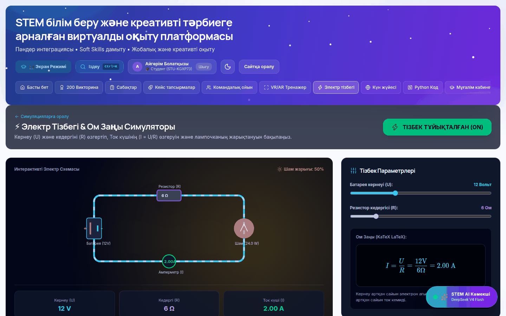

**Сурет 29 – Электр тізбегі және Ом заңы симуляторы**

Суретте батарея, шам, резистор және амперметр схемасы, кернеу мен кедергі параметрлері, ток күші және Ом заңының формуласы көрсетілген. Бұл бөлім оқушыға кернеу мен кедергіні өзгертіп, ток күшінің өзгерісін және шамның жарықтануын бақылауға мүмкіндік береді. Педагогикалық тұрғыдан симулятор себеп-салдарлық байланысты анықтауға және сыни ойлауға бағытталған†.

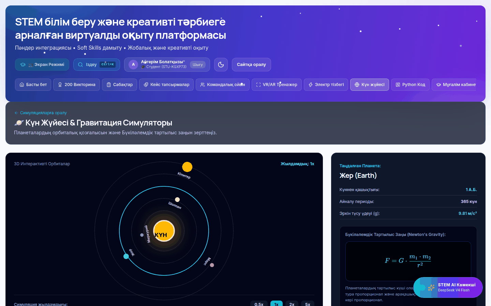

**Сурет 30 – Күн жүйесі және гравитация симуляторы**

Суретте планеталардың 3D орбитасы, жылдамдық ауыстырғышы, таңдалған планета деректері және тартылыс заңының формуласы көрсетілген. Бұл бөлім оқушыға планеталардың қозғалысын бақылап, қашықтық пен период арасындағы байланысты салыстыруға мүмкіндік береді. Педагогикалық тұрғыдан симулятор визуализация арқылы зерттеушілік және аналитикалық ойлауға бағытталған†.

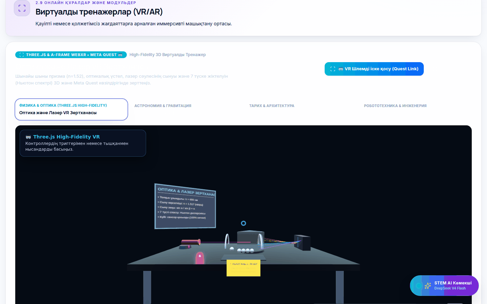

**Сурет 31 – VR/AR тренажер: оптика және лазер зертханасы**

Суретте төрт сахнаның таңдағышы, VR-шлемді іске қосу батырмасы және оптикалық үстелдің 3D көрінісі (лазер, призма, спектр, ақпараттық тақта) көрсетілген. Бұл бөлім оқушыға іс жүзінде қауіпті не қолжетімсіз тәжірибені виртуалды ортада бақылауға мүмкіндік береді. Педагогикалық тұрғыдан тренажер иммерсивті модельдеу арқылы мәселені шешу мен сыни ойлауға бағытталған†. VR-шлемде іске қосу тексерілмеді.

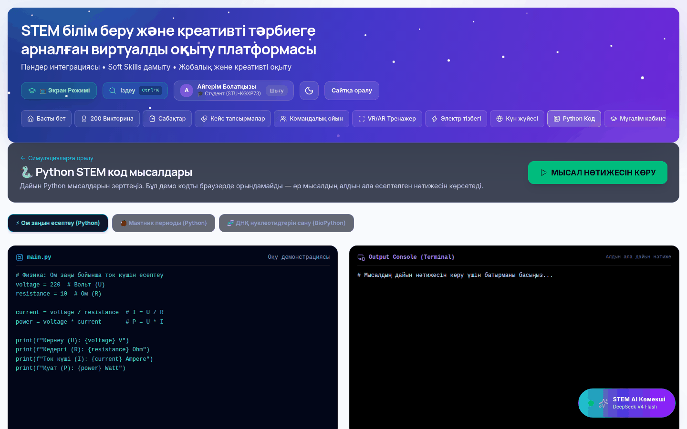

**Сурет 32 – Python STEM код мысалдары (демонстрациялық режим)**

Суретте үш мысалдың таңдағышы, `main.py` терезесі және «Алдын ала дайын нәтиже» терминалы көрсетілген; бетте демо кодты браузерде орындамайтыны айтылған. Бұл бөлім оқушыға дайын алгоритмді оқып, оның нәтижесін физикалық және биологиялық есеппен байланыстыруға мүмкіндік береді. Педагогикалық тұрғыдан бөлім цифрлық сауат пен алгоритмдік ойлауға бағытталған†; нақты код жазып орындау функциясы платформада жоқ.

## 8. Геймификация элементтері

Платформада төмендегі геймификация элементтері іске асырылған; әрқайсысы мотивациямен бірге нақты Soft Skills-ке байланыстырылды.

- **Ұпай.** Командалық ойында — 100 ұпай және жылдамдық бонусы (+50/+30/+10); рөлдік ойында — әр дұрыс жауапқа 10 ұпай; командалық жоба симуляторында — 0–100 қорытынды ұпай; сабақ тесті мен викторинада — пайыздық нәтиже. *Дағдысы:* өзін реттеу (уақытты есептеп жауап беру), шешім қабылдау, жауапкершілік (рөлдік ойында жеке жауап команда ұпайына қосылады).
- **Деңгей.** 200-тесттің қорытындысы төрт деңгейге бөлінеді (бастапқы, орташа, жақсы, жоғары), ал деңгей атауы келесі әрекетті ұсынады («қадамдық қолдау қажет», «жүйелі жаттығу қажет» және т.б.). *Дағдысы:* өзін-өзі бағалау, табандылық.
- **Бейдж (жетістік белгісі).** Жеке кабинетте төрт белгі: «Алғашқы қадам» (кез келген бірінші әрекет), «Сабақ шебері» (ойын мен тест орындалған сабақ), «Зерттеуші» (бір симуляция), «Нақты жауап» (80 %-дан жоғары нәтиже); панельдегі портфолио қойындысында үш жетістік (зерттеуші — үш симуляция; команда сүйеніші — командалық жоба 70 %-дан жоғары; шығармашыл — екі ойын 100 %). Ашылмаған белгі құлыппен көрсетіледі. *Дағдысы:* оқу белсенділігі, табандылық.
- **Викторина.** Бес пән бойынша 1 000 жағдаяттық сұрақ; командалық ойындағы сыныптық викторина. *Дағдысы:* сыни ойлау, коммуникация (команда ішінде талқылау).
- **Команда және жарыс.** Төрт команда, олардың белгілері мен түстері, команда ұпайы және подиум. *Дағдысы:* командалық жұмыс, ортақ нәтижеге жауапкершілік.
- **Прогресс.** Сабақтар прогресі (аяқталған сабақ үлесі), күндік белсенділік (қатарынан күн саны), апталық белсенділік диаграммасы, оқу уақыты. *Дағдысы:* өзін реттеу, оқу белсенділігі, табандылық.
- **Миссия мен марапат.** Бөлек «миссия» немесе «марапат» механизмі платформада жоқ; жетістік белгілері марапат функциясын ішінара атқарады. XP-ұпай деректер қабатында есептеледі және мұғалім кабинетінің демо кестесінде көрсетіледі, бірақ оқушы интерфейсінде көрінбейді.

Көпшілік сайттың аналитика бөлімі өсуді «рейтингсіз» көрсету қағидасын ұстанады: жеке оқушылар рейтингі жоқ; рейтинг тек команда деңгейінде (подиум) және рөлдік ойын нәтижесінде ойын ішінде көрінеді. Бұл геймификацияны жеке бәсекеге емес, командалық жауапкершілікке және өзін-өзі салыстыруға бағыттайды.

---

## 9. Soft Skills дамыту әдістемесі: платформаны қолдану тәсілі

Әдістеме бір қағидаға сүйенеді: икемді дағды пәндік тапсырманы орындау барысында қалыптасады, ал платформа осы тапсырманың әрбір кезеңін цифрлық құралмен қамтамасыз етеді. Төмендегі алты кезең платформада қолжетімді құралдармен сәйкестендірілген; мұғалімнің әрекеті мен бағалау бағандарында платформа функциясы мен әдістемелік ұсыныс бөлек көрсетілген.

**1-кезең. Диагностикалық-дайындық.** Мұғалім сабақтың пәндік мақсатын және дағдылық мақсатын белгілейді: сабақ каталогында әр сабақтың дағдылары, ал кейс каталогында дағды белгілері көрсетілген. Бастапқы деңгейді анықтау үшін оқушылар «200 Викторина» бөлімінен қысқа (25 сұрақтық) сессия тапсырады; нәтиже төрт деңгейлі интерпретация мен дағдылар картасын береді. Мұғалім осы картаға қарап сәйкес сабақты немесе кейсті таңдайды.

**2-кезең. Мотивациялық.** Қызығушылықты оятуға: кейстің бейнесі мен «бейнеден нені іздеу керек» нұсқауы; сабақтың «Нақты өмірлік жағдаят» кезеңі (жағдаят, негізгі сұрақ, нақты деректер: мысалы, көпірдің аралығы — 12 м, есептік жүктеме — 1 500 кг); мұғалімнің «Экран режимі» квизі; командалық ойынның қысқа сұрақ раунды қолданылады.

**3-кезең. Белсенді оқу әрекеті.** Жеке тапсырма — сабақ ойыны (топтастыру, жұп табу, ретке келтіру) және тест; топтық және STEM-кейс — кейс пен командалық жоба симуляторы; модельдеу және виртуалды тренажер — маятник, электр тізбегі, Күн жүйесі және VR/AR сахналары; рөлдік және командалық ойын — кейстің рөлдік бөлмесі мен STEM Team Battle.

**4-кезең. Бірлескен әрекет.** Мұғалім бөлме ашып, QR-кодты тақтаға шығарады; оқушылар қосылады, рөл бөледі, чатта пікір алмасады, раундтарда рөліне сәйкес сұрақтарға жауап береді, үшінші раундта бірлескен ұсыныс дайындайды. Екінші раундтың қиындығы (жетекші жалғыз шешім қабылдайды) қақтығысты конструктивті шешуге жағдай жасайды. Командалық өнім ретінде бірлескен ұсыныс және команда ұпайы шығады.

**5-кезең. Рефлексия және бағалау.** Оқушы кейстің бес рефлексиялық сұрағын талқылайды, сабақтың «Топтық жұмыс және рефлексия» кезеңінің сұрақтарына жауап береді, тест нәтижесін түсініктемемен қарап шығады, жеке кабинетте прогресін көреді. Мұғалім кабинетте оқушының жазбаша жауабын оқып, пікір жазады. Өзара бағалау мен рубрикалық бағалау платформада құрал ретінде жоқ; олар әдістемелік құрал ретінде 10-бөлімде ұсынылған.

**6-кезең. Жекелендірілген келесі қадам.** Мұғалім немесе оқушы дағдылар радарынан және викторина картасынан әлсіз дағдыны анықтайды да, сол дағды тіркелген келесі сабақты не кейсті таңдайды (мысалы, көшбасшылық әлсіз болса — «Эко-роботты жобалау» сабағы мен «Жарық пен мейірімділік» кейсі). Қайта тапсыру (сабақ тесті, викторина) арқылы деңгей біртіндеп күрделенеді. Бұл кезеңнің таңдауы қолмен жасалады; платформа ұсынысты ереже бойынша («Келесі қадам») береді, ал дағдыға бағытталған тапсырманы автоматты тағайындамайды.

### Кесте 2. Soft Skills дамытуда платформаны қолдану әдістемесі

| Кезең | Мұғалім әрекеті | Оқушы әрекеті | Платформа құралы | Дамитын Soft Skills | Бағалау |
|---|---|---|---|---|---|
| 1. Диагностикалық-дайындық | Пәндік және дағдылық мақсатты белгілейді; сабақ пен кейсті таңдайды | Қысқа викторина тапсырады; дағдылар картасын көреді | 200 Викторина (дағдылар картасы, 4 деңгей); сабақ және кейс каталогы | Өзін-өзі бағалау, өзін реттеу | Диагностикалық: деңгей мен дағды бойынша пайыз (автоматты) |
| 2. Мотивациялық | Бейнені, жағдаятты не квизді көрсетеді; негізгі сұрақ қояды | Бейне көреді, жағдаятты оқиды, сұраққа жауап береді | Кейс бейнесі; сабақтың «Нақты өмірлік жағдаят» кезеңі; Экран режимі | Сыни ойлау, коммуникация | Бақылау (мұғалім), жауап белсенділігі |
| 3. Белсенді оқу әрекеті | Жеке және топтық тапсырма ұйымдастырады; симуляция мен ойынды іске қосады | Ойын ойнайды, симуляция жасайды, жағдаятты модельдейді | Сабақ ойыны; маятник, тізбек, Күн жүйесі, VR/AR; командалық жоба симуляторы | Мәселені шешу, сыни ойлау, цифрлық сауат, жауапкершілік | Ойын нәтижесі (n/n), симулятор ұпайы (автоматты) |
| 4. Бірлескен әрекет | Бөлме ашады, QR көрсетеді, таймерді және раундты басқарады, чатты қадағалайды | QR арқылы қосылады, рөл таңдайды, пікір алмасады, бірлескен ұсыныс жасайды | Кейстің рөлдік бөлмесі (рөл, чат, раунд); STEM Team Battle | Коммуникация, командалық жұмыс, көшбасшылық, қақтығысты басқару, шешім қабылдау | Команда мен жеке ұпай (автоматты); бақылау парағы (әдістемелік) |
| 5. Рефлексия және бағалау | Талқылау сұрақтарын қояды; жазбаша жауапқа пікір жазады; рубрика қолданады | Рефлексиялық сұрақтарды талқылайды; тест нәтижесін қарап шығады | Кейстің «Талқылау» қадамы; мұғалім кабинеті; сабақ тесті; жеке кабинет | Рефлексия, өзін-өзі бағалау, жауапкершілік | Рефлексиялық жауап (мұғалім пікірі); тест %; рубрика мен өзара бағалау (әдістемелік) |
| 6. Жекелендірілген келесі қадам | Радар мен картаға қарап әлсіз дағдыны анықтайды; келесі тапсырманы таңдайды | «Келесі қадам» ұсынысын көреді; қайта тапсырады; келесі сабақты таңдайды | Дағдылар радары; викторина картасы; «Келесі қадам»; каталогтар | Өзін реттеу, табандылық | Прогресс динамикасы, қайта тапсыру нәтижесі |

### Кесте 3. Платформа құралдары мен Soft Skills арасындағы байланыс

| Цифрлық құрал | Педагогикалық әдіс | Оқушы әрекеті | Дамитын дағды | Күтілетін нәтиже |
|---|---|---|---|---|
| 200 Викторина | Жағдаяттық тест, диагностика | Жағдаятты талдап, шешім таңдайды | Сыни ойлау, шешім қабылдау, мәселені шешу | Дағдылар картасы мен деңгей бойынша бастапқы профиль |
| Сабақ плеері (6 кезең) | Жобалық, проблемалық оқыту | Мақсаттан тестке дейін кезеңдерден өтеді | Сыни ойлау, өзін реттеу, цифрлық сауат | Пәндік және дағдылық нәтиженің бірге көрінуі |
| Сабақ ойындары (топтастыру, жұп табу, ретке келтіру) | Ойын арқылы оқыту | Элементтерді топтайды, жұптайды, ретке келтіреді | Сыни ойлау, дәлелдеу | Ұғымды бекіту, қатені бірден көру |
| Кейс тапсырма | Кейс-стади, рефлексия | Жағдаятқа өз ұстанымын жазады | Рефлексия, коммуникация, жауапкершілік | Жазбаша жауап, мұғалімге көрінетін ойлау дәлелі |
| Рөлдік ойын бөлмесі (QR, чат) | Рөлдік ойын, ынтымақтастықта оқыту | Рөл таңдап, рөлге сай әрекет етеді, пікір алмасады | Коммуникация, көшбасшылық, эмпатия, жауапкершілік | Команда мен жеке ұпай; талқылауға негіз |
| STEM Team Battle | Геймификация, командалық жарыс | Таймермен жауап береді, команда ұпайына үлес қосады | Командалық жұмыс, шешім қабылдау | Команда рейтингі, оқу белсенділігі |
| Командалық жоба симуляторы | Әлеуметтік өзара әрекет симуляциясы | Рөл бөледі, қақтығыс жағдаятында шешім таңдайды | Қақтығысты басқару, жоспарлау, коммуникация | 0–100 ұпай, төрт көрсеткіш, шешімдер журналы |
| Маятник, тізбек, Күн жүйесі | Виртуалды эксперимент | Параметр өзгертіп, нәтижені салыстырады | Сыни ойлау†, дәлелді қорытынды† | Заңдылықты өз тәжірибесімен тексеру |
| VR/AR тренажер | Иммерсивті модельдеу | 3D сахнада нысанды бақылайды | Мәселені шешу†, сыни ойлау† | Қолжетімсіз тәжірибені виртуалды көру |
| Дағдылар радары, жеке кабинет | Өзін-өзі бақылау, рефлексия | Прогресі мен жетістігін қарайды | Өзін реттеу, табандылық | Өз дағдыларын көру, келесі мақсатты қою |
| Мұғалім кабинеті (кейс жауаптары) | Қалыптастырушы бағалау | — (оқушы жауабын мұғалім оқиды) | Рефлексия (оқушыда) | Жазбаша кері байланыс |
| STEM AI көмекші | Өзіндік оқу, диалог | Сұрақ қояды, түсініктеме алады | Өзіндік оқу†, ақпарат іздеу† | Сабақтан тыс қолдау |
| Экран режимі | Фронтальды интерактив | Сыныптық квизге ауызша жауап береді | Коммуникация† | Қысқа жиынтық тексеру |

*† — платформада дағды белгісі жоқ, әдістемелік байланыс.*

**Әдістемелік қолдану үлгісі (сабақ сценарийі).** «Көпірдің беріктігін зерттеу» (физика, 9-сынып, 55 мин): 5 мин — «Мақсаттар» кезеңі: оқушылар үш оқу мақсаты мен үш дағдыны (сыни ойлау, дәлелге негізделген пайымдау, командалық жұмыс) оқиды; 7 мин — «Жағдаят»: ескі көпір, аралығы 12 м, жүктеме 1 500 кг, сұрақ «Қандай конструкция ең аз материалмен ең жоғары беріктік береді?»; 20 мин — ойын («Күштерді топтастыру») және командалық жоба симуляторы; 10 мин — маятник симуляциясы (резонанс түсінігі); 8 мин — топтық талқылау сұрақтары («Кім есептеуді, кім модель құрастыруды алады?», «Сынақ нәтижесі болжамға сай келмесе, не істейсіздер?»); 5 мин — тест (6 сұрақ, өту шегі 70 %). Сабақ соңында мұғалім «Командалық жарыс (QR)» арқылы 5 минуттық қорытынды раунд өткізе алады.

## 10. Бағалау, рефлексия және кері байланыс

### 10.1. Платформадағы бағалау құралдары

Төмендегі тізімде Soft Skills бағалаудың сегіз әдісі платформадағы нақты іске асу дәрежесімен берілген.

- **Тапсырма нәтижесі — іске асырылды.** Ойын (n/n), сабақ тесті (%, өту шегі 70 %), викторина (%, дағдылар картасы), командалық жоба симуляторы (0–100), рөлдік ойын (10 ұпай/жауап) автоматты есептеледі.
- **Платформадағы прогресс — іске асырылды.** Жеке кабинет, дағдылар радары, апталық белсенділік, жетістік белгілері; нәтиже сабақ ойыны, тест, кейс, маятник және симулятор әрекеттерінен жиналады. Нәтиже Supabase қосылмаған режимде құрылғыда ғана сақталады.
- **Командалық белсенділік — іске асырылды.** Командалық ойында команда ұпайы мен подиум, рөлдік ойында команда ұпайы мен әр мүшенің жеке үлесі, чат хабарлары.
- **Рефлексиялық жауап — ішінара.** Кейстің екінші қадамындағы жазбаша жауап сақталады және мұғалімге көрінеді; рефлексиялық талқылау сұрақтары (сабақтың 5-кезеңінде үш сұрақ, кейстің 4-қадамында бес сұрақ) ауызша қойылады, жауаптары сақталмайды. Рефлексия күнделігі немесе портфолиоға жазба енгізу құралы жоқ.
- **Өзін-өзі бағалау — ішінара.** Викторинадағы дағдылар картасы, радар және кейстегі өзін-өзі тексеру тізімі өзін-өзі бағалауға негіз береді; арнайы өзін-өзі бағалау формасы жоқ.
- **Рубрика — платформа интерфейсінде жоқ.** Бағалау ережелері (10 критерийлі 5 деңгейлі рубрика және салмақты қорытынды баға формуласы) бағдарлама кодында жазылған, бірақ оны толтыратын экран интерфейске қосылмаған. Рубрика әдістемелік құрал ретінде төменде (Кесте 4) ұсынылған.
- **Бақылау парағы — платформа интерфейсінде жоқ.** Рөл карточкаларындағы «НЕ ІСТЕЙСІЗ» тізімдерін мұғалім бақылауға болатын мінез-құлық белгілері ретінде қолдана алады; мұғалімге арналған толтыру құралы платформада жоқ.
- **Өзара бағалау — платформа интерфейсінде жоқ.** Әдістемелік жолмен ұйымдастырылады.

**Автоматты аналитика.** Оқушы деңгейінде автоматты аналитика жұмыс істейді: жеке кабинет, дағдылар радары, апталық белсенділік, викторина картасы. Сынып деңгейінде автоматты аналитика жоқ: мұғалім кабинетіндегі сыныптар кестесі (9-A, 9-B, 10-A, 10-B; орташа ұпай, аяқталған сабақ, XP) үлгі деректермен толтырылған және «демо» белгісімен көрсетілген; «Тапсырма жіберуді көрсету» батырмасы тек демонстрация («серверге дерек жіберілген жоқ»). Мұғалімге арналған нақты деректі қамтитын бірден-бір бөлім — кейс жауаптары. «Мұғалімге есеп» және «Ата-анаға есеп» карточкалары мақсатты сипаттайды, есепті генерациялау құралы жоқ.

### Кесте 4. Soft Skills бағалауға ұсынылатын әдістемелік рубрика (платформа функциясы емес)

Рубрика платформаның рөлдік ойын нәтижелеріне (мінез-құлық белгілеріне) негізделген және мұғалім бақылау парағы ретінде қолдана алады. Деңгейлер: 1 — бастапқы, 2 — дамушы, 3 — құзыретті.

| Дағды | 1 — бастапқы | 2 — дамушы | 3 — құзыретті |
|---|---|---|---|
| Коммуникация | Тек сұраққа жауап береді | Өз пікірін айтады, чатқа жазады | Өз пікірін дәлелдеп айтады, басқаның сөзін нақтылап қайталайды |
| Тыңдау және эмпатия | Басқаның сөзін бөліп отырады | Кезегін күтеді | Әр адамға сөз береді, «Кім әлі айтқан жоқ?» деп сұрайды |
| Командалық жұмыс | Тек өз рөлінің ісін орындайды | Басқа рөлге көмектеседі | Ортақ ұсынысқа әр мүшенің үлесін кіргізеді |
| Көшбасшылық | Шешімді жалғыз қабылдайды | Пікір сұрайды, бірақ шешімді өзі айтады | Шешімді «біз келістік» деп бірге қабылдайды |
| Жауапкершілік | Рөлін ұмытады | Рөлін орындайды | Рөлін орындап, команда нәтижесіне есеп береді |
| Қақтығысты басқару | Келіспеушілікте үнсіз қалады не таласады | Келіспеушілікті атайды | Критерий бойынша салыстырып, ортақ шешімге келеді |

### 10.2. Рефлексия және кері байланыс құралдары

- **Сабақтың «Топтық жұмыс және рефлексия» кезеңі** әр сабақта үш рефлексиялық сұрақ береді (мысалы, «Сынақ нәтижесі болжамға сай келмесе, не істейсіздер?»); сұрақтар командада талқыланады.
- **Кейстің екінші қадамы** — жеке жазбаша рефлексия; **төртінші қадам** — бес сұрақты сыныптық талқылау.
- **Дереу кері байланыс:** тест түсініктемесі, симулятор салдары, рөлдік ойында жауап ашылуы, командалық ойындағы дұрыс жауап.
- **Мұғалімнің пікірі:** кейс жауабына жазбаша пікір (мұғалім кабинетінде сақталады; оқушы интерфейсінде көрсету әзірге жоқ).
- **STEM AI көмекші:** сұрақ қойып, түсініктеме алуға болады; кілт болмаған кезде жауап жергілікті STEM дерекқорынан беріледі (Ом заңы сұрағына формуламен жауап берді). AI модельге сұрау нақты кілтпен тексерілмеді.

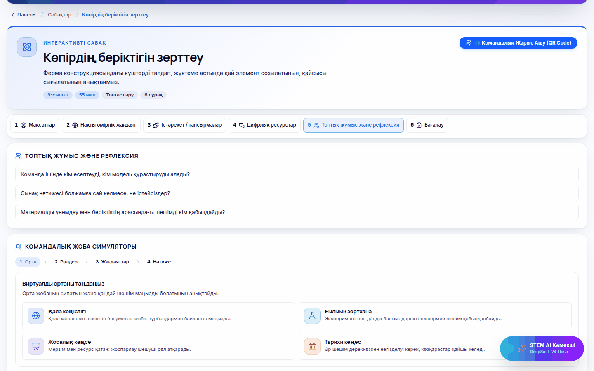

**Сурет 33 – Сабақ плеері: «Топтық жұмыс және рефлексия» кезеңі**

Суретте көпір сабағының бесінші кезеңі көрсетілген: топтық талқылауға арналған үш сұрақ және төменде командалық жоба симуляторының басы. Бұл бөлім оқушыға рөлді бөлу, күтпеген нәтиже және шешімді кім қабылдайтыны туралы бірге ойлануға мүмкіндік береді. Педагогикалық тұрғыдан кезең рефлексия, коммуникация және ортақ шешім қабылдау дағдыларына бағытталған; жауаптар платформада сақталмайды.

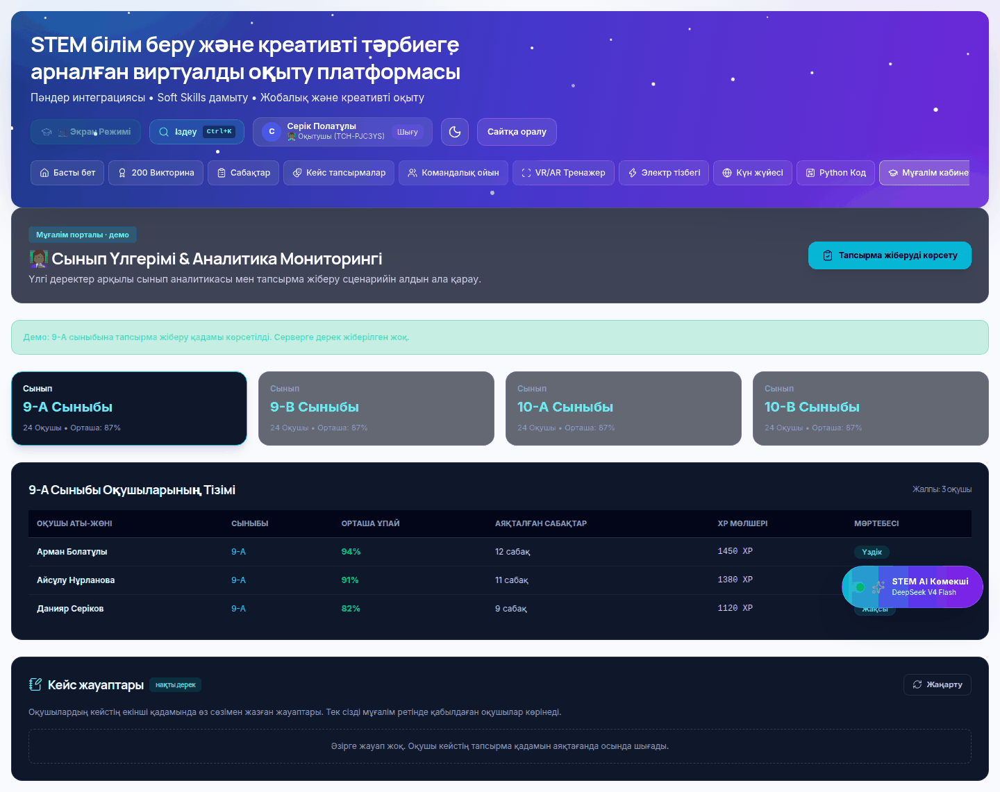

**Сурет 34 – Мұғалім кабинеті: сынып үлгерімі (демо) және кейс жауаптары (нақты дерек)**

Суретте «Мұғалім порталы · демо» белгісімен сыныптар таңдағышы, 9-A сыныбының үлгі кестесі және төменде «Кейс жауаптары — нақты дерек» блогы көрсетілген. Бұл бөлім мұғалімге сынып аналитикасының үлгісін көруге және нақты оқушы жауабына пікір жазуға мүмкіндік береді. Педагогикалық тұрғыдан кабинет қалыптастырушы бағалауға бағытталған; кестедегі деректер демонстрациялық сипатта.

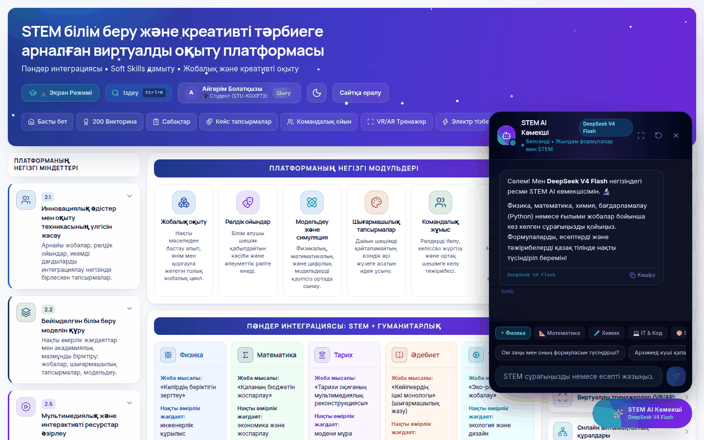

**Сурет 35 – STEM AI көмекші**

Суретте бетке қатар ашылған чат терезесі, пән санаттары (физика, математика, химия, IT және код, Soft Skills) және дайын сұрақтар көрсетілген. Бұл бөлім оқушыға сұрақ қойып, формуламен түсіндірме алуға мүмкіндік береді. Педагогикалық тұрғыдан көмекші өзіндік оқу мен ақпарат іздеу дағдысына бағытталған†; жауаптың сапасы бұл тексеруде жергілікті дерекқормен ғана расталды.

---

## 11. Платформаны пәндік оқытуға интеграциялау

Платформаның негізгі әдістемелік қағидасы: **Soft Skills – пәндік оқу мақсатын орындау барысында қалыптасатын интеграциялық оқу нәтижесі.** Платформада дағды бөлек модульде оқытылмайды: әр сабақ пен кейс пәндік мақсатты және дағдыны бірге береді, ал дағды белгісі нәтижені радарға жібереді.

### Кесте 5. Пәндік мазмұн мен Soft Skills интеграциясы (платформадағы нақты материалдар)

| Пән | Платформадағы нақты материал | Пәндік мақсат | Тіркелген Soft Skills | Пәндік құрал |
|---|---|---|---|---|
| Физика | Сабақ «Көпірдің беріктігін зерттеу» (9-сынып) | Ферма күштерін талдау; созылу мен сығылуды ажырату; модельді өлшеумен дәлелдеу | Сыни ойлау, топта жұмыс, цифрлық сауат | Топтастыру ойыны, маятник, тест |
| Физика | Кейс «Жарық пен мейірімділік» (3-сынып) | Жарықтың таралуы және оны үнемді пайдалану | Топта жұмыс, коммуникация, көшбасшылық, жауапкершілік | Рөлдік ойын (оптика VR сахнасы — қосымша ресурс) |
| Математика | Сабақ «Қаланың бюджетін жоспарлау» (9-сынып) | Кіріс пен шығысты ажырату; екі сценарийді сандармен салыстыру; шешімді дәлелдеу | Сыни ойлау, жауапкершілік, цифрлық сауат | Терминдерді сәйкестендіру ойыны, тест |
| Тарих | Сабақ «Тарихи оқиғаның мультимедиялық реконструкциясы» (8-сынып) | Дереккөз сенімділігін бағалау; хронологияны қалпына келтіру; бірнеше көзқарасты салыстыру | Сыни ойлау, коммуникация, шығармашылық | Хронология ойыны, тест |
| Әдебиет | Сабақ «Кейіпкердің ішкі монологы» (8-сынып) | Кейіпкер мотивін мәтінге сүйеніп түсіндіру; ішкі монолог жанры; көркемдегіш құралдар | Шығармашылық, коммуникация, өзін реттеу | Көркемдегіш құралдар ойыны, тест |
| Технология | Сабақ «Эко-роботты жобалау» (9-сынып) | Инженерлік дизайн циклін қолдану; прототипті сынау | Топта жұмыс, көшбасшылық, цифрлық сауат | Дизайн циклі ойыны, командалық симулятор |
| Технология / цифрлық сауат | Кейс «Роботтың бірінші қадамы» | Роботты жүргізу алгоритмін бірлесіп құру (рөлдер: бағдарламашы, тестілеуші, құрастырушы, құжаттаушы) | Цифрлық сауат, топта жұмыс, сыни ойлау, өзін реттеу | Рөлдік ойын |
| Қоршаған орта | Кейстер «Тамшының бағасы», «Қоқыстың екінші өмірі» | Су шығынын өлшеу; қоқысты сұрыптау және екінші өмір | Жауапкершілік, шығармашылық, топта жұмыс | Рөлдік ойын |

Платформада информатика, биология және химия бойынша бөлек сабақ жоқ. Олар командалық ойындағы санаттар (химия, биология) және Python мысалдары (Ом заңы, маятник, ДНҚ нуклеотидтерін санау; код орындалмайды) арқылы ішінара берілген.

**Платформаны қолданудың әдістемелік мысалдары (платформада бөлек материал ретінде жоқ).** Төмендегі екі мысал платформаның қолданыстағы құралдарын біріктіру арқылы мұғалім құра алатын сабақ жоспарлары; олар платформада дайын сабақ ретінде енгізілмеген.

- *Информатика (алгоритм құру).* Пәндік мақсат — қарапайым алгоритмді рөлдер бойынша құру. Тәсіл: «Роботтың бірінші қадамы» кейсінің рөлдік ойынын өткізіп, «Python Код» бетіндегі дайын мысалды алгоритм үлгісі ретінде талқылау. Soft Skills: мәселені шешу, шығармашылық, өзін-өзі басқару. Ескерту: оқушы кодты платформада жазып орындай алмайды.
- *Биология (фотосинтез, ДНҚ).* Пәндік мақсат — ұғымдарды бекіту. Тәсіл: STEM Team Battle-де «Биология» санатын таңдап, жауап ашылғаннан кейін түсініктемені топпен талқылау. Soft Skills: командалық жұмыс, коммуникация, дәлелдеу.

## 12. Қорытынды

Зерттелген платформа «Soft Skills дамытуға арналған жекелендірілген оқыту, мультимедиялық контент, интерактивті тапсырмалар, командалық және рөлдік әрекеттер, виртуалды тренажерлар, геймификация, бағалау және рефлексия құралдарын бір ортада біріктіретін **интеграцияланған цифрлық білім беру ортасы**» ретінде қарастырылады. Бұл тұжырымның дәлелі — жеке құралдардың саны емес, олардың бір оқу циклінде өзара байланысуы.

**Төрт бағыттың интеграциясы.**

- *Жекелендірілген виртуалды оқытуды басқару ортасы.* Диагностика (200 викторина, дағдылар картасы), деңгей анықтау (төрт деңгей), орындау (сабақ, кейс), кері байланыс және прогресті бағалау (жеке кабинет, радар) құралдары енгізілді. Келесі тапсырманы автоматты бейімдеу толық іске асырылмаған, сондықтан платформа құрылымы жекелендірілген оқу траекториясын ұйымдастыруға мүмкіндік береді.
- *Soft Skills дамытуға арналған цифрлық құралдар ортасы.* Жағдаяттық тесттер, симуляциялар, виртуалды лабораториялар, VR сахналары, кейстер, ойындар және рефлексия сұрақтары әзірленді; дағдылар сегіз осьті таксономияға тіркелген.
- *Мультимедиялық және интерактивті білім беру ортасы.* Бейнелі кейстер, интерактивті сабақ ойындары, 3D кітапхана, виртуалды модельдер және QR-код арқылы қосылу іске асырылды; қосымша материалға QR арқылы өту және бейнекітапхана сипаттамалық деңгейде қалды.
- *Командалық жобалар мен әлеуметтік өзара әрекет симуляторы.* Рөлдік бөлме (рөл, чат, раунд, нәтиже), командалық STEM ойыны және командалық жоба симуляторы нақты жұмыс істейді.

**Бір оқу циклі.** Платформада мына тізбек жүзеге асады: мультимедиа (кейс бейнесі, жағдаят) → интерактивті тапсырма (сабақ ойыны) → жеке жұмыс (жазбаша жауап, тест) → командалық әрекет (STEM Team Battle, командалық жоба симуляторы) → рөлдік ойын (рөлдік бөлме) → виртуалды тренажер (симулятор, VR) → геймификация (ұпай, подиум, белгі) → кері байланыс (түсініктеме, мұғалім пікірі) → бағалау (нәтиже, радар) → рефлексия (талқылау сұрақтары) → келесі тапсырма (қолмен таңдау, «Келесі қадам»).

**Басты педагогикалық ерекшелік.** Платформаның жаңашылдығы цифрлық ресурстардың санында емес, пәндік білім мен Soft Skills мақсаттарының бір оқу әрекеті ішінде біріктірілуінде: әр сабақ пен кейс пәндік мақсатты және дағдыны бірге береді, ал дағды белгісі арқылы әр орындалған тапсырма сол дағдының профиліне қосылады.

**Шектеулер және келесі қадамдар.** Есепте нәтижелік сипаттама жасалған функциялармен қатар, интерфейсте көрсетілген, бірақ толық іске асырылмаған бөлімдер де нақты белгіленді: келесі тапсырманы автоматты бейімдеу, рубрика мен өзара бағалау экрандары, сынып деңгейіндегі нақты аналитика, мұғалім пікірін оқушыға көрсету, сертификат пен есепті жүктеу, QR арқылы қосымша материалға өту, бейне мен чек-лист ресурстары, Python кодын орындау. Дағдылардың нақты мінез-құлықтағы қалыптасуын эксперименттік жолмен (оқушылармен сынақ, өлшеу) растау бұл сипаттаманың шеңберінен тыс және жеке зерттеуді қажет етеді.

---

## А қосымшасы. Бөлімдердің тексерілу дәрежесі

Тексеру 2026 жылғы 3 қазанда платформаның өндірістік құрастыруында (Next.js 15.5) жүргізілді. Supabase кілттері, YouTube, сыртқы CDN және OpenRouter қолжетімсіз болды; A-Frame кітапханасы 3D сахнаны көру үшін npm арқылы жергілікті берілді.

### Кесте 6. Платформа бөлімдерінің тексерілу дәрежесі

| Бөлім | Дәреже | Ескертпе |
|---|---|---|
| Басты панель | Толық тексерілді | Блоктар, навигация, аналитиканың демо және нақты күйі |
| Кіру / рөлдер | Ішінара | Демо-аккаунттар (студент, оқытушы) тексерілді; пошта және Google арқылы кіру, тіркелу Supabase қосылмаған ортада тексерілмеді |
| 200 Викторина | Толық тексерілді | Блиц-сессия аяқталып, нәтиже мен дағдылар картасы алынды; 200 сұрақтық толық сессия мен 1 000 сұрақтың мазмұны бастан-аяқ оқылмады, дағды белгісінің бар-жоғы деректер файлы бойынша есептелді |
| Сабақтар (5) | Ішінара | Бес сабақтың барлық алты кезеңі ашылды, қателер жоқ; ойын мен тест толық тек «Көпірдің беріктігін зерттеу» сабағында орындалды |
| Кейс тапсырмалар (5) | Ішінара | Бес кейс ашылды; бірінші кейстің барлық қадамы орындалды; 2–5-кейстің рөлдік бөлмесі іске қосылмады; бейнелер сыртқы желі жабық болғандықтан ойнатылмады |
| Кейстің рөлдік ойыны | Толық тексерілді (1-кейс бойынша) | Хост және үш қатысушы; рөл таңдау, 3 раунд, чат, нәтиже; QR-кодтың кескіні көрсетілді, бірақ телефонмен сканерленбеді (сілтеме тікелей ашылып тексерілді) |
| Командалық STEM ойыны | Толық тексерілді | Хост және үш ойыншы, 7 сұрақ, подиум; бір браузердің қойындылары арасында |
| Бірнеше құрылғыда бөлмеге қосылу | Тексерілмеді | Supabase Realtime кілті жоқ |
| Командалық жоба симуляторы | Толық тексерілді | Бір орта, алты рөл, төрт сценарий, нәтиже |
| Маятник, электр тізбегі, Күн жүйесі | Ішінара | Беттер ашылды, параметр өзгертілді; маятник іске қосылды; Күн жүйесінің 3D орбиталарының қозғалысы бақыланбады |
| VR/AR тренажер | Ішінара | Оптика сахнасының 3D көрінісі расталды; VR-шлемде іске қосу және сахнадағы тапсырмалардың орындалуы қолжетімділік шектеулі болғандықтан тексерілмеді |
| Python Код | Толық тексерілді | Демо режим: код өзгертілмейді, нәтиже алдын ала есептелген |
| Цифрлық кітапхана | Ішінара | Бет пен 3D сахна ашылды; кітап ішіндегі оқу панелінің барлық мазмұны оқылмады |
| Мультимедиялық ресурс беттері (8) | Интерфейс деңгейінде | Беттер ашылды; VR бетінен басқасы сипаттамалық |
| Пәндік модуль беттері (5) | Интерфейс деңгейінде | Сипаттама, жоба мысалы, викторинаға сілтеме; бейне мен жүктеме тізімі — көрсетілген, бірақ батырмалар әрекетсіз |
| Жеке кабинет | Толық тексерілді | Нәтиже жазылғаннан кейінгі күйі |
| Мұғалім кабинеті | Ішінара | Сынып кестесі — демо; кейс жауаптары мен пікір жазу нақты тексерілді |
| STEM AI көмекші | Ішінара | Жергілікті дерекқордан жауап алынды; OpenRouter арқылы нақты AI жауабы тексерілмеді |
| Іздеу, Экран режимі | Толық тексерілді | Іздеу нәтижесі және квиз терезесі ашылды |
| Көпшілік сайт | Ішінара | Басты бет және бөлімдер тізімі расталды; 16 бөлімнің барлық мәтіні егжей-тегжейлі тексерілмеді |

Тексеру барысында байқалған, платформаның жұмысына қатысты ескертулер: (1) 3D кітап сахнасы HDR картасын сыртқы CDN-нен жүктейді; сыртқы желі жабық болғанда басты панель мен сайт dev режимінде қате экранына түсті (өндірістік режимде бұл күй тексерілмеді); (2) `/play` бетінде таңдалмаған командалардың атаулары көрінбейді; (3) мұғалімнің кейс жауабына жазған пікірі оқушы интерфейсінде көрсетілмейді; (4) dev (`next dev`) режимінде React Strict Mode әсерінен командалық ойын хосты қосылған ойыншыларды көрмейді, өндірістік құрастыруда бұл құбылыс байқалмады.

## Б қосымшасы. Суреттер тізімі

| № | Сурет | Файл |
|---|---|---|
| 1 | Басты панель | `screenshots/01-dashboard.png` |
| 2 | Көпшілік портал | `screenshots/02-public-portal.png` |
| 3 | Цифрлық кітапхана | `screenshots/03-digital-library.png` |
| 4 | Жекелендіру блоктары (демо) | `screenshots/04-personalization-blocks.png` |
| 5 | Дағдылар радары | `screenshots/05-skills-radar.png` |
| 6 | Викториналар бөлімі | `screenshots/06-quiz-hub.png` |
| 7 | Дағдылар диагностикалық картасы | `screenshots/07-quiz-skills-map.png` |
| 8 | Жеке кабинет | `screenshots/08-student-profile.png` |
| 9 | Сабақтар каталогы | `screenshots/09-lessons-catalogue.png` |
| 10 | Сабақ үлгісінің құрылымы | `screenshots/10-lesson-template.png` |
| 11 | Сабақ плеері: мақсаттар | `screenshots/11-lesson-goals.png` |
| 12 | Сабақ ойыны | `screenshots/12-lesson-game.png` |
| 13 | Тест: кері байланыс | `screenshots/13-lesson-quiz-feedback.png` |
| 14 | Тест қорытындысы | `screenshots/14-lesson-quiz-result.png` |
| 15 | Экран режимі | `screenshots/15-presenter-mode.png` |
| 16 | Кейс тапсырмалар | `screenshots/16-cases-catalogue.png` |
| 17 | Кейс: жазбаша жауап | `screenshots/17-case-task.png` |
| 18 | Кейс: рөлдік ойын (сценарий) | `screenshots/18-case-roleplay-setup.png` |
| 19 | Рөлдік бөлме: QR | `screenshots/19-room-lobby-qr.png` |
| 20 | Рөл карточкасы және чат | `screenshots/20-room-player-card.png` |
| 21 | Рөлдік ойын нәтижесі | `screenshots/21-room-results.png` |
| 22 | Мұғалім: кейс жауабы | `screenshots/22-teacher-case-responses.png` |
| 23 | Командалық ойын: хост | `screenshots/23-teamgame-host-lobby.png` |
| 24 | Командалық ойынға қосылу | `screenshots/24-teamgame-join.png` |
| 25 | Командалық ойын: ойыншы | `screenshots/25-teamgame-player.png` |
| 26 | Командалық ойын: подиум | `screenshots/26-teamgame-podium.png` |
| 27 | Командалық жоба симуляторы | `screenshots/27-team-simulator.png` |
| 28 | Маятник | `screenshots/28-pendulum.png` |
| 29 | Электр тізбегі | `screenshots/29-circuit.png` |
| 30 | Күн жүйесі | `screenshots/30-astronomy.png` |
| 31 | VR/AR тренажер | `screenshots/31-vr-trainer.png` |
| 32 | Python демо | `screenshots/32-python-demo.png` |
| 33 | Топтық жұмыс және рефлексия | `screenshots/33-lesson-teamwork-reflection.png` |
| 34 | Мұғалім кабинеті | `screenshots/34-teacher-cabinet.png` |
| 35 | STEM AI көмекші | `screenshots/35-ai-tutor.png` |
